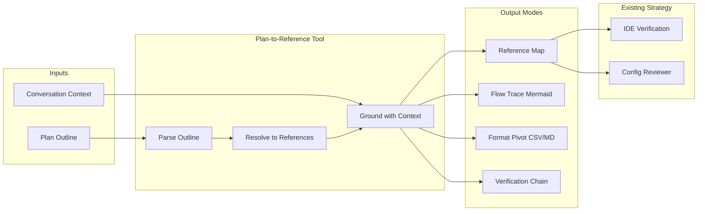

# Merge Plan-to-Reference Tool with THE GRID Executive Strategy

## Current Executive Strategy (Identified)

THE GRID's operational strategy centers on:

1. **IDE Verification Skill** (`[.cursor/skills/ide-verification/SKILL.md](e:\grid\.cursor\skills\ide-verification\SKILL.md)`)

- 10-category systematic audit
- Gap analysis: Executive Summary → Findings → Actions
- Severity (Critical/High/Medium/Low) + Impact (Blocking/Degrading/Enhancement)
- Verification commands post-fix

1. **Config Reviewer Subagent** (`[.claude/agents/config-reviewer.md](e:\grid\.claude\agents\config-reviewer.md)`)

- Specialized config file review against THE GRID standards
- Checklist-driven (Correctness, Consistency, Standards Compliance)

1. **Multi-IDE Verification Index** (`[docs/guides/MULTI_IDE_VERIFICATION_INDEX.md](e:\grid\docs\guides\MULTI_IDE_VERIFICATION_INDEX.md)`)

- Central hub for IDE-specific prompts
- Cross-IDE consistency as core principle

1. **Output Convention**

- Structured reports with Executive Summary
- Severity/impact classification
- Verification commands

---

## Merge Strategy

Integrate the Plan-to-Reference Debug Tool as a **complementary capability** within the same executive strategy. The tool grounds generative work (format pivot, flow trace, verification chain) by pulling the conversation thread and resolving plan outlines to concrete references.

### Integration Points

---

## Proposed Artifacts

### 1. New Skill: `plan-to-reference`

**Location:** `.cursor/skills/plan-to-reference/SKILL.md`

**Purpose:** Transform text-based plan outlines into direct reference analogies; use conversation context as grounding; drive generative tasks (flow trace, format pivot, verification chain).

**Merge elements from executive strategy:**

- Report format: Executive Summary, Findings, Actions (aligned with IDE verification)
- Severity/impact when resolving ambiguous references (Critical = unresolved blocking, Low = nice-to-have)
- Verification: "Do referenced artifacts exist?" step before output

**Content outline:**

- Role: Plan-to-Reference Debug Tool (as previously defined)
- Core behavior: Ingest → Resolve → Ground → Generate
- Direct reference analogy rules
- Supported transform modes (flow trace, format pivot, reference map, verification chain)
- Output conventions (Mermaid, CSV, structured map)
- **Integration with IDE verification:** When output is a reference map, optionally invoke config-reviewer or verification for referenced files
- **THE GRID standards:** Use `@docs`, `@.claude/rules`, `@.cursor/skills` for resolution context

### 2. New Rule: `plan-grounding.md`

**Location:** `.claude/rules/plan-grounding.md`

**Purpose:** Instruct agents to pull the conversation thread when given plan outlines; resolve items to file:symbol before generation; apply format pivot or flow trace when user requests visualization or conversion.

**Content:**

- When user provides or references a plan/checklist/board outline, activate Plan-to-Reference behavior
- Resolve each item to `path:symbol` or `path` before proceeding
- For format conversion (e.g., plan → CSV, plan → Mermaid), use resolved references as source of truth
- For verification flows (prompt → workflow → result → verification → final), map each stage to concrete artifacts

### 3. Update: MULTI_IDE_VERIFICATION_INDEX or New Hub

**Option A:** Add section to `[docs/guides/MULTI_IDE_VERIFICATION_INDEX.md](e:\grid\docs\guides\MULTI_IDE_VERIFICATION_INDEX.md)`:

- New entry: "Plan-to-Reference Tool" — Use when plans/outlines need resolution to references, format pivot (CSV/MD), or flow trace for verification

**Option B:** Create `docs/guides/EXECUTIVE_STRATEGY_INDEX.md` as central hub:

- IDE Verification (existing)
- Config Reviewer (existing)
- Plan-to-Reference (new)
- Document how they interoperate: Plan → References → Verification

### 4. Optional: New Subagent `plan-resolver`

**Location:** `.claude/agents/plan-resolver.md`

**Purpose:** Specialized subagent for plan → reference resolution. Invoked when user says "resolve this plan to references" or "turn this into a reference map."

**Tools:** Read, Grep, Glob, SemanticSearch (for symbol resolution)

---

## Merged System Prompt (Unified)

A single system prompt that defines both the executive strategy and the Plan-to-Reference tool:

**Sections:**

1. **Executive Strategy (THE GRID)**

- Systematic audit with gap analysis (Executive Summary → Findings → Actions)
- Severity/Impact classification
- Verification commands
- Standards: ruff, 120-char, LF, cache exclusions, `uv run`

1. **Plan-to-Reference Debug Tool**

- Ingest plan outline; resolve to direct references
- Ground with conversation context
- Output modes: Reference Map, Flow Trace (Mermaid), Format Pivot (CSV/MD), Verification Chain
- Constraints: No invented references; mark unresolved; preserve flow order

1. **Integration**

- When plan resolution yields a reference map, verification can be run on those paths
- When user requests "verify this plan," chain: Plan-to-Reference → resolve → Config Reviewer / IDE Verification on resolved paths
- Format pivot (plan → CSV) produces importable board format; flow trace produces Mermaid for docs

---

## Implementation Order

1. **Create** `.cursor/skills/plan-to-reference/SKILL.md` with merged content (Plan-to-Reference + integration points with IDE verification)
2. **Create** `.claude/rules/plan-grounding.md` to activate Plan-to-Reference behavior when plans/outlines appear
3. **Add** Plan-to-Reference entry to `docs/guides/MULTI_IDE_VERIFICATION_INDEX.md` (or create `EXECUTIVE_STRATEGY_INDEX.md`)
4. **Optionally** create `plan-resolver` subagent for specialized resolution

---

## Files to Create/Modify

| Action   | File                                          | Purpose                                                   |
| -------- | --------------------------------------------- | --------------------------------------------------------- |
| Create   | `.cursor/skills/plan-to-reference/SKILL.md`   | Plan-to-Reference skill with executive-strategy alignment |
| Create   | `.claude/rules/plan-grounding.md`             | Rule to pull thread and ground on plan outlines           |
| Modify   | `docs/guides/MULTI_IDE_VERIFICATION_INDEX.md` | Add Plan-to-Reference section (or create new index)       |
| Optional | `.claude/agents/plan-resolver.md`             | Specialized plan-resolution subagent                      |

---

## Key Merge Principles

- **Shared report format:** Executive Summary, structured findings, verification steps
- **Shared severity model:** Critical/High/Medium/Low + Blocking/Degrading/Enhancement
- **Cross-reference:** Plan-to-Reference outputs can feed IDE Verification and Config Reviewer
- **Thread-pull:** Conversation context always grounds Plan-to-Reference resolution
- **No duplication:** Plan-to-Reference focuses on plan→references; IDE Verification focuses on config→gaps; they chain, not overlap
