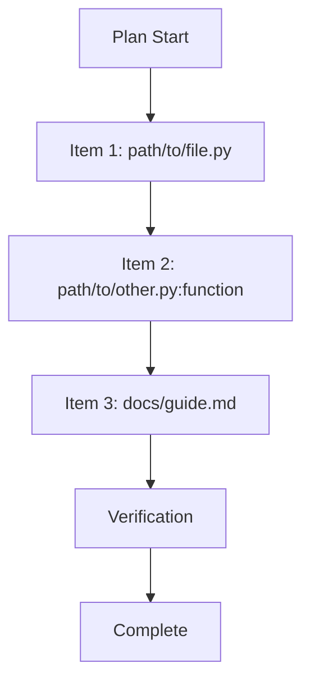

# Plan-to-Reference Debug Tool

## Quick Start

When given a plan outline or checklist:

1. Pull conversation thread for context
2. Parse plan items and resolve to `path:symbol` or `path` references
3. Ground with conversation context
4. Generate output mode: Reference Map, Flow Trace (Mermaid), Format Pivot (CSV/MD), or Verification Chain

## Core Behavior

### Ingest → Resolve → Ground → Generate

1. **Ingest**: Parse plan outline, checklist, or board items
2. **Resolve**: Map each item to concrete references using:
   - `@docs` for documentation
   - `@.claude/rules` for standards
   - `@.cursor/skills` for verification workflows
   - File paths and symbols in codebase
3. **Ground**: Use conversation context to disambiguate references
4. **Generate**: Output in requested format with verification steps

## Resolution Rules

### Direct Reference Analogy

Transform abstract plan items into concrete references:

- "Implement authentication" → `src/grid/api/routers/auth.py:create_user`
- "Add tests" → `tests/integration/test_auth_flow.py:test_register_user`
- "Update config" → `src/grid/core/config.py:ACCESS_TOKEN_EXPIRE_MINUTES`
- "Review security" → `docs/guides/AUTH_ROLLBACK_PLAYBOOK.md`

### Reference Types

1. **File Reference**: `path/to/file.py`
2. **Symbol Reference**: `path/to/file.py:function_name`
3. **Directory Reference**: `path/to/directory/`
4. **Documentation Reference**: `docs/guides/FILENAME.md`
5. **Rule Reference**: `.claude/rules/RULE_NAME.md`
6. **Skill Reference**: `.cursor/skills/SKILL_NAME/SKILL.md`

### Unresolved References

- Mark clearly: `[UNRESOLVED: description]`
- Assign severity (default: High if blocking, Medium otherwise)
- Provide context for manual resolution
- Never invent references

### Edge Cases

- **Empty plan**: Return brief message; do not generate reference map
- **Single item**: Process normally; output still uses Executive Summary format
- **Large plans (50+ items)**: Batch output or summarize; note item count in Executive Summary
- **Multiple candidate references**: Pick best match; list alternatives in output when ambiguous

## Output Modes

### 1. Reference Map

Structured mapping of plan items to concrete references:

```markdown
# Plan Reference Map

**Source:** [plan description]
**Date:** YYYY-MM-DD

## Executive Summary

- Total items: X
- Resolved: X | Unresolved: X
- Critical: X | High: X | Medium: X | Low: X

## Reference Mapping

### [Plan Item 1]

**Reference:** `path/to/file.py:symbol`
**Severity:** [🔴/🟠/🟡/🟢]
**Impact:** [🎯/⚠️/💡]
**Status:** ✅ Resolved / ❌ Unresolved

### [Plan Item 2]

**Reference:** `path/to/file.py`
**Severity:** [🔴/🟠/🟡/🟢]
**Impact:** [🎯/⚠️/💡]
**Status:** ✅ Resolved / ❌ Unresolved

## Verification Steps

- Check all resolved references exist
- Validate symbol names are correct
- Confirm file paths are accessible
```

### 2. Flow Trace (Mermaid)

Visualize plan execution flow:



### 3. Format Pivot (CSV/MD)

Convert plan to importable formats:

**CSV Format:**

```csv
Item,Reference,Severity,Impact,Status
"Implement auth","src/grid/api/routers/auth.py","🔴","🎯","✅"
"Add tests","tests/integration/test_auth_flow.py","🟠","⚠️","✅"
```

**Markdown Format:**

```markdown
| Item           | Reference                             | Severity | Impact | Status |
| -------------- | ------------------------------------- | -------- | ------ | ------ |
| Implement auth | `src/grid/api/routers/auth.py`        | 🔴       | 🎯     | ✅     |
| Add tests      | `tests/integration/test_auth_flow.py` | 🟠       | ⚠️     | ✅     |
```

### Enhanced Format Pivot (Seed Point 10)

Convert resolved plans to different output formats on demand:

**CSV Export:**
- "Export to CSV for Jira import" → Generate CSV with Item,Reference,Severity,Impact,Status columns
- Include metadata for project management tool import
- Preserve plan item order and resolution status

**Markdown Conversion:**
- "Convert to markdown table" → Create structured MD tables for documentation
- Include headers and formatting for technical docs
- Add linking between related references

**Mermaid Generation:**
- "Generate mermaid diagram" → Create flowchart visualization of resolved plan
- Show dependencies and execution flow
- Include decision points and verification gates

**Verification Chain:**
- "Create verification chain" → Map Prompt → Workflow → Result → Verification → Final stages
- Include concrete artifact references for each stage
- Provide verification checkpoints

### 4. Verification Chain

Map verification workflow stages:

```markdown
# Verification Chain

**Plan:** [plan description]

## Stage 1: Prompt → Workflow

- Input: [prompt description]
- Output: [workflow artifact]
- Reference: `path/to/workflow/file.py`

## Stage 2: Workflow → Result

- Input: [workflow artifact]
- Output: [result artifact]
- Reference: `path/to/result/file.py`

## Stage 3: Result → Verification

- Input: [result artifact]
- Output: [verification report]
- Reference: `docs/reports/verification.md`

## Stage 4: Verification → Final

- Input: [verification report]
- Output: [final artifact]
- Reference: `path/to/final/file.py`
```

## Integration with Executive Strategy

### Chaining to IDE Verification (Seed Point 5)

When reference map is generated, automatically offer IDE verification:

**After Reference Resolution:**
- Scan resolved references for config files (`.vscode/settings.json`, `.vscode/tasks.json`)
- Check if referenced paths exist and are accessible
- Verify symbol references are valid (functions/classes exist)

**Optional IDE Verification Trigger:**
- "Also check IDE config for these files" → Invokes IDE verification skill
- "Verify these paths work in VS Code" → Runs path accessibility checks
- "Check cross-IDE consistency" → Compares settings across editors

### Integration with Config Reviewer (Seed Point 6)

When plan resolution includes configuration files:

**Automatic Standards Check:**
- Referenced `.vscode/settings.json` → Check against `ide-config-standards.md`
- Included `src/grid/core/config.py` → Validate against backend standards
- Mentioned `pyproject.toml` → Verify ruff/mypy configuration

**Config Compliance Verification:**
- "Review these settings against GRID standards" → Invokes config reviewer
- "Check configuration completeness" → Validates required settings present
- "Verify cross-IDE consistency" → Compares settings inheritance

### Documentation Enhancement (Seed Point 7)

After generating reference maps, identify and suggest documentation improvements:

**Gap Analysis:**
- Scan resolved references against existing documentation
- Identify undocumented functions, classes, or workflows
- Flag incomplete README files or missing architecture docs

**Enhancement Suggestions:**
- "Document this implementation" → Suggest README updates for new modules
- "Add architecture diagram for this flow" → Propose Mermaid diagrams for complex flows
- "Update docs with these references" → Recommend doc updates with new file references

**Automated Suggestions:**
- New API endpoints → Suggest API documentation updates
- Complex business logic → Recommend architecture decision records
- Multi-step processes → Propose flow documentation

### Severity Classification

Use same severity model as IDE verification:

- 🔴 **Critical**: Breaks core workflow or plan execution
- 🟠 **High**: Causes inconsistency or confusion
- 🟡 **Medium**: Reduces efficiency
- 🟢 **Low**: Nice-to-have enhancement

### Error Recovery (Seed Point 9)

When plan items cannot be resolved to concrete references:

**Unresolved Reference Handling:**
- Mark clearly: `[UNRESOLVED: description]`
- Assign severity (default: High if blocking, Medium otherwise)
- Provide context for manual resolution

**Recovery Strategies:**
- "Find similar files" → Search for pattern matches in codebase
- "Search for alternatives" → Use semantic search when exact matches fail
- "Check workspace boundary" → Explain path restrictions and suggest corrections

**Intelligent Suggestions:**
- Missing symbols → Propose similar function names or locations
- Path outside workspace → Suggest equivalent paths within workspace
- File not found → Recommend file creation or alternative locations

## Context Grounding

### Conversation Thread Pull

Always pull recent conversation context to:

- Disambiguate file references
- Understand project structure
- Identify relevant standards and rules
- Capture user preferences and constraints

### THE GRID Standards

Use these for resolution context:

- **Development Standards**: `.claude/rules/discipline.md`
- **Backend Standards**: `.claude/rules/backend.md`
- **Security Standards**: `.claude/rules/safety.md`
- **IDE Standards**: `.claude/rules/ide-config-standards.md`

## Examples

### Example 1: Authentication Plan

**Input Plan:**

```
1. Implement user registration
2. Add password validation
3. Create login endpoint
4. Add JWT token handling
5. Write integration tests
```

**Reference Map Output:**

```markdown
### 1. Implement user registration

**Reference:** `src/grid/api/routers/auth.py:register_user`
**Severity:** 🔴 Critical
**Impact:** 🎯 Blocking
**Status:** ✅ Resolved

### 2. Add password validation

**Reference:** `src/grid/core/password_policy.py:validate_password_strength`
**Severity:** 🔴 Critical
**Impact:** 🎯 Blocking
**Status:** ✅ Resolved

[...]
```

### Example 2: Format Pivot to CSV

**Input:** Task board checklist
**Output:** CSV file for import into project management tool

### Example 3: Flow Trace for Documentation

**Input:** Multi-step deployment plan
**Output:** Mermaid diagram for technical documentation

## Verification

### Pre-Generation Verification

Before generating output:

1. Verify all resolved references exist
2. Check file paths are accessible
3. Validate symbol names are correct
4. Confirm documentation references are current

### Post-Generation Verification

After generating output:

1. Test CSV import if format pivot
2. Validate Mermaid syntax if flow trace
3. Check reference map completeness
4. Verify chain stage connectivity

## Tools Usage

**Read**: Access files for reference resolution
**Grep**: Search for symbols and patterns
**Glob**: Find files matching patterns
**SemanticSearch**: Find code by meaning when exact matches fail
**LS**: Directory exploration for context

**NOT used:**

- ❌ `Edit` — Read-only transformation tool
- ❌ `Bash` — No command execution needed
- ❌ `WebFetch` — Local references only

## Constraints

1. **No Invented References**: Only resolve to actual files/symbols
2. **Mark Unresolved**: Clearly indicate what couldn't be resolved
3. **Preserve Order**: Maintain plan item sequence in outputs
4. **Context Grounding**: Always use conversation thread for disambiguation
5. **Standards Alignment**: Follow THE GRID's severity/impact model
6. **Workspace Boundary**: Resolve only to paths under workspace root; reject paths that escape workspace
7. **Sensitive Paths**: Treat `.env`, `credentials.json`, `*.pem`, `*.key` as sensitive; do not highlight unless user explicitly requests

## Staleness and Re-Verification

- **Before generation**: Re-verify all resolved references exist (files may have moved)
- **Stale plans**: If plan is from a prior session or codebase has changed, re-resolve before output
- **Invalid references**: If a previously resolved reference no longer exists, mark unresolved and explain

## Additional Resources

- **Implementation Guide:** `docs/guides/PLAN_TO_REFERENCE_IMPLEMENTATION_GUIDE.md` — Code examples for resolution
- **IDE Verification:** `.cursor/skills/ide-verification/SKILL.md`
- **Config Reviewer:** `.claude/agents/config-reviewer.md`
- **Multi-IDE Index:** `docs/guides/MULTI_IDE_VERIFICATION_INDEX.md`
- **Development Standards:** `.claude/rules/discipline.md`
