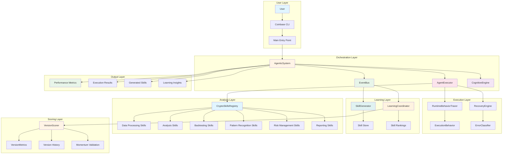

# GRID Agentic System - Architecture Flowchart

## Architecture Components

### User Layer
- **User**: Initiates requests
- **Coinbase CLI**: Command-line interface
- **Main Entry Point**: Entry point for all operations

### Orchestration Layer
- **AgenticSystem**: Main orchestrator
- **EventBus**: Decoupled communication
- **AgentExecutor**: Task execution
- **CognitiveEngine**: User state tracking

### Execution Layer
- **RuntimeBehaviorTracer**: Behavior tracking
- **RecoveryEngine**: Error recovery
- **ExecutionBehavior**: Trace data
- **ErrorClassifier**: Error categorization

### Learning Layer
- **SkillGenerator**: Skill creation
- **LearningCoordinator**: Skill ranking
- **Skill Store**: Persistent storage
- **Skill Rankings**: Skill performance data

### Analysis Layer
- **CryptoSkillsRegistry**: Skill registry
- **Data Processing Skills**: Data normalization, validation
- **Analysis Skills**: Price trends, volume analysis
- **Backtesting Skills**: Strategy backtesting
- **Pattern Recognition Skills**: Chart patterns
- **Risk Management Skills**: Risk assessment
- **Reporting Skills**: Report generation

### Scoring Layer
- **VersionScorer**: Score calculation
- **VersionMetrics**: Score components
- **Version History**: Progress tracking
- **Momentum Validation**: Trend validation

### Output Layer
- **Performance Metrics**: Execution statistics
- **Execution Results**: Task outcomes
- **Generated Skills**: Persistent knowledge
- **Learning Insights**: Performance data
