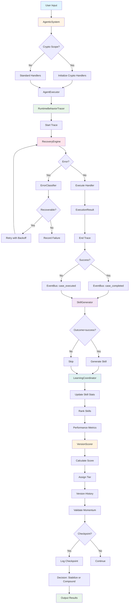

# GRID Agentic System - Data Flow Diagram

## Data Flow Description

### 1. Input Phase
- User provides input to AgenticSystem
- System checks if crypto scope is enabled
- Initializes appropriate handlers based on scope

### 2. Execution Phase
- AgentExecutor starts task execution
- RuntimeBehaviorTracer begins tracking
- RecoveryEngine wraps execution with error handling
- ErrorClassifier determines error type and recovery strategy
- Transient errors trigger retry with exponential backoff
- Non-recoverable errors abort immediately

### 3. Event Phase
- EventBus publishes case_executed event
- EventBus publishes case_completed event
- SkillGenerator handles completion events
- Only successful cases generate skills

### 4. Learning Phase
- LearningCoordinator updates skill statistics
- Skills ranked by success rate and latency
- Performance metrics collected
- VersionScorer calculates weighted scores
- Tier assigned based on score thresholds

### 5. Momentum Phase
- Version history tracked
- Momentum validated (non-decreasing scores)
- Checkpoints logged every 10 samples
- Decision to stabilize or compound

### 6. Output Phase
- Results returned to user
- Performance metrics available
- Skills available for reuse
- Learning insights available
