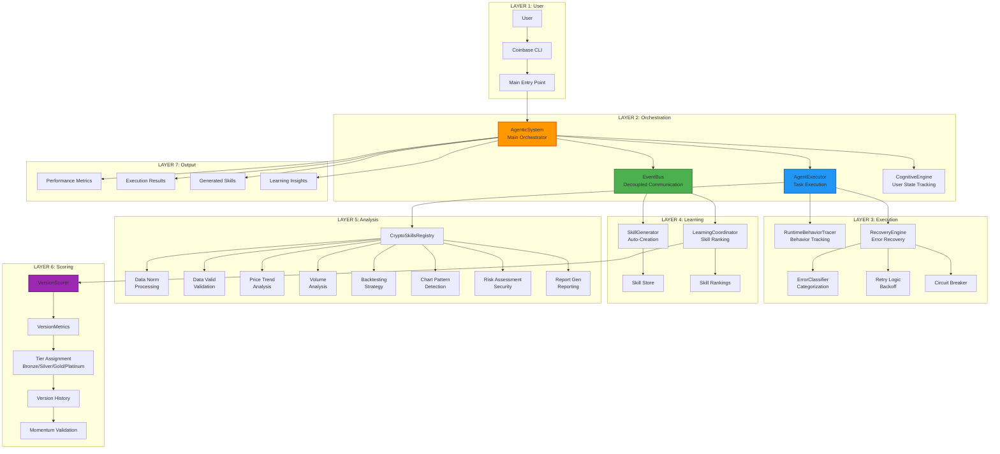
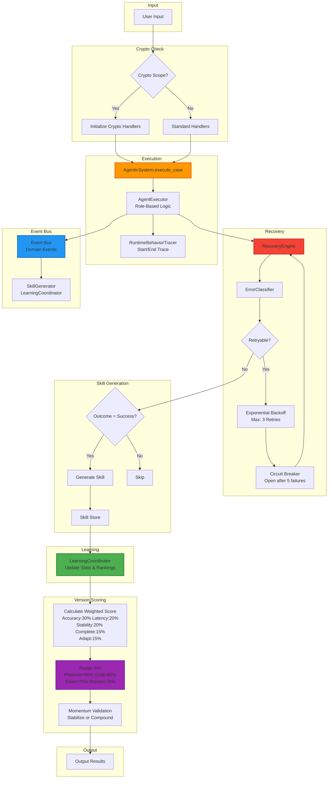

# Coinbase Architecture Visualizations

## 📊 7-Layer Architecture Overview

### ASCII Diagram

```
╔═══════════════════════════════════════════════════════════════════════════╗
║                        COINBASE ARCHITECTURE                               ║
║                   (Crypto Investment Platform)                             ║
║              Built on GRID Agentic System Patterns                         ║
╚═══════════════════════════════════════════════════════════════════════════╝

┌─────────────────────────────────────────────────────────────────────────┐
│ LAYER 1: USER LAYER                                                      │
│ ┌────────────────┬────────────────┬────────────────┐                     │
│ │ User           │ Coinbase CLI   │ Main Entry     │                     │
│ │ (Initiates)    │ (Commands)     │ (Entry Point)  │                     │
│ └────────────────┴────────────────┴────────────────┘                     │
└─────────────────────────────────────────────────────────────────────────┘
                                   │
                                   ▼
┌─────────────────────────────────────────────────────────────────────────┐
│ LAYER 2: ORCHESTRATION LAYER                                             │
│ ┌────────────────┬────────────────┬────────────────┬────────────────┐    │
│ │ AgenticSystem  │ EventBus       │ AgentExecutor  │ CognitiveEngine│    │
│ │ (Main          │ (Decoupled     │ (Task          │ (User State    │    │
│ │  Orchestrator) │  Communication)│  Execution)    │  Tracking)     │    │
│ └────────────────┴────────────────┴────────────────┴────────────────┘    │
│                                                                          │
│ 9 Core GRID Modules Integrated:                                          │
│ ┌───────┬───────┬───────┬───────┬───────┬───────┬───────┬───────┬──────┐ │
│ │Tracer │Events │Recover│SkillGn│LearnCd│AgExec │AgSyst │VerScor│CogEng│ │
│ └───────┴───────┴───────┴───────┴───────┴───────┴───────┴───────┴──────┘ │
└─────────────────────────────────────────────────────────────────────────┘
                                   │
                                   ▼
┌─────────────────────────────────────────────────────────────────────────┐
│ LAYER 3: EXECUTION LAYER                                                 │
│ ┌────────────────────────────────┬────────────────────────────────┐      │
│ │ RuntimeBehaviorTracer          │ RecoveryEngine                 │      │
│ │ (Behavior Tracking)            │ (Error Recovery)               │      │
│ │ ├─ ExecutionBehavior           │ ├─ ErrorClassifier             │      │
│ │ └─ Decision Points             │ ├─ Retry w/ Backoff            │      │
│ │    Performance Metrics         │ └─ Circuit Breaking            │      │
│ └────────────────────────────────┴────────────────────────────────┘      │
└─────────────────────────────────────────────────────────────────────────┘
                                   │
                                   ▼
┌─────────────────────────────────────────────────────────────────────────┐
│ LAYER 4: LEARNING LAYER                                                  │
│ ┌────────────────────────────────┬────────────────────────────────┐      │
│ │ SkillGenerator                 │ LearningCoordinator            │      │
│ │ (Skill Creation)               │ (Skill Ranking)                │      │
│ │                                │                                │      │
│ │   Successful Outcome           │   Update Stats                 │      │
│ │        ↓                       │        ↓                       │      │
│ │   Generate Skill               │   Rank by Success              │      │
│ │        ↓                       │        ↓                       │      │
│ │   ┌───────────┐                │   ┌───────────┐                │      │
│ │   │ Skill     │                │   │ Skill     │                │      │
│ │   │ Store     │                │   │ Rankings  │                │      │
│ │   └───────────┘                │   └───────────┘                │      │
│ └────────────────────────────────┴────────────────────────────────┘      │
└─────────────────────────────────────────────────────────────────────────┘
                                   │
                                   ▼
┌─────────────────────────────────────────────────────────────────────────┐
│ LAYER 5: ANALYSIS LAYER                                                  │
│ ┌──────────────────────────────────────────────────────────────────────┐ │
│ │ CryptoSkillsRegistry                                                 │ │
│ │                                                                      │ │
│ │  8 Crypto Analysis Skills:                                           │ │
│ │  ┌───────────────────┬───────────────────┬───────────────────┐      │ │
│ │  │ 1. Data Norm      │ 2. Data Valid     │ 3. Price Trend    │      │ │
│ │  │    (Processing)   │    (Validation)   │    (Analysis)     │      │ │
│ │  ├───────────────────┼───────────────────┼───────────────────┤      │ │
│ │  │ 4. Volume         │ 5. Backtesting    │ 6. Chart Pattern  │      │ │
│ │  │    (Analysis)     │    (Strategy)     │    (Detection)    │      │ │
│ │  ├───────────────────┼───────────────────┼───────────────────┤      │ │
│ │  │ 7. Risk Assessment│ 8. Report Gen     │                   │      │ │
│ │  │    (Security)     │    (Reporting)    │                   │      │ │
│ │  └───────────────────┴───────────────────┴───────────────────┘      │ │
│ └──────────────────────────────────────────────────────────────────────┘ │
└─────────────────────────────────────────────────────────────────────────┘
                                   │
                                   ▼
┌─────────────────────────────────────────────────────────────────────────┐
│ LAYER 6: SCORING LAYER                                                   │
│ ┌──────────────────────────────────────────────────────────────────────┐ │
│ │ VersionScorer                                                        │ │
│ │                                                                      │ │
│ │  Weighted Score Calculation                                          │ │
│ │        ↓                                                             │ │
│ │  Tier Assignment (Bronze/Silver/Gold/Platinum)                       │ │
│ │        ↓                                                             │ │
│ │  Version History Tracking                                            │ │
│ │        ↓                                                             │ │
│ │  Momentum Validation                                                 │ │
│ │  (Trend Analysis)                                                    │ │
│ └──────────────────────────────────────────────────────────────────────┘ │
│                                                                          │
│ VersionMetrics:                                                          │
│ • Accuracy, Latency, Stability, Completeness, Adaptability              │
└─────────────────────────────────────────────────────────────────────────┘
                                   │
                                   ▼
┌─────────────────────────────────────────────────────────────────────────┐
│ LAYER 7: OUTPUT LAYER                                                    │
│ ┌────────────────┬────────────────┬────────────────┬────────────────┐    │
│ │ Performance    │ Execution      │ Generated      │ Learning       │    │
│ │ Metrics        │ Results        │ Skills         │ Insights       │    │
│ │ (Statistics)   │ (Outcomes)     │ (Knowledge)    │ (Data)         │    │
│ └────────────────┴────────────────┴────────────────┴────────────────┘    │
└─────────────────────────────────────────────────────────────────────────┘
```

### Mermaid Diagram



---

## 🔄 Agentic Data Flow

### ASCII Diagram

```
┌─────────────────────────────────────────────────────────────────────────┐
│                         AGENTIC DATA FLOW                                │
└─────────────────────────────────────────────────────────────────────────┘

User Input
     │
     ▼
┌─────────────────────────────────────────────────────────────────────────┐
│ 1. CRYPTO SCOPE CHECK                                                    │
│    ┌─────────────────────────────────────────────────────────────────┐  │
│    │ Is input crypto-related?                                         │  │
│    │  ┌─────────┐        ┌─────────┐                                 │  │
│    │  │  YES    │──Yes──→│ Initialize│                              │  │
│    │  │         │        │ Crypto    │                              │  │
│    │  │         │        │ Handlers  │                              │  │
│    │  └─────────┘        └─────────┘                                 │  │
│    │       │No                                                       │  │
│    │       ↓                                                         │  │
│    │  ┌─────────┐                                                    │  │
│    │  │ Standard│                                                    │  │
│    │  │ Handlers│                                                    │  │
│    │  └─────────┘                                                    │  │
│    └─────────────────────────────────────────────────────────────────┘  │
└─────────────────────────────────────────────────────────────────────────┘
     │
     ▼
┌─────────────────────────────────────────────────────────────────────────┐
│ 2. AGENT EXECUTOR                                                        │
│    • AgenticSystem.execute_case() orchestrates                          │
│    • Role-based logic execution                                         │
└─────────────────────────────────────────────────────────────────────────┘
     │
     ▼
┌─────────────────────────────────────────────────────────────────────────┐
│ 3. RUNTIME BEHAVIOR TRACER                                               │
│    ┌─────────────────────────────────────────────────────────────────┐  │
│    │ • Start trace                                                   │  │
│    │ • Record decision points                                        │  │
│    │ • Track execution behavior                                      │  │
│    │ • Capture performance metrics                                   │  │
│    │ • End trace with outcome                                        │  │
│    └─────────────────────────────────────────────────────────────────┘  │
└─────────────────────────────────────────────────────────────────────────┘
     │
     ▼
┌─────────────────────────────────────────────────────────────────────────┐
│ 4. RECOVERY ENGINE                                                       │
│    ┌─────────────────────────────────────────────────────────────────┐  │
│    │ ErrorClassifier: Categorize error type                         │  │
│    │     ↓                                                           │  │
│    │ ┌─────────┐  ┌─────────┐  ┌─────────┐  ┌─────────┐             │  │
│    │ │Network  │  │Timeout  │  │Logic    │  │Fatal    │             │  │
│    │ │Error    │  │Error    │  │Error    │  │Error    │             │  │
│    │ └────┬────┘  └────┬────┘  └────┬────┘  └────┬────┘             │  │
│    │      │            │            │            │                  │  │
│    │      │Recoverable  │Recoverable │Non-Recover │Non-Recover       │  │
│    │      │            │            │            │                  │  │
│    │      ↓            ↓            ↓            ↓                  │  │
│    │ ┌──────────────────────────────────────────┐                  │  │
│    │ │ Retry with Exponential Backoff           │                  │  │
│    │ │ Max Retries: 3                           │                  │  │
│    │ │ Circuit Breaker: Open after 5 failures   │                  │  │
│    │ └──────────────────────────────────────────┘                  │  │
│    └─────────────────────────────────────────────────────────────────┘  │
└─────────────────────────────────────────────────────────────────────────┘
     │
     ▼
┌─────────────────────────────────────────────────────────────────────────┐
│ 5. SKILL GENERATION                                                      │
│    EventBus.emit("case_completed")
│           │
│           ▼
│    SkillGenerator.handle_execution_completed()
│           │
│           ▼
│    ┌─────────────────────────────────────────────────────────────────┐  │
│    │ Outcome = success?                                              │  │
│    │      ┌─────────┐        ┌─────────┐                            │  │
│    │      │  YES    │──Yes──→│ Generate│                            │  │
│    │      │         │        │ Skill   │                            │  │
│    │      │         │        │         │                            │  │
│    │      └─────────┘        └────┬────┘                            │  │
│    │           │No                 │                                 │  │
│    │           ↓                  ↓                                 │  │
│    │      ┌─────────┐        ┌─────────┐                            │  │
│    │      │ Skip    │        │ Store in│                            │  │
│    │      │         │        │ Skill   │                            │  │
│    │      └─────────┘        │ Store   │                            │  │
│    │                         └─────────┘                            │  │
│    └─────────────────────────────────────────────────────────────────┘  │
└─────────────────────────────────────────────────────────────────────────┘
     │
     ▼
┌─────────────────────────────────────────────────────────────────────────┐
│ 6. LEARNING COORDINATOR                                                  │
│    ┌─────────────────────────────────────────────────────────────────┐  │
│    │ • Update skill statistics (success rate, latency)              │  │
│    │ • Rank skills by performance metrics                           │  │
│    │ • Update skill rankings                                        │  │
│    └─────────────────────────────────────────────────────────────────┘  │
└─────────────────────────────────────────────────────────────────────────┘
     │
     ▼
┌─────────────────────────────────────────────────────────────────────────┐
│ 7. VERSION SCORING                                                       │
│    ┌─────────────────────────────────────────────────────────────────┐  │
│    │ VersionScorer.calculate_score():                               │  │
│    │                                                                  │  │
│    │   Weighted Components:                                         │  │
│    │   • Accuracy      30%                                          │  │
│    │   • Latency       20%                                          │  │
│    │   • Stability     20%                                          │  │
│    │   • Completeness  15%                                          │  │
│    │   • Adaptability  15%                                          │  │
│    │                                                                  │  │
│    │        ↓                                                         │  │
│    │   ┌───────────────────────┐                                     │  │
│    │   │ Tier Assignment:      │                                     │  │
│    │   │ • Platinum: >90%      │                                     │  │
│    │   │ • Gold: >80%          │                                     │  │
│    │   │ • Silver: >70%        │                                     │  │
│    │   │ • Bronze: <70%        │                                     │  │
│    │   └───────────────────────┘                                     │  │
│    │                                                                  │  │
│    │        ↓                                                         │  │
│    │   ┌───────────────────────┐                                     │  │
│    │   │ Momentum Validation:  │                                     │  │
│    │   │ Check trend direction │                                     │  │
│    │   │ Decision: Stabilize or│                                     │  │
│    │   │           Compound    │                                     │  │
│    │   └───────────────────────┘                                     │  │
│    └─────────────────────────────────────────────────────────────────┘  │
└─────────────────────────────────────────────────────────────────────────┘
     │
     ▼
  Output Results

┌─────────────────────────────────────────────────────────────────────────┐
│                         EVENT BUS FLOW                                   │
├─────────────────────────────────────────────────────────────────────────┤
│                                                                         │
│   AgenticSystem ──→ EventBus.emit(event) ──→ EventBus.publish()       │
│        │                                      │                        │
│        │                              ┌──────┴──────┐                 │
│        │                              │             │                 │
│        │                         Handlers    Subscribers              │
│        │                              │             │                 │
│        │                    ┌────────┴────────┐   ┌──┴──┐             │
│        │                    │                 │   │     │             │
│        │              SkillGenerator  LearningCoord  Audit  Analytics  │
│        │                                                                             │
│        │                    │                 │   │     │             │
│        │                    └────────┬────────┘   └──┬──┘             │
│        │                               │              │               │
│        │                               ▼              ▼               │
│        │                          Update Skills   Log/Analyze          │
│        │                                                                             │
│   Domain Events:                                                       │
│   • CaseCreated • CaseCategorized • CaseReferenceGenerated             │
│   • CaseExecuted • CaseCompleted • LearningUpdate                      │
│                                                                         │
└─────────────────────────────────────────────────────────────────────────┘
```

### Mermaid Diagram



---

## 🏗️ System Architecture Components

### ASCII Diagram

```
┌─────────────────────────────────────────────────────────────────────────┐
│                    SYSTEM COMPONENTS OVERVIEW                            │
└─────────────────────────────────────────────────────────────────────────┘

┌─────────────────────────────────────────────────────────────────────────┐
│ 9 CORE GRID MODULES                                                      │
├─────────────────────────────────────────────────────────────────────────┤
│                                                                         │
│  ┌─────────────┐ ┌─────────────┐ ┌─────────────┐ ┌─────────────┐       │
│  │   TRACER    │ │   EVENTS    │ │   RECOVERY  │ │ SKILL GEN   │       │
│  │             │ │             │ │             │ │             │       │
│  │ Runtime     │ │ EventBus    │ │ Recovery    │ │ Automatic   │       │
│  │ Behavior    │ │ Decoupled   │ │ Engine      │ │ Skill       │       │
│  │ Tracking    │ │ Comm        │ │ Retry/      │ │ Creation    │       │
│  │             │ │             │ │ Circuit     │ │             │       │
│  └─────────────┘ └─────────────┘ └─────────────┘ └─────────────┘       │
│                                                                         │
│  ┌─────────────┐ ┌─────────────┐ ┌─────────────┐ ┌─────────────┐       │
│  │   LEARN     │ │   EXEC      │ │   AGENTIC   │ │   SCORER    │       │
│  │             │ │             │ │             │ │             │       │
│  │ Learning    │ │ Agent       │ │ Agentic     │ │ Version     │       │
│  │ Coordinator │ │ Executor    │ │ System      │ │ Scorer      │       │
│  │ Skill       │ │ Task        │ │ Main        │ │ Weighted    │       │
│  │ Ranking     │ │ Execution   │ │ Orchestrator│ │ Scoring     │       │
│  └─────────────┘ └─────────────┘ └─────────────┘ └─────────────┘       │
│                                                                         │
│  ┌─────────────────────────────────────────────────────────────┐       │
│  │                    COGNITIVE ENGINE                          │       │
│  │  User State Tracking • Cognitive Load • Mental Models        │       │
│  └─────────────────────────────────────────────────────────────┘       │
│                                                                         │
└─────────────────────────────────────────────────────────────────────────┘

┌─────────────────────────────────────────────────────────────────────────┐
│ 8 CRYPTO ANALYSIS SKILLS                                                 │
├─────────────────────────────────────────────────────────────────────────┤
│                                                                         │
│  ┌───────────────────┐    ┌───────────────────┐                        │
│  │ DATA PROCESSING   │    │ DATA VALIDATION   │                        │
│  │ • Normalization   │    │ • Data Quality    │                        │
│  │ • Formatting      │    │ • Validation      │                        │
│  └───────────────────┘    └───────────────────┘                        │
│           │                        │                                   │
│           ▼                        ▼                                   │
│  ┌───────────────────┐    ┌───────────────────┐    ┌──────────────┐   │
│  │ PRICE TREND       │    │ VOLUME            │    │ BACKTESTING  │   │
│  │ ANALYSIS          │    │ ANALYSIS          │    │ STRATEGY     │   │
│  │ • Trend Detection │    │ • Volume Profile  │    │ • Historical │   │
│  │ • Momentum        │    │ • Liquidity       │    │ • Performance│   │
│  └───────────────────┘    └───────────────────┘    └──────────────┘   │
│           │                        │                  │                │
│           ▼                        ▼                  ▼                │
│  ┌───────────────────┐    ┌───────────────────┐    ┌──────────────┐   │
│  │ CHART PATTERN     │    │ RISK              │    │ REPORT       │   │
│  │ DETECTION         │    │ ASSESSMENT        │    │ GENERATION   │   │
│  │ • Pattern Recog   │    │ • Risk Metrics    │    │ • Reports    │   │
│  │ • Signal Gen      │    │ • Exposure        │    │ • Analysis   │   │
│  └───────────────────┘    └───────────────────┘    └──────────────┘   │
│                                                                         │
└─────────────────────────────────────────────────────────────────────────┘

┌─────────────────────────────────────────────────────────────────────────┐
│ FEATURES LAYER (Revenue-Generating)                                      │
├─────────────────────────────────────────────────────────────────────────┤
│                                                                         │
│  ┌─────────────────────────────────┐  ┌─────────────────────────────┐  │
│  │   REVENUE FEATURES              │  │   FACT CHECKER              │  │
│  │                                 │  │                             │  │
│  │ • Portfolio Analysis            │  │ • Multi-Source Verification │  │
│  │ • Trading Signals               │  │   - CoinGecko               │  │
│  │ • Revenue Calculation           │  │   - Binance                 │  │
│  │ • Event Calendar                │  │   - Coinbase                │  │
│  │                                 │  │ • Consensus Calculation     │  │
│  └─────────────────────────────────┘  └─────────────────────────────┘  │
│                                                                         │
└─────────────────────────────────────────────────────────────────────────┘

┌─────────────────────────────────────────────────────────────────────────┐
│ SECURITY LAYER (Privacy-First Design)                                    │
├─────────────────────────────────────────────────────────────────────────┤
│                                                                         │
│  ┌──────────────────┬──────────────────┬──────────────────┐            │
│  │ Portfolio        │ AI Safety        │ Audit Logging    │            │
│  │ Security         │                  │                  │            │
│  │ • SHA-256        │ • AI Access      │ • Event Logging  │            │
│  │ • AES-256        │   Validation     │ • READ/WRITE/    │            │
│  │ • Access Control │ • Output         │   DELETE/EXPORT  │            │
│  │                  │   Sanitization   │ • AI_ACCESS      │            │
│  └──────────────────┴──────────────────┴──────────────────┘            │
│                                                                         │
│  ┌──────────────────┬──────────────────┬──────────────────┐            │
│  │ Data Policy      │ Privacy Vault    │ Verification     │            │
│  │                  │                  │ Scale            │            │
│  │ • Field-Level    │ • Secure         │ • Multi-Source   │            │
│  │   Sensitivity    │   Storage        │ • Consensus      │            │
│  │ • Classification │ • Encryption     │ • Validation     │            │
│  └──────────────────┴──────────────────┴──────────────────┘            │
│                                                                         │
└─────────────────────────────────────────────────────────────────────────┘
```

---

## 🎯 Design Patterns Used

```
┌─────────────────────────────────────────────────────────────────────────┐
│                       DESIGN PATTERNS                                    │
├─────────────────────────────────────────────────────────────────────────┤
│                                                                         │
│  ✅ 7-Layer Architecture    - User → Orchestration → Execution           │
│                              → Learning → Analysis → Scoring → Output   │
│  ✅ Event-Driven            - EventBus for decoupled communication       │
│  ✅ Dependency Injection    - Core components injected via constructor   │
│  ✅ Protocol-Based          - Protocol interfaces for loose coupling     │
│  ✅ Repository Pattern      - Database layer abstraction                 │
│  ✅ Factory Pattern         - create_app() factory function              │
│  ✅ Singleton Pattern       - PortfolioAuditLogger, Security contexts    │
│  ✅ Strategy Pattern        - Different analysis/recovery strategies     │
│  ✅ Observer Pattern        - Event subscription/handling                │
│  ✅ Circuit Breaker         - Error recovery with circuit breaking       │
│  ✅ Registry Pattern        - CryptoSkillsRegistry management            │
│  ✅ Agentic System Pattern  - Case-based execution with learning         │
│                                                                         │
└─────────────────────────────────────────────────────────────────────────┘
```

---

## 🔄 Workflow Flowchart

```
┌─────────────────────────────────────────────────────────────────────────┐
│                     7-STAGE WORKFLOW                                     │
├─────────────────────────────────────────────────────────────────────────┤
│                                                                         │
│  STAGE 1: INITIATE                                                       │
│  ┌─────────────────────────────────────────────────────────────────┐  │
│  │ • User submits raw input                                        │  │
│  │ • Receptionist classifies input                                 │  │
│  │ • Generate case ID and category                                 │  │
│  │ → EMIT: CaseCreated                                             │  │
│  └─────────────────────────────────────────────────────────────────┘  │
│                              ↓                                          │
│  STAGE 2: CATEGORIZE                                                    │
│  ┌─────────────────────────────────────────────────────────────────┐  │
│  │ • Determine priority and category                               │  │
│  │ • Check crypto scope                                            │  │
│  │ → EMIT: CaseCategorized                                         │  │
│  └─────────────────────────────────────────────────────────────────┘  │
│                              ↓                                          │
│  STAGE 3: REFERENCE                                                     │
│  ┌─────────────────────────────────────────────────────────────────┐  │
│  │ • Load relevant documents                                       │  │
│  │ • Generate reference context                                    │  │
│  │ → EMIT: CaseReferenceGenerated                                  │  │
│  └─────────────────────────────────────────────────────────────────┘  │
│                              ↓                                          │
│  STAGE 4: EXECUTE                                                       │
│  ┌─────────────────────────────────────────────────────────────────┐  │
│  │ • Execute with crypto handlers if applicable                    │  │
│  │ • RuntimeBehaviorTracer tracks execution                        │  │
│  │ • RecoveryEngine handles errors                                 │  │
│  │ → EMIT: CaseExecuted                                            │  │
│  └─────────────────────────────────────────────────────────────────┘  │
│                              ↓                                          │
│  STAGE 5: LEARN                                                         │
│  ┌─────────────────────────────────────────────────────────────────┐  │
│  │ • If success, generate skill                                    │  │
│  │ • Update skill statistics                                       │  │
│  │ • Rank skills by performance                                    │  │
│  └─────────────────────────────────────────────────────────────────┘  │
│                              ↓                                          │
│  STAGE 6: SCORE                                                         │
│  ┌─────────────────────────────────────────────────────────────────┐  │
│  │ • Calculate weighted version score                              │  │
│  │ • Assign tier (Bronze/Silver/Gold/Platinum)                     │  │
│  │ • Validate momentum                                             │  │
│  └─────────────────────────────────────────────────────────────────┘  │
│                              ↓                                          │
│  STAGE 7: COMPLETE                                                      │
│  ┌─────────────────────────────────────────────────────────────────┐  │
│  │ • Return outcome to user                                        │  │
│  │ • Log performance metrics                                       │  │
│  │ → EMIT: CaseCompleted                                           │  │
│  └─────────────────────────────────────────────────────────────────┘  │
│                                                                         │
│  Exit Criteria:                                                         │
│  ✓ Execution successful OR max retries exceeded                         │
│  ✓ Performance metrics logged                                           │
│  ✓ Learning updated                                                     │
│                                                                         │
└─────────────────────────────────────────────────────────────────────────┘
```

---

## 📊 Technology Stack

```
┌─────────────────────────────────────────────────────────────────────────┐
│                       TECHNOLOGY STACK                                   │
├─────────────────────────────────────────────────────────────────────────┤
│                                                                         │
│  Core Framework:                                                         │
│  ┌─────────────┬─────────────┬─────────────┬─────────────┐             │
│  │ Python 3.13 │ Click 8.1+  │ Pandas 2.0+ │ NumPy 1.24+ │             │
│  │             │ (CLI)       │ (Data)      │ (Numerical) │             │
│  └─────────────┴─────────────┴─────────────┴─────────────┘             │
│                                                                         │
│  Databricks Integration:                                                 │
│  ┌─────────────────────────────────────────────────────────────┐       │
│  │ Databricks SDK 0.20+  •  Unity Catalog  •  Delta Lake       │       │
│  └─────────────────────────────────────────────────────────────┘       │
│                                                                         │
│  External APIs:                                                          │
│  ┌─────────────┬─────────────┬─────────────┬─────────────┐             │
│  │ CoinGecko   │ Binance     │ Coinbase    │ Yahoo       │             │
│  │ (Price)     │ (Price)     │ (Exchange)  │ Finance     │             │
│  └─────────────┴─────────────┴─────────────┴─────────────┘             │
│                                                                         │
│  MCP Servers (Multi-Agent Support):                                      │
│  ┌─────────────────┬─────────────────┬──────────────────────────┐      │
│  │ grid-rag        │ grid-enhanced   │ Portfolio Safety Lens    │      │
│  │ (Knowledge)     │ (Tools)         │ (Context Analytics)      │      │
│  ├─────────────────┼─────────────────┼──────────────────────────┤      │
│  │ grid-agentic    │                 │                          │      │
│  │ (Orchestration) │                 │                          │      │
│  └─────────────────┴─────────────────┴──────────────────────────┘      │
│                                                                         │
│  Testing & Quality:                                                      │
│  ┌─────────────┬─────────────┬─────────────┬─────────────┐             │
│  │ pytest 7+   │ pytest-cov  │ ruff        │ black       │             │
│  │             │ (Coverage)  │ (Linter)    │ (Formatter) │             │
│  └─────────────┴─────────────┴─────────────┴─────────────┘             │
│                                                                         │
│  Key Constraints:                                                        │
│  ⚠️  Synchronous only (No async/await)                                  │
│  ⚠️  Python 3.13 enforced                                               │
│  ⚠️  Minimal dependencies (revenue features only)                       │
│                                                                         │
└─────────────────────────────────────────────────────────────────────────┘
```

---

## 📈 Key Metrics

```
┌─────────────────────────────────────────────────────────────────────────┐
│                         SUCCESS METRICS                                  │
├─────────────────────────────────────────────────────────────────────────┤
│                                                                         │
│  Testing:                                                                │
│  ✓ 112 tests passing                                                     │
│  ✓ Unit, integration, and smoke tests                                    │
│                                                                         │
│  Security:                                                               │
│  ✓ SHA-256 hashing for user IDs                                         │
│  ✓ AES-256 encryption                                                   │
│  ✓ Comprehensive audit logging                                          │
│                                                                         │
│  Privacy-First Design:                                                   │
│  ✓ No personal data stored in plain text                                │
│  ✓ All portfolio data encrypted                                         │
│  ✓ Databricks Unity Catalog governance                                   │
│                                                                         │
│  Documentation:                                                          │
│  ✓ 12+ documentation files                                               │
│  ✓ Architecture diagrams                                                 │
│  ✓ Security guides                                                       │
│                                                                         │
└─────────────────────────────────────────────────────────────────────────┘
```

---

**Version**: 1.0.0  
**Status**: Production Ready ✅  
**Built on**: GRID Agentic System Patterns  
**Database**: Databricks Unity Catalog + Delta Lake  
**Python**: 3.13 (Enforced)  
**Execution**: Synchronous Only
