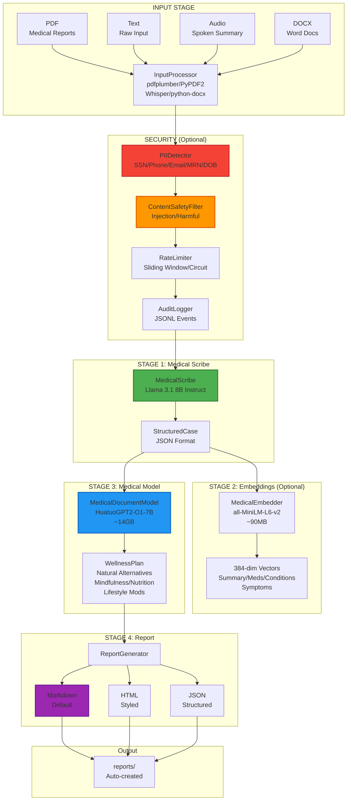
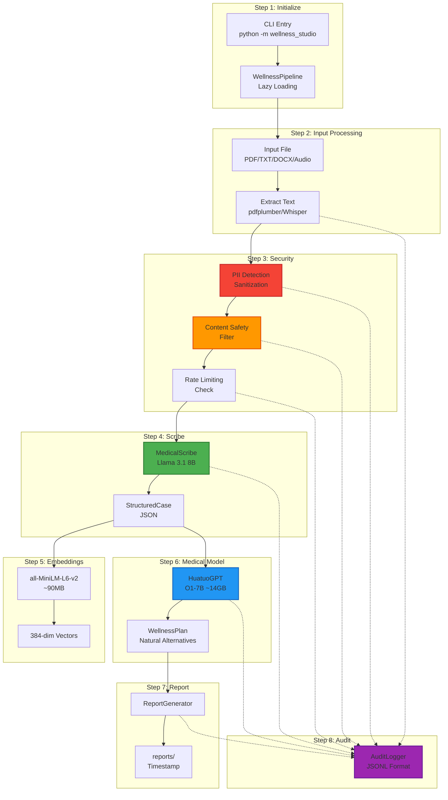

# Wellness Studio Architecture Visualizations

## 📊 5-Stage Pipeline Overview

### ASCII Diagram

```
╔═══════════════════════════════════════════════════════════════════════════╗
║                      WELLNESS STUDIO ARCHITECTURE                          ║
║            (HuggingFace-Centric Health & Wellness System)                  ║
║                    Security-First Design • HIPAA-Ready                     ║
╚═══════════════════════════════════════════════════════════════════════════╝

┌─────────────────────────────────────────────────────────────────────────┐
│ INPUT STAGE                                                              │
│ ┌──────────────────────────────────────────────────────────────────────┐│
│ │ Multi-Format Input Processing                                       ││
│ │                                                                      ││
│ │  ┌───────────┐  ┌───────────┐  ┌───────────┐  ┌───────────┐        ││
│ │  │   PDF     │  │   Text    │  │   Audio   │  │   DOCX    │        ││
│ │  │           │  │           │  │           │  │           │        ││
│ │  │• Medical  │  │• Raw text │  │• Spoken  │  │• Word     │        ││
│ │  │  reports  │  │• Input    │  │  summaries│  │  documents│        ││
│ │  │• Scripts  │  │• Strings  │  │• Prescrip.│  │• Reports  │        ││
│ │  │• Lab res  │  │           │  │• Narrative│  │           │        ││
│ │  └─────┬─────┘  └─────┬─────┘  └─────┬─────┘  └─────┬─────┘        ││
│ │        │              │              │              │              ││
│ │        └──────────────┴──────────────┴──────────────┘              ││
│ │                       │                                            ││
│ │                       ▼                                            ││
│ │           InputProcessor.process_input()                           ││
│ │                       │                                            ││
│ │              ┌────────┴────────┐                                   ││
│ │              │  pdfplumber     │ PDF extraction                     ││
│ │              │  PyPDF2         │ Alternative PDF                    ││
│ │              │  Whisper        │ Audio transcription                ││
│ │              │  python-docx    │ Word documents                     ││
│ │              └─────────────────┘                                   ││
│ │                       │                                            ││
│ │                       ▼                                            ││
│ │              Raw Text + Metadata                                   ││
│ └──────────────────────────────────────────────────────────────────────┘│
└─────────────────────────────────────────────────────────────────────────┘
                                   │
                                   ▼
┌─────────────────────────────────────────────────────────────────────────┐
│ SECURITY CHECK STAGE (Optional but Recommended)                         │
│ ┌──────────────────────────────────────────────────────────────────────┐│
│ │ Comprehensive Security Guardrails                                   ││
│ │                                                                      ││
│ │  ┌───────────────────────────────────────────────────────────────┐  ││
│ │  │ PII/PHI Detection & Sanitization                              │  ││
│ │  │ • PIIDetector.detect_pii()                                    │  ││
│ │  │ • Detects: SSN, Phone, Email, MRN, DOB, Names, Addresses      │  ││
│ │  │ • Sanitization modes: hash / mask / remove                    │  ││
│ │  └───────────────────────────────────────────────────────────────┘  ││
│ │                              │                                       ││
│ │                              ▼                                       ││
│ │  ┌───────────────────────────────────────────────────────────────┐  ││
│ │  │ Content Safety Filter                                         │  ││
│ │  │ • Block prompt injection                                      │  ││
│ │  │ • Detect harmful/inappropriate content                        │  ││
│ │  │ • Flag medical misinformation                                 │  ││
│ │  └───────────────────────────────────────────────────────────────┘  ││
│ │                              │                                       ││
│ │                              ▼                                       ││
│ │  ┌───────────────────────────────────────────────────────────────┐  ││
│ │  │ Rate Limiting                                                 │  ││
│ │  │ • Sliding window                                              │  ││
│ │  │ • Token bucket                                                │  ││
│ │  │ • Circuit breaker                                             │  ││
│ │  └───────────────────────────────────────────────────────────────┘  ││
│ │                              │                                       ││
│ │                              ▼                                       ││
│ │  ┌───────────────────────────────────────────────────────────────┐  ││
│ │  │ Audit Logging                                                 │  ││
│ │  │ • All operations logged                                       │  ││
│ │  │ • Immutable JSONL format                                      │  ││
│ │  │ • 9 event types tracked                                       │  ││
│ │  └───────────────────────────────────────────────────────────────┘  ││
│ └──────────────────────────────────────────────────────────────────────┘│
└─────────────────────────────────────────────────────────────────────────┘
                                   │
                                   ▼
┌─────────────────────────────────────────────────────────────────────────┐
│ STAGE 1: MEDICAL SCRIBE                                                  │
│ ┌──────────────────────────────────────────────────────────────────────┐│
│ │ Llama 3.1 8B Instruct                                                ││
│ │                                                                      ││
│ │  Raw Unstructured Text → Structured JSON (StructuredCase)           ││
│ │                                                                      ││
│ │  Input:                                                              ││
│ │  "Patient John Smith has high blood pressure, prescribed 5mg       ││
│ │   Amlodipine, also takes Metformin for diabetes, experiencing       ││
│ │   headaches and fatigue..."                                          ││
│ │                                                                      ││
│ │  Output:                                                             ││
│ │  {                                                                   ││
│ │    "patient_summary": "58yo male with hypertension and Type 2 DM", ││
│ │    "current_medications": [                                         ││
│ │      {"name": "Amlodipine", "dosage": "5mg", "frequency": "daily"},  ││
│ │      {"name": "Metformin", "dosage": "500mg", "frequency": "twice daily"}││
│ │    ],                                                                ││
│ │    "conditions": ["Hypertension", "Type 2 Diabetes"],               ││
│ │    "symptoms": ["Headaches", "Fatigue"],                            ││
│ │    "treatment_history": "Recently started Amlodipine...",           ││
│ │    "goals": "Better BP control, reduce medication side effects"     ││
│ │  }                                                                   ││
│ │                                                                      ││
│ │  Lazy Loading: Models downloaded on first use, cached in models/    ││
│ └──────────────────────────────────────────────────────────────────────┘│
└─────────────────────────────────────────────────────────────────────────┘
                                   │
                                   ▼
┌─────────────────────────────────────────────────────────────────────────┐
│ STAGE 2: EMBEDDINGS (Optional)                                          │
│ ┌──────────────────────────────────────────────────────────────────────┐│
│ │ sentence-transformers/all-MiniLM-L6-v2                               ││
│ │                                                                      ││
│ │  StructuredCase → Vector Embeddings                                 ││
│ │                                                                      ││
│ │  ┌───────────────────────────────────────────────────────────────┐  ││
│ │  │ Embeddings for:                                               │  ││
│ │  │ • patient_summary        → 384-dim vector                    │  ││
│ │  │ • medications (combined) → 384-dim vector                    │  ││
│ │  │ • conditions             → 384-dim vector                    │  ││
│ │  │ • symptoms               → 384-dim vector                    │  ││
│ │  └───────────────────────────────────────────────────────────────┘  ││
│ │                                                                      ││
│ │  Size: ~90MB • Can skip with --skip-embeddings flag                 ││
│ └──────────────────────────────────────────────────────────────────────┘│
└─────────────────────────────────────────────────────────────────────────┘
                                   │
                                   ▼
┌─────────────────────────────────────────────────────────────────────────┐
│ STAGE 3: MEDICAL MODEL ANALYSIS                                          │
│ ┌──────────────────────────────────────────────────────────────────────┐│
│ │ HuatuoGPT2-O1-7B                                                      ││
│ │                                                                      ││
│ │  StructuredCase → WellnessPlan (Natural Alternatives)               ││
│ │                                                                      ││
│ │  Input: Patient context (conditions, medications, symptoms)         ││
│ │                                                                      ││
│ │  Output (WellnessPlan):                                              ││
│ │  {                                                                   ││
│ │    "natural_alternatives": [                                         ││
│ │      {                                                               ││
│ │        "for_condition": "Hypertension",                             ││
│ │        "suggestion": "Hibiscus tea",                                ││
│ │        "evidence_level": "High",                                    ││
│ │        "benefits": ["Lowers BP naturally", "Rich in antioxidants"], ││
│ │        "considerations": ["Avoid with ACE inhibitors"]              ││
│ │      },                                                              ││
│ │      ...                                                             ││
│ │    ],                                                                ││
│ │    "mindfulness_practices": [                                        ││
│ │      "10-min daily breathing meditation",                            ││
│ │      "Progressive muscle relaxation"                                 ││
│ │    ],                                                                ││
│ │    "nutritional_suggestions": [                                      ││
│ │      "DASH diet principles",                                         ││
│ │      "Reduce sodium to <1500mg/day"                                  ││
│ │    ],                                                                ││
│ │    "lifestyle_modifications": [                                      ││
│ │      "30-min brisk walk 5x/week",                                    ││
│ │      "Sleep hygiene optimization"                                    ││
│ │    ]                                                                 ││
│ │  }                                                                   ││
│ │                                                                      ││
│ │  Model: FreedomIntelligence/HuatuoGPT2-O1-7B (Medical-focused LLM)  ││
│ │  Size: ~14GB • Quantization available (8-bit, 4-bit)                ││
│ └──────────────────────────────────────────────────────────────────────┘│
└─────────────────────────────────────────────────────────────────────────┘
                                   │
                                   ▼
┌─────────────────────────────────────────────────────────────────────────┐
│ STAGE 4: REPORT GENERATION                                               │
│ ┌──────────────────────────────────────────────────────────────────────┐│
│ │ ReportGenerator.generate_report()                                    ││
│ │                                                                      ││
│ │  WellnessPlan → Beautiful Report                                    ││
│ │                                                                      ││
│ │  ┌───────────────────────────────────────────────────────────────┐  ││
│ │  │ FORMAT OPTIONS:                                               │  ││
│ │  │                                                               │  ││
│ │  │ 1. MARKDOWN (Default)                                         │  ││
│ │  │    ✓ Beautiful, readable with emojis                          │  ││
│ │  │    ✓ Clear sections: Summary, Alternatives, Practices         │  ││
│ │  │    ✓ Evidence level badges                                    │  ││
│ │  │    ✓ Considerations highlighted                               │  ││
│ │  │                                                               │  ││
│ │  │ 2. HTML                                                       │  ││
│ │  │    ✓ Professional styled layout                               │  ││
│ │  │    ✓ Color-coded sections                                     │  ││
│ │  │    ✓ Print-friendly                                           │  ││
│ │  │    ✓ Mobile responsive                                        │  ││
│ │  │                                                               │  ││
│ │  │ 3. JSON                                                       │  ││
│ │  │    ✓ Structured data for integration                          │  ││
│ │  │    ✓ Machine-readable                                         │  ││
│ │  │    ✓ API-compatible                                           │  ││
│ │  └───────────────────────────────────────────────────────────────┘  ││
│ │                                                                      ││
│ │  Output Directory: reports/ (auto-created)                            ││
│ └──────────────────────────────────────────────────────────────────────┘│
└─────────────────────────────────────────────────────────────────────────┘
```

### Mermaid Diagram



---

## 🔄 Processing Flow

### ASCII Diagram

```
┌─────────────────────────────────────────────────────────────────────────┐
│                      DETAILED PROCESSING FLOW                            │
└─────────────────────────────────────────────────────────────────────────┘

Step 1: Initialize Pipeline
┌─────────────────────────────────────────────────────────────────────────┐
│ python -m wellness_studio input.pdf --patient "John Doe"               │
│                          │                                              │
│                          ▼                                              │
│ WellnessPipeline() created                                              │
│ • device='auto' (cpu/cuda/mps)                                         │
│ • models/ directory checked                                             │
│ • Lazy loading enabled                                                  │
└─────────────────────────────────────────────────────────────────────────┘

Step 2: Process Input File
┌─────────────────────────────────────────────────────────────────────────┐
│ File Extension Check:                                                   │
│      ┌──────────┬──────────┬──────────┬──────────┬──────────┐          │
│      │ .pdf     │ .txt     │ .md      │ .docx    │ .mp3/.wav│          │
│      └────┬─────┴────┬─────┴────┬─────┴────┬─────┴────┬─────┘          │
│           │          │          │          │          │                │
│           ▼          ▼          ▼          ▼          ▼                │
│      pdfplumber   open()    open()   python-docx  Whisper             │
│      or PyPDF2    read()    read()   Document    transcribe           │
│                                                                         │
│ Result: raw_text + metadata (pages, word_count, source_file)           │
└─────────────────────────────────────────────────────────────────────────┘

Step 3: Security Validation (PII/PHI)
┌─────────────────────────────────────────────────────────────────────────┐
│ PIIDetector.detect_pii(raw_text)                                        │
│                                                                         │
│ ┌─────────────────────────────────────────────────────────────────────┐│
│ │ Detected Entities:                                                  ││
│ │ • SSN: 123-45-6789                    → [XXX-XX-XXXX]               ││
│ │ • Phone: (555) 123-4567               → [XXX-XXX-XXXX]              ││
│ │ • Email: john@email.com               → [EMAIL]                     ││
│ │ • MRN: 123456789                      → [MRN]                       ││
│ │ • DOB: 01/15/1965                     → [DOB]                       ││
│ │ • Names: John Smith                   → [NAME]                      ││
│ │ • Addresses: 123 Main St...           → [ADDRESS]                   ││
│ └─────────────────────────────────────────────────────────────────────┘│
│                                                                         │
│ Sanitization Mode (configurable):                                       │
│ • hash:    Replace with hash (irreversible)                            │
│ • mask:    Replace with placeholders [SSN], [PHONE], etc.              │
│ • remove:  Delete PII entirely                                         │
│                                                                         │
│ Audit Log: log_pii_detection() → JSONL                                  │
└─────────────────────────────────────────────────────────────────────────┘

Step 4: Content Safety Check
┌─────────────────────────────────────────────────────────────────────────┐
│ ContentSafetyFilter.validate_input(sanitized_text)                      │
│                                                                         │
│ ┌─────────────────────────────────────────────────────────────────────┐│
│ │ Violation Checks:                                                   ││
│ │ ❌ Prompt Injection: "Ignore previous instructions..." → BLOCK      ││
│ │ ❌ Harmful Content: Violence, self-harm instructions    → BLOCK     ││
│ │ ❌ Medical Misinfo: Dangerous advice, unverified claims → BLOCK     ││
│ │ ✅ Safe Input: Proceed to next stage                                ││
│ └─────────────────────────────────────────────────────────────────────┘│
│                                                                         │
│ If violations detected:                                                 │
│   Return error with violation details                                   │
│   Log to audit trail                                                    │
└─────────────────────────────────────────────────────────────────────────┘

Step 5: Rate Limiting
┌─────────────────────────────────────────────────────────────────────────┐
│ RateLimiter.check(user_id, operation_type)                              │
│                                                                         │
│ Strategies:                                                             │
│ • Sliding Window: Max N requests per time window                        │
│ • Token Bucket: Burst allowance with steady rate                        │
│ • Circuit Breaker: Fail-fast after threshold                            │
│                                                                         │
│ If limit exceeded:                                                      │
│   Return 429 Too Many Requests                                          │
│   Suggest retry after X seconds                                         │
└─────────────────────────────────────────────────────────────────────────┘

Step 6: Medical Scribe Processing
┌─────────────────────────────────────────────────────────────────────────┐
│ MedicalScribe.scribe(safe_text)                                         │
│                                                                         │
│ Model: meta-llama/Llama-3.1-8B-Instruct                                 │
│ Size: ~16GB VRAM (or CPU, slower)                                       │
│ First run: Download and cache to models/                                │
│                                                                         │
│ Prompt Engineering:                                                     │
│ "Extract structured medical information from the following text..."    │
│                                                                         │
│ Output Validation:                                                      │
│ ✓ JSON parsing check                                                    │
│ ✓ Required fields present                                               │
│ ✓ Data type validation                                                  │
│                                                                         │
│ Result: StructuredCase object                                           │
└─────────────────────────────────────────────────────────────────────────┘

Step 7: Embedding Generation (Optional)
┌─────────────────────────────────────────────────────────────────────────┐
│ MedicalEmbedder.embed_case(structured_case)                             │
│                                                                         │
│ Model: sentence-transformers/all-MiniLM-L6-v2                           │
│ Size: ~90MB                                                             │
│                                                                         │
│ Process:                                                                │
│ 1. Extract text fields from StructuredCase                              │
│ 2. Batch encode with sentence-transformers                              │
│ 3. Return 384-dimensional vectors                                       │
│                                                                         │
│ Use case:                                                               │
│ • Semantic search across patient cases                                  │
│ • Similarity matching for treatment protocols                           │
│ • Skip with --skip-embeddings for faster processing                     │
└─────────────────────────────────────────────────────────────────────────┘

Step 8: Medical Model Analysis
┌─────────────────────────────────────────────────────────────────────────┐
│ MedicalDocumentModel.generate_wellness_plan(structured_case)            │
│                                                                         │
│ Model: FreedomIntelligence/HuatuoGPT2-O1-7B                             │
│ Size: ~14GB VRAM                                                        │
│ First run: Download and cache to models/                                │
│                                                                         │
│ Prompt:                                                                 │
│ "Given the patient's conditions, medications, and symptoms,            │
│  suggest evidence-informed natural wellness alternatives..."            │
│                                                                         │
│ Generation Parameters:                                                  │
│ • Temperature: 0.7 (balanced creativity/coherence)                      │
│ • Max tokens: 2048                                                      │
│ • Top-p: 0.9                                                            │
│                                                                         │
│ Output: WellnessPlan object                                             │
└─────────────────────────────────────────────────────────────────────────┘

Step 9: Report Generation
┌─────────────────────────────────────────────────────────────────────────┐
│ ReportGenerator.generate_report(wellness_plan, format='markdown')       │
│                                                                         │
│ Markdown Template Sections:                                             │
│ ┌─────────────────────────────────────────────────────────────────────┐│
│ │ # Wellness Plan for [Patient]                                       ││
│ │                                                                     ││
│ │ ## Case Summary                                                     ││
│ │ [patient_summary from StructuredCase]                               ││
│ │                                                                     ││
│ │ ## Natural Alternatives 🌿                                          ││
│ │ ### [Condition 1]                                                   ││
│ │ **Suggestion**: [Natural alternative]                               ││
│ │ 🔬 Evidence Level: [High/Medium/Low]                                ││
│ │                                                                     ││
│ │ **Benefits:**                                                       ││
│ │ - [Benefit 1]                                                       ││
│ │ - [Benefit 2]                                                       ││
│ │                                                                     ││
│ │ **Considerations:** ⚠️                                              ││
│ │ - [Consideration 1]                                                 ││
│ │ - [Interaction warning]                                             ││
│ │                                                                     ││
│ │ ## Mindfulness Practices 🧘                                         ││
│ │ - [Practice 1]                                                      ││
│ │ - [Practice 2]                                                      ││
│ │                                                                     ││
│ │ ## Nutritional Suggestions 🥗                                       ││
│ │ - [Suggestion 1]                                                    ││
│ │ - [Suggestion 2]                                                    ││
│ │                                                                     ││
│ │ ## Lifestyle Modifications 🏃                                       ││
│ │ - [Modification 1]                                                  ││
│ │ - [Modification 2]                                                  ││
│ │                                                                     ││
│ │ ## Combined Approach Guidelines                                     ││
│ │ [Integrative recommendations]                                       ││
│ │                                                                     ││
│ │ ---                                                                 ││
│ │ ⚠️ Disclaimer: This is for educational purposes...                  ││
│ └─────────────────────────────────────────────────────────────────────┘│
│                                                                         │
│ Save to: reports/wellness_plan_[timestamp].md                          │
└─────────────────────────────────────────────────────────────────────────┘

Step 10: Audit Logging
┌─────────────────────────────────────────────────────────────────────────┐
│ AuditLogger operations throughout pipeline:                             │
│                                                                         │
│ log_data_input()     → Input file processed                            │
│ log_pii_detection()  → PII entities found and sanitized                │
│ log_model_usage()    → Llama 3.1 / HuatuoGPT invoked                   │
│ log_report_generation() → Output saved                                 │
│                                                                         │
│ Output: logs/audit_[date].jsonl                                         │
│                                                                         │
│ Example Entry:                                                          │
│ {"timestamp": "2026-01-31T10:30:00Z",                                   │
│  "event_type": "model_usage",                                           │
│  "model": "Llama-3.1-8B-Instruct",                                      │
│  "input_hash": "abc123...",                                             │
│  "output_hash": "def456...",                                            │
│  "duration_ms": 2500}                                                   │
└─────────────────────────────────────────────────────────────────────────┘
```

### Mermaid Diagram



---

## 🔐 Security Architecture

```
┌─────────────────────────────────────────────────────────────────────────┐
│                    SECURITY LAYERS (125+ Tests)                          │
├─────────────────────────────────────────────────────────────────────────┤
│                                                                         │
│  LAYER 1: INPUT VALIDATION                                               │
│  ┌─────────────────────────────────────────────────────────────────┐   │
│  │ InputValidator                                                  │   │
│  │ • File type validation (PDF, TXT, DOCX, Audio)                  │   │
│  │ • Size limits enforcement                                       │   │
│  │ • Malware scan integration (optional)                           │   │
│  │ • Path traversal prevention                                     │   │
│  └─────────────────────────────────────────────────────────────────┘   │
│                              ↓                                          │
│  LAYER 2: PII/PHI DETECTION                                              │
│  ┌─────────────────────────────────────────────────────────────────┐   │
│  │ PIIDetector                                                     │   │
│  │                                                                 │   │
│  │ Detected Patterns (32+ tests):                                  │   │
│  │ • Social Security Numbers (SSN)                                 │   │
│  │ • Phone numbers (multiple formats)                              │   │
│  │ • Email addresses                                               │   │
│  │ • Medical Record Numbers (MRN)                                  │   │
│  │ • Dates of Birth (DOB)                                          │   │
│  │ • Names (person entities)                                       │   │
│  │ • Addresses                                                     │   │
│  │ • Credit card numbers                                           │   │
│  │ • Insurance policy numbers                                      │   │
│  │                                                                 │   │
│  │ Sanitization Modes:                                             │   │
│  │ • hash:    One-way hash replacement                             │   │
│  │ • mask:    Placeholder replacement [SSN], [PHONE]               │   │
│  │ • remove:  Complete deletion                                    │   │
│  └─────────────────────────────────────────────────────────────────┘   │
│                              ↓                                          │
│  LAYER 3: AI SAFETY                                                      │
│  ┌─────────────────────────────────────────────────────────────────┐   │
│  │ ContentSafetyFilter                                             │   │
│  │                                                                 │   │
│  │ Violation Categories (25+ tests):                               │   │
│  │ • Prompt injection attempts                                     │   │
│  │ • Harmful content (violence, self-harm)                         │   │
│  │ • Medical misinformation                                        │   │
│  │ • Inappropriate requests                                        │   │
│  │ • Jailbreak attempts                                            │   │
│  │                                                                 │   │
│  │ Response Actions:                                               │   │
│  │ • Block request                                                 │   │
│  │ • Log violation                                                 │   │
│  │ • Alert administrators (configurable)                           │   │
│  └─────────────────────────────────────────────────────────────────┘   │
│                              ↓                                          │
│  LAYER 4: RATE LIMITING                                                  │
│  ┌─────────────────────────────────────────────────────────────────┐   │
│  │ RateLimiter                                                     │   │
│  │                                                                 │   │
│  │ Strategies (15+ tests):                                         │   │
│  │ • Sliding Window: Requests per time window                      │   │
│  │ • Token Bucket: Burst capacity with refill rate                 │   │
│  │ • Circuit Breaker: Fail-fast after threshold                    │   │
│  │                                                                 │   │
│  │ Per-User Tracking:                                              │   │
│  │ • Request counts                                                │   │
│  │ • Time windows                                                  │   │
│  │ • Quota enforcement                                             │   │
│  └─────────────────────────────────────────────────────────────────┘   │
│                              ↓                                          │
│  LAYER 5: AUDIT LOGGING                                                  │
│  ┌─────────────────────────────────────────────────────────────────┐   │
│  │ AuditLogger (20+ tests)                                         │   │
│  │                                                                 │   │
│  │ 9 Event Types:                                                  │   │
│  │ 1. DATA_INPUT       → File processed                            │   │
│  │ 2. PII_DETECTION    → PII found and sanitized                   │   │
│  │ 3. SAFETY_CHECK     → Content validation                        │   │
│  │ 4. RATE_LIMIT       → Rate limit enforced                       │   │
│  │ 5. MODEL_USAGE      → LLM invoked                               │   │
│  │ 6. REPORT_GENERATION → Report created                           │   │
│  │ 7. ERROR            → Error occurred                            │   │
│  │ 8. ACCESS_DENIED    → Security violation                        │   │
│  │ 9. SYSTEM_EVENT     → System operation                          │   │
│  │                                                                 │   │
│  │ Log Format: Immutable JSONL                                     │   │
│  │ Location: logs/audit_[date].jsonl                               │   │
│  │ Retention: Configurable (default: 90 days)                      │   │
│  └─────────────────────────────────────────────────────────────────┘   │
│                              ↓                                          │
│  LAYER 6: CONSENT MANAGEMENT                                             │
│  ┌─────────────────────────────────────────────────────────────────┐   │
│  │ ConsentManager                                                  │   │
│  │ • Track patient consent for processing                          │   │
│  │ • Consent revocation handling                                   │   │
│  │ • Data retention policies                                       │   │
│  └─────────────────────────────────────────────────────────────────┘   │
│                              ↓                                          │
│  LAYER 7: ENCRYPTION                                                     │
│  ┌─────────────────────────────────────────────────────────────────┐   │
│  │ EncryptionUtils                                                 │   │
│  │ • Field-level encryption for sensitive data                     │   │
│  │ • AES-256 encryption standard                                   │   │
│  │ • Key rotation support                                          │   │
│  └─────────────────────────────────────────────────────────────────┘   │
│                              ↓                                          │
│  LAYER 8: CONCURRENCY SAFETY                                             │
│  ┌─────────────────────────────────────────────────────────────────┐   │
│  │ ConcurrencyManager                                              │   │
│  │ • Thread-safe model access                                      │   │
│  │ • Resource pool management                                      │   │
│  │ • Dynamic IO management                                         │   │
│  └─────────────────────────────────────────────────────────────────┘   │
│                                                                         │
│  HIPAA Compliance: 20+ tests                                            │
│  Red Teaming: 15+ tests                                                 │
│  Integration Tests: 10+ tests                                           │
│                                                                         │
│  Total: 157+ security tests passing ✅                                  │
│                                                                         │
└─────────────────────────────────────────────────────────────────────────┘
```

---

## 🏗️ Architecture Patterns

```
┌─────────────────────────────────────────────────────────────────────────┐
│                      ARCHITECTURAL PATTERNS                              │
├─────────────────────────────────────────────────────────────────────────┤
│                                                                         │
│  ✅ Pipeline Pattern        - Sequential 5-stage processing              │
│  ✅ Strategy Pattern        - Multiple sanitization modes                │
│  ✅ Factory Pattern         - Lazy model loading                         │
│  ✅ Builder Pattern         - WellnessPlan construction                  │
│  ✅ Observer Pattern        - Audit logging for all operations           │
│  ✅ Dataclass Pattern       - Structured data containers                 │
│  ✅ Guard Layer Pattern     - Security filters wrap all I/O              │
│  ✅ Repository Pattern      - Local model caching                        │
│  ✅ Dependency Injection    - Device/config dependencies                 │
│                                                                         │
└─────────────────────────────────────────────────────────────────────────┘
```

---

## 📊 Model Specifications

```
┌─────────────────────────────────────────────────────────────────────────┐
│                      HUGGINGFACE MODELS USED                             │
├─────────────────────────────────────────────────────────────────────────┤
│                                                                         │
│  1. MEDICAL SCRIBE                                                       │
│  ┌─────────────────────────────────────────────────────────────────┐   │
│  │ Model: meta-llama/Llama-3.1-8B-Instruct                         │   │
│  │ Purpose: Structure unstructured medical text into JSON          │   │
│  │ Size: ~16GB (FP16)                                              │   │
│  │ VRAM: 16GB+ recommended, CPU fallback available                 │   │
│  │ Quantization: 8-bit (~8GB), 4-bit (~4GB)                        │   │
│  │ License: Llama 3.1 Community License                            │   │
│  │ First Run: Auto-download to models/ (10-30 min)                 │   │
│  └─────────────────────────────────────────────────────────────────┘   │
│                                                                         │
│  2. EMBEDDINGS                                                           │
│  ┌─────────────────────────────────────────────────────────────────┐   │
│  │ Model: sentence-transformers/all-MiniLM-L6-v2                   │   │
│  │ Purpose: Create vector embeddings for semantic search           │   │
│  │ Size: ~90MB                                                     │   │
│  │ Output: 384-dimensional vectors                                 │   │
│  │ License: Apache-2.0                                             │   │
│  │ Optional: Can skip with --skip-embeddings                       │   │
│  └─────────────────────────────────────────────────────────────────┘   │
│                                                                         │
│  3. MEDICAL MODEL                                                        │
│  ┌─────────────────────────────────────────────────────────────────┐   │
│  │ Model: FreedomIntelligence/HuatuoGPT2-O1-7B                     │   │
│  │ Purpose: Generate natural wellness alternatives                 │   │
│  │ Size: ~14GB (FP16)                                              │   │
│  │ VRAM: 14GB+ recommended, CPU fallback available                 │   │
│  │ Quantization: 8-bit (~7GB), 4-bit (~3.5GB)                      │   │
│  │ License: Apache-2.0                                             │   │
│  │ Specialty: Medical domain fine-tuning                           │   │
│  │ First Run: Auto-download to models/ (10-30 min)                 │   │
│  └─────────────────────────────────────────────────────────────────┘   │
│                                                                         │
│  4. AUDIO (Optional)                                                     │
│  ┌─────────────────────────────────────────────────────────────────┐   │
│  │ Model: openai-whisper (various sizes)                           │   │
│  │ Purpose: Transcribe audio input                                 │   │
│  │ Size: tiny (~39MB) to large (~1.5GB)                            │   │
│  │ Install: pip install openai-whisper                             │   │
│  │ Optional: Only required for audio input                         │   │
│  └─────────────────────────────────────────────────────────────────┘   │
│                                                                         │
└─────────────────────────────────────────────────────────────────────────┘
```

---

## 🎯 Usage Examples

```
┌─────────────────────────────────────────────────────────────────────────┐
│                      COMMAND LINE USAGE                                  │
├─────────────────────────────────────────────────────────────────────────┤
│                                                                         │
│  # Process a prescription PDF                                            │
│  python -m wellness_studio prescription.pdf --patient "John Doe"        │
│                                                                         │
│  # Process raw text                                                      │
│  python -m wellness_studio -t "Patient takes Xanax for anxiety..."      │
│                                                                         │
│  # Generate HTML report                                                  │
│  python -m wellness_studio report.pdf --format html                     │
│                                                                         │
│  # Skip embeddings for faster processing                                 │
│  python -m wellness_studio input.txt --skip-embeddings                  │
│                                                                         │
│  # Show model information                                                │
│  python -m wellness_studio --models                                     │
│                                                                         │
└─────────────────────────────────────────────────────────────────────────┘

┌─────────────────────────────────────────────────────────────────────────┐
│                      PYTHON API USAGE                                    │
├─────────────────────────────────────────────────────────────────────────┤
│                                                                         │
│  # Method 1: Simple function                                             │
│  from wellness_studio import run_pipeline                               │
│                                                                         │
│  result = run_pipeline(                                                  │
│      text="Patient has anxiety and takes lorazepam daily...",           │
│      patient="John Doe"                                                  │
│  )                                                                       │
│  print(f"Report: {result.report_path}")                                  │
│                                                                         │
│  # Method 2: Full pipeline control                                       │
│  from wellness_studio import WellnessPipeline                           │
│                                                                         │
│  pipeline = WellnessPipeline(device='cuda')                              │
│                                                                         │
│  result = pipeline.process(                                              │
│      input_path="medical_report.pdf",                                    │
│      patient_name="Jane Smith",                                          │
│      case_type="prescription",                                           │
│      output_format="html",                                               │
│      save_embeddings=True                                                │
│  )                                                                       │
│                                                                         │
│  if result.success:                                                      │
│      print(f"✅ Generated in {result.processing_time:.2f}s")              │
│      print(f"📄 Report: {result.report_path}")                            │
│                                                                         │
└─────────────────────────────────────────────────────────────────────────┘
```

---

## 📈 System Requirements

```
┌─────────────────────────────────────────────────────────────────────────┐
│                      HARDWARE REQUIREMENTS                               │
├─────────────────────────────────────────────────────────────────────────┤
│                                                                         │
│  MINIMUM:                                                                │
│  • 8GB RAM                                                              │
│  • CPU-only mode                                                        │
│  • 20GB disk space                                                      │
│  • Python 3.13+                                                         │
│                                                                         │
│  RECOMMENDED:                                                            │
│  • 16GB+ RAM                                                            │
│  • NVIDIA GPU with 8GB+ VRAM                                            │
│  • 50GB disk space                                                      │
│  • SSD storage                                                          │
│                                                                         │
│  OPTIMAL:                                                                │
│  • 32GB+ RAM                                                            │
│  • NVIDIA GPU with 16GB+ VRAM (e.g., RTX 4090)                          │
│  • 100GB disk space                                                     │
│  • NVMe SSD                                                             │
│                                                                         │
│  CPU MODE NOTES:                                                         │
│  • Fully functional but slower                                          │
│  • Initial model download: 10-30 min                                    │
│  • Processing time: 2-5x longer than GPU                                │
│  • Use --device cpu flag                                                │
│                                                                         │
└─────────────────────────────────────────────────────────────────────────┘
```

---

**Version**: 1.0.0  
**Status**: Production Ready ✅  
**Security**: 157+ tests passing  
**Privacy**: Offline-only operation  
**Framework**: HuggingFace Transformers  
**License**: MIT
