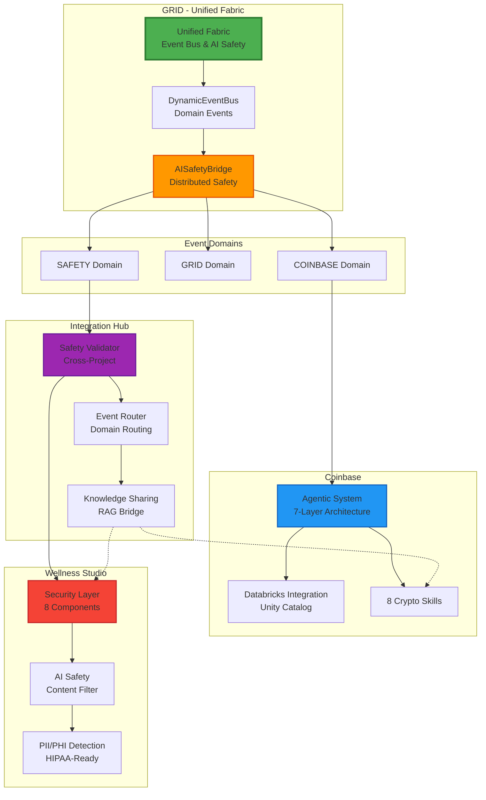
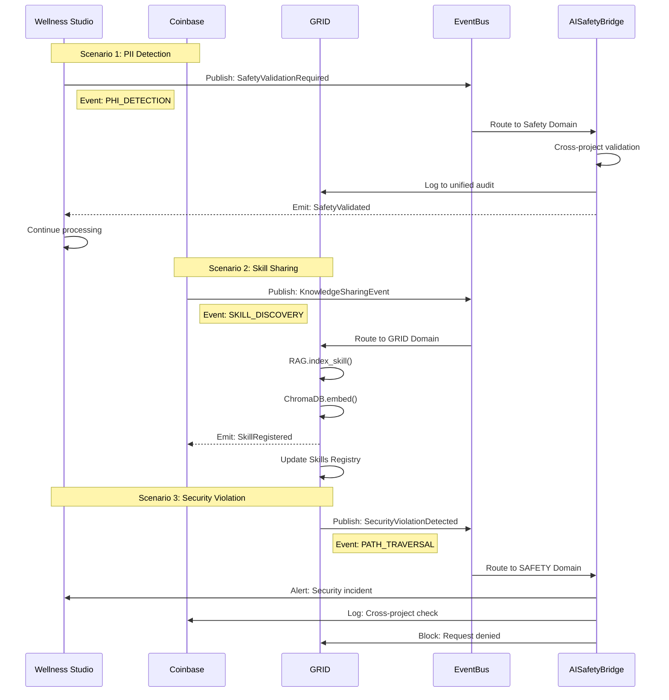

# Cross-Project Integration Architecture
## 🌐 System Integration Map
### ASCII Diagram
```
╔═══════════════════════════════════════════════════════════════════════════╗
║                     CROSS-PROJECT INTEGRATION ARCHITECTURE                 ║
║                        GRID ↔ Coinbase ↔ Wellness Studio                   ║
╚═══════════════════════════════════════════════════════════════════════════╝
┌─────────────────────────────────────────────────────────────────────────┐
│                        INTEGRATION LANDSCAPE                             │
├─────────────────────────────────────────────────────────────────────────┤
│                                                                         │
│    ┌─────────────────────────────────────────────────────────────────┐  │
│    │                          GRID                                   │  │
│    │                    (E:\grid)                                    │  │
│    │                                                                  │  │
│    │  ┌──────────────────────────────────────────────────────────┐  │  │
│    │  │                   UNIFIED FABRIC                          │  │  │
│    │  │                                                           │  │  │
│    │  │   ┌─────────────────────────────────────────────────────┐ │  │  │
│    │  │   │              DynamicEventBus                        │ │  │  │
│    │  │   │     Async pub/sub event distribution                │ │  │  │
│    │  │   │     • Event Domains: SAFETY, GRID, COINBASE         │ │  │  │
│    │  │   │     • Request-Reply pattern support                 │ │  │  │
│    │  │   │     • Distributed AI safety bridge                  │ │  │  │
│    │  │   └─────────────────────────────────────────────────────┘ │  │  │
│    │  │                           │                             │  │  │
│    │  │                           ▼                             │  │  │
│    │  │   ┌─────────────────────────────────────────────────────┐ │  │  │
│    │  │   │              AISafetyBridge                         │ │  │  │
│    │  │   │     Distributed safety validation                  │ │  │  │
│    │  │   │     • Cross-project security checks                 │ │  │  │
│    │  │   │     • Safety event propagation                      │ │  │  │
│    │  │   │     • Integration validation                        │ │  │  │
│    │  │   └─────────────────────────────────────────────────────┘ │  │  │
│    │  └──────────────────────────────────────────────────────────┘  │  │
│    │                                                                  │  │
│    │  ┌───────────┐ ┌───────────┐ ┌───────────┐ ┌───────────┐       │  │
│    │  │ Agentic   │ │ RAG       │ │ Cognitive │ │ 9         │       │  │
│    │  │ System    │ │ Engine    │ │ Layer     │ │ Patterns  │       │  │
│    │  └───────────┘ └───────────┘ └───────────┘ └───────────┘       │  │
│    │                                                                  │  │
│    └─────────────────────────────────────────────────────────────────┘  │
│                                    │                                     │
│                                    │ Event Bus                            │
│            ┌───────────────────────┼───────────────────────┐             │
│            │                       │                       │             │
│            │                       ▼                       │             │
│            │    ┌──────────────────────────────────┐      │             │
│            │    │      SAFETY DOMAIN EVENTS        │      │             │
│            │    │                                  │      │             │
│            │    │  • SafetyValidationRequired      │      │             │
│            │    │  • SecurityViolationDetected     │      │             │
│            │    │  • CrossProjectValidation        │      │             │
│            │    │  • AuditLogReplication           │      │             │
│            │    └──────────────────────────────────┘      │             │
│            │                       │                       │             │
│            ▼                       ▼                       ▼             │
│    ┌─────────────────┐    ┌─────────────────┐    ┌─────────────────┐    │
│    │    COINBASE     │    │  INTEGRATION    │    │  WELLNESS       │    │
│    │   (E:\coinbase) │    │    HUB          │    │    STUDIO       │    │
│    │                 │    │                 │    │                 │    │
│    │ ┌─────────────┐ │    │ ┌─────────────┐ │    │ ┌─────────────┐ │    │
│    │ │ Agentic     │ │◄──►│ │ Safety      │ │◄──►│ │ Security    │ │    │
│    │ │ System      │ │    │ │ Validator   │ │    │ │ Layer       │ │    │
│    │ └─────────────┘ │    │ └─────────────┘ │    │ └─────────────┘ │    │
│    │       │         │    │       │         │    │       │         │    │
│    │ ┌─────────────┐ │    │ ┌─────────────┐ │    │ ┌─────────────┐ │    │
│    │ │ Databricks  │ │    │ │ Event       │ │    │ │ AI Safety   │ │    │
│    │ │ Integration │ │    │ │ Router      │ │    │ │ Bridge      │ │    │
│    │ └─────────────┘ │    │ └─────────────┘ │    │ └─────────────┘ │    │
│    │       │         │    │       │         │    │       │         │    │
│    │ ┌─────────────┐ │    │ ┌─────────────┐ │    │ ┌─────────────┐ │    │
│    │ │ Crypto      │ │    │ │ Knowledge   │ │    │ │ PII/PHI     │ │    │
│    │ │ Skills      │ │    │ │ Sharing     │ │    │ │ Detection   │ │    │
│    │ └─────────────┘ │    │ └─────────────┘ │    │ └─────────────┘ │    │
│    │                 │    │                 │    │                 │    │
│    └─────────────────┘    └─────────────────┘    └─────────────────┘    │
│                                                                         │
└─────────────────────────────────────────────────────────────────────────┘
```
### Mermaid Diagram

---
## 🔄 Event Flow Between Projects
### ASCII Diagram
```
┌─────────────────────────────────────────────────────────────────────────┐
│                    CROSS-PROJECT EVENT FLOW                              │
└─────────────────────────────────────────────────────────────────────────┘
Scenario 1: Wellness Studio → GRID Safety Validation
┌─────────────────────────────────────────────────────────────────────────┐
│                                                                         │
│  [Wellness Studio]              [GRID Unified Fabric]                  │
│  ┌───────────────┐              ┌──────────────────────────────┐       │
│  │ PII Detected  │─────────────►│ SafetyValidationRequired     │       │
│  │ in patient    │   Event      │ Event                        │       │
│  │ data          │─────────────►│                              │       │
│  └───────────────┘              │ • Event Type: SAFETY         │       │
│                                 │ • Domain: PHI_DETECTION      │       │
│                                 │ • Source: wellness_studio    │       │
│                                 │ • Payload: {                 │       │
│                                 │     patient_id: "hash123",   │       │
│                                 │     pii_types: ["SSN", "DOB"]│       │
│                                 │   }                          │       │
│                                 └──────────────┬───────────────┘       │
│                                                │                       │
│                                                ▼                       │
│                                 ┌──────────────────────────────┐       │
│                                 │ AISafetyBridge.validate()    │       │
│                                 │                              │       │
│                                 │ • Check cross-project rules  │       │
│                                 │ • Validate safety policies   │       │
│                                 │ • Log to unified audit       │       │
│                                 └──────────────┬───────────────┘       │
│                                                │                       │
│                                                ▼                       │
│                                 ┌──────────────────────────────┐       │
│                                 │ Emit: SafetyValidated        │       │
│                                 │ (Confirmation)               │       │
│                                 └──────────────┬───────────────┘       │
│                                                │                       │
│                                                ▼                       │
│                                 [Wellness Studio]                      │
│                                 ┌──────────────────────────────┐       │
│                                 │ Continue processing with     │       │
│                                 │ validation confirmation      │       │
│                                 └──────────────────────────────┘       │
│                                                                         │
└─────────────────────────────────────────────────────────────────────────┘
Scenario 2: Coinbase → GRID Knowledge Sharing
┌─────────────────────────────────────────────────────────────────────────┐
│                                                                         │
│  [Coinbase]                     [GRID Unified Fabric]                  │
│  ┌───────────────┐              ┌──────────────────────────────┐       │
│  │ New Skill     │─────────────►│ KnowledgeSharingEvent        │       │
│  │ Generated     │   Event      │                              │       │
│  │ from portfolio│─────────────►│ • Event Type: GRID           │       │
│  │ analysis      │              │ • Domain: SKILL_DISCOVERY    │       │
│  │               │              │ • Source: coinbase           │       │
│  └───────────────┘              │ • Payload: {                 │       │
│                                 │     skill_name: "portfolio_  │       │
│                                 │       risk_assessment",      │       │
│                                 │     capability: "analyzes    │       │
│                                 │       crypto portfolio risk",│       │
│                                 │     patterns: [...]          │       │
│                                 │   }                          │       │
│                                 └──────────────┬───────────────┘       │
│                                                │                       │
│                                                ▼                       │
│                                 ┌──────────────────────────────┐       │
│                                 │ RAG System                   │       │
│                                 │                              │       │
│                                 │ • Index skill documentation  │       │
│                                 │ • Embed in ChromaDB          │       │
│                                 │ • Make available for query   │       │
│                                 └──────────────┬───────────────┘       │
│                                                │                       │
│                                                ▼                       │
│                                 [GRID Skills Registry]                 │
│                                 ┌──────────────────────────────┐       │
│                                 │ Register skill for future    │       │
│                                 │ cross-project use            │       │
│                                 └──────────────────────────────┘       │
│                                                                         │
└─────────────────────────────────────────────────────────────────────────┘
Scenario 3: GRID → Coinbase Security Event
┌─────────────────────────────────────────────────────────────────────────┐
│                                                                         │
│  [GRID]                         [GRID Unified Fabric]                  │
│  ┌───────────────┐              ┌──────────────────────────────┐       │
│  │ Security      │─────────────►│ SecurityViolationDetected    │       │
│  │ Violation     │   Event      │ Event                        │       │
│  │ (Path         │─────────────►│                              │       │
│  │  Traversal)   │              │ • Event Type: SAFETY         │       │
│  └───────────────┘              │ • Domain: SECURITY_VIOLATION │       │
│                                 │ • Source: grid               │       │
│                                 │ • Severity: HIGH             │       │
│                                 │ • Payload: {                 │       │
│                                 │     violation_type:          │       │
│                                 │       "path_traversal",      │       │
│                                 │     attempted_path: "../../  │       │
│                                 │       etc/passwd"            │       │
│                                 │   }                          │       │
│                                 └──────────────┬───────────────┘       │
│                                                │                       │
│                            ┌───────────────────┼───────────────────┐   │
│                            │                   │                   │   │
│                            ▼                   ▼                   ▼   │
│                   [GRID]                    [Coinbase]          [Wellness]│
│                   ┌───────────┐             ┌───────────┐       ┌───────────┐
│                   │ Block     │             │ Audit Log │       │ Alert     │
│                   │ Request   │             │ & Check   │       │ Admin     │
│                   └───────────┘             └───────────┘       └───────────┘
│                                                                             │
│                   Cross-project security awareness                          │
└─────────────────────────────────────────────────────────────────────────────┘
Scenario 4: Wellness Studio Audit → GRID Event Store
┌─────────────────────────────────────────────────────────────────────────┐
│                                                                         │
│  [Wellness Studio]              [GRID Unified Fabric]                  │
│  ┌───────────────┐              ┌──────────────────────────────┐       │
│  │ Audit Log     │─────────────►│ AuditLogReplicationEvent     │       │
│  │ Entry Created │   Event      │                              │       │
│  │ (HIPAA event) │─────────────►│ • Event Type: SAFETY         │       │
│  └───────────────┘              │ • Domain: AUDIT_COMPLIANCE   │       │
│                                 │ • Source: wellness_studio    │       │
│                                 │ • Payload: {                 │       │
│                                 │     event_type: "pii_detect",│       │
│                                 │     timestamp: "...",        │       │
│                                 │     severity: "INFO",        │       │
│                                 │     hash: "sha256:abc..."    │       │
│                                 │   }                          │       │
│                                 └──────────────┬───────────────┘       │
│                                                │                       │
│                                                ▼                       │
│                                 ┌──────────────────────────────┐       │
│                                 │ Event Store                  │       │
│                                 │ (PostgreSQL)                 │       │
│                                 │                              │       │
│                                 │ • Append-only log            │       │
│                                 │ • Immutable records          │       │
│                                 │ • Cross-project audit trail  │       │
│                                 └──────────────────────────────┘       │
│                                                                         │
│  Note: Audit events replicated for centralized compliance monitoring   │
│                                                                         │
└─────────────────────────────────────────────────────────────────────────┘
```
### Mermaid Sequence Diagram

---
## 🏗️ Integration Architecture Components
```
┌─────────────────────────────────────────────────────────────────────────┐
│                    INTEGRATION ARCHITECTURE                              │
├─────────────────────────────────────────────────────────────────────────┤
│                                                                         │
│  GRID'S UNIFIED FABRIC (E:\grid\src\unified_fabric\)                    │
│  ┌────────────────────────────────────────────────────────────────────┐ │
│  │                                                                    │ │
│  │  DYNAMIC EVENT BUS                                                 │ │
│  │  ┌──────────────────────────────────────────────────────────────┐ │ │
│  │  │ • Async pub/sub event distribution                            │ │ │
│  │  │ • Domain-based routing (SAFETY, GRID, COINBASE)               │ │ │
│  │  │ • Request-reply pattern for synchronous needs                 │ │ │
│  │  │ • Event persistence and replay capability                     │ │ │
│  │  │ • Handler registration and lifecycle management               │ │ │
│  │  └──────────────────────────────────────────────────────────────┘ │ │
│  │                                                                    │ │
│  │  AI SAFETY BRIDGE                                                  │ │
│  │  ┌──────────────────────────────────────────────────────────────┐ │ │
│  │  │ • Distributed safety validation                               │ │ │
│  │  │ • Cross-project security policy enforcement                   │ │ │
│  │  │ • Safety event propagation to all connected projects          │ │ │
│  │  │ • Integration validation and verification                     │ │ │
│  │  │ • Wellness Studio → GRID safety event forwarding              │ │ │
│  │  └──────────────────────────────────────────────────────────────┘ │ │
│  │                                                                    │ │
│  │  EVENT DOMAINS                                                     │ │
│  │  ┌──────────────────────────────────────────────────────────────┐ │ │
│  │  │ SAFETY Domain:                                                │ │ │
│  │  │   • SafetyValidationRequired                                  │ │ │
│  │  │   • SafetyValidated                                           │ │ │
│  │  │   • SecurityViolationDetected                                 │ │ │
│  │  │   • AuditLogReplication                                       │ │ │
│  │  │   • CrossProjectValidation                                    │ │ │
│  │  │                                                               │ │ │
│  │  │ GRID Domain:                                                  │ │ │
│  │  │   • CaseCreated, CaseExecuted, CaseCompleted                  │ │ │
│  │  │   • PatternDetected                                           │ │ │
│  │  │   • KnowledgeSharingEvent                                     │ │ │
│  │  │   • SkillDiscovered                                           │ │ │
│  │  │                                                               │ │ │
│  │  │ COINBASE Domain:                                              │ │ │
│  │  │   • PortfolioAnalyzed                                         │ │ │
│  │  │   • TradingSignalGenerated                                    │ │ │
│  │  │   • SkillGenerated                                            │ │ │
│  │  └──────────────────────────────────────────────────────────────┘ │ │
│  │                                                                    │ │
│  └────────────────────────────────────────────────────────────────────┘ │
│                                                                         │
│  WELLNESS STUDIO INTEGRATION POINTS                                     │
│  ┌────────────────────────────────────────────────────────────────────┐ │
│  │                                                                    │ │
│  │  AI SAFETY BRIDGE CLIENT                                           │ │
│  │  ┌──────────────────────────────────────────────────────────────┐ │ │
│  │  │ Location: AI SAFETY/PROVIDERS/wellness_studio/                │ │ │
│  │  │                                                               │ │ │
│  │  │ Responsibilities:                                             │ │ │
│  │  │ • Forward PII detection events to GRID                        │ │ │
│  │  │ • Receive safety validation responses                         │ │ │
│  │  │ • Replicate audit logs to unified store                       │ │ │
│  │  │ • Subscribe to security violation alerts                      │ │ │
│  │  └──────────────────────────────────────────────────────────────┘ │ │
│  │                                                                    │ │
│  │  SECURITY MODULE (8 Components)                                    │ │
│  │  ┌──────────────────────────────────────────────────────────────┐ │ │
│  │  │ • PIIDetector → Emit: PHI_DETECTION events                    │ │ │
│  │  │ • ContentSafetyFilter → Emit: SAFETY_VIOLATION events         │ │ │
│  │  │ • AuditLogger → Replicate to GRID Event Store                 │ │ │
│  │  │ • RateLimiter → Emit: THRESHOLD_EXCEEDED events               │ │ │
│  │  │ • InputValidator → Emit: VALIDATION_FAILURE events            │ │ │
│  │  │ • ConsentManager → Emit: CONSENT_CHANGE events                │ │ │
│  │  │ • EncryptionUtils → Key management events                     │ │ │
│  │  │ • ConcurrencyManager → Resource events                        │ │ │
│  │  └──────────────────────────────────────────────────────────────┘ │ │
│  │                                                                    │ │
│  └────────────────────────────────────────────────────────────────────┘ │
│                                                                         │
│  COINBASE INTEGRATION POINTS                                            │
│  ┌────────────────────────────────────────────────────────────────────┐ │
│  │                                                                    │ │
│  │  AGENTIC SYSTEM                                                    │ │
│  │  ┌──────────────────────────────────────────────────────────────┐ │ │
│  │  │ • SkillGenerator → Emit: SKILL_DISCOVERY events               │ │ │
│  │  │ • LearningCoordinator → Share skill patterns with GRID        │ │ │
│  │  │ • EventBus integration with GRID Unified Fabric               │ │ │
│  │  └──────────────────────────────────────────────────────────────┘ │ │
│  │                                                                    │ │
│  │  DATABRICKS CONNECTOR                                              │ │
│  │  ┌──────────────────────────────────────────────────────────────┐ │ │
│  │  │ • Audit events can be replicated to GRID Event Store          │ │ │
│  │  │ • Portfolio data access patterns shared                       │ │ │
│  │  │ • Security events forwarded to GRID safety bridge             │ │ │
│  │  └──────────────────────────────────────────────────────────────┘ │ │
│  │                                                                    │ │
│  │  SECURITY LAYER                                                    │ │
│  │  ┌──────────────────────────────────────────────────────────────┐ │ │
│  │  │ • PortfolioSecurity → Emit encryption/key events              │ │ │
│  │  │ • AISafety → Content validation events                      │ │ │
│  │  │ • AuditLogger → Cross-project audit replication             │ │ │
│  │  └──────────────────────────────────────────────────────────────┘ │ │
│  │                                                                    │ │
│  └────────────────────────────────────────────────────────────────────┘ │
│                                                                         │
└─────────────────────────────────────────────────────────────────────────┘
```
---
## 🔐 Security Integration
```
┌─────────────────────────────────────────────────────────────────────────┐
│                    CROSS-PROJECT SECURITY INTEGRATION                    │
├─────────────────────────────────────────────────────────────────────────┤
│                                                                         │
│  UNIFIED SECURITY EVENTS                                                 │
│  ┌────────────────────────────────────────────────────────────────────┐ │
│  │                                                                    │ │
│  │  Event Type: SecurityViolationDetected                             │ │
│  │  ┌──────────────────────────────────────────────────────────────┐ │ │
│  │  │ Payload:                                                      │ │ │
│  │  │ {                                                             │ │ │
│  │  │   event_id: "uuid",                                           │ │ │
│  │  │   timestamp: "2026-01-31T10:30:00Z",                          │ │ │
│  │  │   source_project: "wellness_studio|coinbase|grid",            │ │ │
│  │  │   severity: "LOW|MEDIUM|HIGH|CRITICAL",                       │ │ │
│  │  │   violation_type: "path_traversal|pii_exposure|injection|     │ │ │
│  │  │                   rate_limit|unauthorized_access",            │ │ │
│  │  │   description: "...",                                         │ │ │
│  │  │   affected_resources: [...],                                  │ │ │
│  │  │   remediation: "..."                                          │ │ │
│  │  │ }                                                             │ │ │
│  │  └──────────────────────────────────────────────────────────────┘ │ │
│  │                                                                    │ │
│  │  Event Type: SafetyValidationRequired                              │ │
│  │  ┌──────────────────────────────────────────────────────────────┐ │ │
│  │  │ Payload:                                                      │ │ │
│  │  │ {                                                             │ │ │
│  │  │   event_id: "uuid",                                           │ │ │
│  │  │   source_project: "wellness_studio",                          │ │ │
│  │  │   validation_type: "pii_check|content_safety|encryption",     │ │ │
│  │  │   data_classification: "PHI|PII|SENSITIVE|PUBLIC",            │ │ │
│  │  │   data_hash: "sha256:...",                                    │ │ │
│  │  │   context: {...}                                              │ │ │
│  │  │ }                                                             │ │ │
│  │  └──────────────────────────────────────────────────────────────┘ │ │
│  │                                                                    │ │
│  │  Event Type: AuditLogReplication                                   │ │
│  │  ┌──────────────────────────────────────────────────────────────┐ │ │
│  │  │ Payload:                                                      │ │ │
│  │  │ {                                                             │ │ │
│  │  │   source_project: "coinbase",                                 │ │ │
│  │  │   audit_event: {                                              │ │ │
│  │  │     event_type: "DATA_ACCESS",                                │ │ │
│  │  │     user_id: "hash",                                          │ │ │
│  │  │     resource: "portfolio_data",                               │ │ │
│  │  │     action: "READ",                                           │ │ │
│  │  │     timestamp: "...",                                         │ │ │
│  │  │     outcome: "SUCCESS"                                        │ │ │
│  │  │   }                                                           │ │ │
│  │  │ }                                                             │ │ │
│  │  └──────────────────────────────────────────────────────────────┘ │ │
│  │                                                                    │ │
│  └────────────────────────────────────────────────────────────────────┘ │
│                                                                         │
│  SECURITY RESPONSE WORKFLOW                                              │
│  ┌────────────────────────────────────────────────────────────────────┐ │
│  │                                                                    │ │
│  │  1. DETECTION                                                      │ │
│  │     Project detects security event (PII, violation, etc.)          │ │
│  │                            │                                       │ │
│  │                            ▼                                       │ │
│  │  2. EVENT PUBLICATION                                              │ │
│  │     Publish SecurityViolationDetected to SAFETY domain             │ │
│  │                            │                                       │ │
│  │                            ▼                                       │ │
│  │  3. GRID BRIDGE VALIDATION                                         │ │
│  │     AISafetyBridge validates against cross-project policies        │ │
│  │                            │                                       │ │
│  │                            ▼                                       │ │
│  │  4. PROPAGATION                                                    │ │
│  │     Event routed to all connected projects                         │ │
│  │                            │                                       │ │
│  │              ┌─────────────┼─────────────┐                         │ │
│  │              │             │             │                         │ │
│  │              ▼             ▼             ▼                         │ │
│  │     ┌────────────┐ ┌────────────┐ ┌────────────┐                   │ │
│  │     │   GRID     │ │  Coinbase  │ │  Wellness  │                   │ │
│  │     │  - Block   │ │  - Log     │ │  - Alert   │                   │ │
│  │     │  - Alert   │ │  - Check   │ │  - Sanitize│                   │ │
│  │     │  - Remedy  │ │  - Notify  │ │  - Log     │                   │ │
│  └────────────┘ └────────────┘ └────────────┘                   │ │
│                                                                    │ │
│  5. UNIFIED AUDIT                                                  │ │
│     All responses logged to GRID Event Store                       │ │
│                                                                    │ │
│  └────────────────────────────────────────────────────────────────────┘ │
│                                                                         │
└─────────────────────────────────────────────────────────────────────────┘
```
---
## 🎯 Integration Patterns
```
┌─────────────────────────────────────────────────────────────────────────┐
│                    INTEGRATION PATTERNS USED                             │
├─────────────────────────────────────────────────────────────────────────┤
│                                                                         │
│  ✅ Event-Driven Architecture                                            │
│     • Async communication between projects                               │
│     • Domain-based event routing                                         │
│     • Loose coupling with high cohesion                                  │
│                                                                         │
│  ✅ Publisher-Subscriber Pattern                                         │
│     • Projects publish events without knowing subscribers                │
│     • Subscribers receive relevant events only                           │
│     • Dynamic subscription management                                    │
│                                                                         │
│  ✅ Request-Reply Pattern                                                │
│     • Synchronous validation requests                                    │
│     • Blocking until response received                                   │
│     • Timeout and retry handling                                         │
│                                                                         │
│  ✅ Bridge Pattern                                                       │
│     • AISafetyBridge abstracts integration complexity                    │
│     • Unified interface for different projects                           │
│     • Protocol translation between systems                               │
│                                                                         │
│  ✅ Observer Pattern                                                     │
│     • EventBus notifies all registered observers                         │
│     • Security events trigger multiple actions                           │
│     • Audit logging across all operations                                │
│                                                                         │
│  ✅ Shared Repository Pattern                                            │
│     • GRID Event Store as unified audit log                              │
│     • Knowledge sharing via RAG system                                   │
│     • Common skill registry for agentic systems                          │
│                                                                         │
│  ✅ Circuit Breaker Pattern                                              │
│     • Fail-fast when integration unavailable                             │
│     • Prevent cascade failures                                           │
│     • Automatic recovery detection                                       │
│                                                                         │
│  ✅ Saga Pattern (Eventual)                                              │
│     • Distributed transaction coordination                               │
│     • Compensation for failed steps                                      │
│     • Event sourcing for audit trail                                     │
│                                                                         │
└─────────────────────────────────────────────────────────────────────────┘
```
---
## 📊 Integration Metrics
```
┌─────────────────────────────────────────────────────────────────────────┐
│                    INTEGRATION METRICS & MONITORING                      │
├─────────────────────────────────────────────────────────────────────────┤
│                                                                         │
│  EVENT THROUGHPUT                                                        │
│  ┌─────────────────────────────────────────────────────────────────┐   │
│  │ • Events per second: Target 1000+                               │   │
│  │ • Event latency: p95 < 100ms                                    │   │
│  │ • Event delivery: 99.9% success rate                            │   │
│  │ • Event ordering: Guaranteed per domain                         │   │
│  └─────────────────────────────────────────────────────────────────┘   │
│                                                                         │
│  SECURITY INTEGRATION                                                    │
│  ┌─────────────────────────────────────────────────────────────────┐   │
│  │ • PII detection events: Real-time                               │   │
│  │ • Safety validation: < 50ms response time                       │   │
│  │ • Security violation propagation: < 200ms                       │   │
│  │ • Cross-project audit replication: Async, < 5s                  │   │
│  └─────────────────────────────────────────────────────────────────┘   │
│                                                                         │
│  KNOWLEDGE SHARING                                                       │
│  ┌─────────────────────────────────────────────────────────────────┐   │
│  │ • Skill discovery events: On-demand                             │   │
│  │ • RAG indexing latency: < 30s per skill                         │   │
│  │ • Knowledge query response: < 500ms                             │   │
│  │ • Vector embedding sync: Background, eventual                   │   │
│  └─────────────────────────────────────────────────────────────────┘   │
│                                                                         │
│  RELIABILITY                                                             │
│  ┌─────────────────────────────────────────────────────────────────┐   │
│  │ • Event bus availability: 99.99% uptime                         │   │
│  │ • AISafetyBridge availability: 99.9% uptime                     │   │
│  │ • Automatic failover: Enabled                                   │   │
│  │ • Event replay capability: 30-day retention                     │   │
│  └─────────────────────────────────────────────────────────────────┘   │
│                                                                         │
└─────────────────────────────────────────────────────────────────────────┘
```
---
## 🔮 Future Integration Roadmap
```
┌─────────────────────────────────────────────────────────────────────────┐
│                    FUTURE INTEGRATION PLANS                              │
├─────────────────────────────────────────────────────────────────────────┤
│                                                                         │
│  PHASE 1: CURRENT (Implemented)                                          │
│  ┌─────────────────────────────────────────────────────────────────┐   │
│  │ ✓ Basic event bus communication                                  │   │
│  │ ✓ Safety event forwarding (wellness_studio → GRID)              │   │
│  │ ✓ Unified audit log aggregation                                  │   │
│  │ ✓ Security violation cross-project alerts                        │   │
│  └─────────────────────────────────────────────────────────────────┘   │
│                                                                         │
│  PHASE 2: SHORT-TERM (Next 3 months)                                     │
│  ┌─────────────────────────────────────────────────────────────────┐   │
│  │ • Skill sharing between Coinbase and GRID RAG system             │   │
│  │ • Wellness Studio audit events in GRID Event Store              │   │
│  │ • Shared rate limiting across projects                           │   │
│  │ • Cross-project PII detection patterns                           │   │
│  │ • Unified authentication/authorization                           │   │
│  └─────────────────────────────────────────────────────────────────┘   │
│                                                                         │
│  PHASE 3: MEDIUM-TERM (6 months)                                         │
│  ┌─────────────────────────────────────────────────────────────────┐   │
│  │ • Distributed tracing across all projects                        │   │
│  │ • Shared cognitive layer (mental models)                         │   │
│  │ • Cross-project agentic case management                          │   │
│  │ • Unified dashboard for all systems                              │   │
│  │ • Automated security response coordination                       │   │
│  └─────────────────────────────────────────────────────────────────┘   │
│                                                                         │
│  PHASE 4: LONG-TERM (12 months)                                          │
│  ┌─────────────────────────────────────────────────────────────────┐   │
│  │ • Full multi-tenant architecture                                   │   │
│  │ • Cross-project machine learning model sharing                   │   │
│  │ • Unified deployment pipeline                                      │   │
│  │ • Edge computing distribution                                      │   │
│  │ • Federated learning across projects                             │   │
│  └─────────────────────────────────────────────────────────────────┘   │
│                                                                         │
└─────────────────────────────────────────────────────────────────────────┘
```
---
**Version**: 1.0.0  
**Status**: Active Integration ✅  
**Primary Hub**: GRID Unified Fabric (E:\grid\src\unified_fabric\)  
**Event Bus**: DynamicEventBus with domain routing  
**Safety Bridge**: AISafetyBridge for cross-project validation  
**Documentation**: See individual project architecture_visuals.md files
