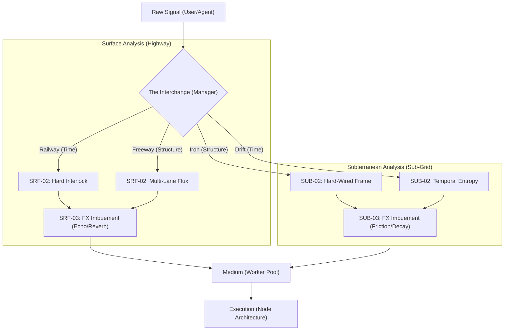

# GRID Distribution: Precise Installation Inventory

## Master Inventory Status
- **Date**: 2026-01-09
- **Domain Count**: 14
- **Status**: Calibrated for Immersive Analysis

This document maps the architectural artifacts of the distribution layer for **Immersive Analysis**. It provides the spatial and logic layout required for a high-fidelity installation.

## I. The Surface Layer (Nervous System)
**Primary Metaphor**: The Highway Interchange.
**Logic Type**: Causal Time + Scalable Structure.

| Artifact ID | Location | Technical Purpose | Immersive Quality |
| :--- | :--- | :--- | :--- |
| **SRF-01** | `grid/distribution/ATMOSPHERE.md` | Philosophical Root | The "Sun-drenched" overview |
| **SRF-02** | `grid/distribution/router.py` | HighwayRouter | Deterministic tracks (Railway) |
| **SRF-03** | `grid/distribution/signal_path.py` | SignalProcessor | Resonance and Echo (Sonic) |
| **SRF-04** | `grid/distribution/manager.py` | Central Interchange | The merge point for all signals |

## II. The Subterranean Layer (Sub-Grid)
**Primary Metaphor**: The Iron Backplane.
**Logic Type**: Immutable Structure + Volatile Time.

| Artifact ID | Location | Technical Purpose | Immersive Quality |
| :--- | :--- | :--- | :--- |
| **SUB-01** | `grid/distribution/ALTERNATE_VIEW.md` | Philosophical Flip | The "Sub-Grid" industrial depth |
| **SUB-02** | `grid/distribution/ghost_router.py` | GhostRouter | The Iron Frame (Hard-wired) |
| **SUB-03** | `grid/distribution/ghost_fx.py` | GhostProcessor | Friction and Drift (Entropy) |

## III. The Transmission Medium (Pavement)
**Component**: `grid/distribution/worker_pool.py`
*   **Infrastructure**: Redis Streams (The Asphalt).
*   **Capacity**: `group_name='grid:worker_group'`
*   **Aura**: Distributed persistence via Consumer Groups.

## IV. Installation Layout (The Signal Path)

## V. Sensory Checklist for Analysis
- [ ] **Sonic**: Verify the decay rate of the **Echoes** (SRF-03).
- [ ] **Thermal**: Monitor the **Friction** signatures of the Subterranean Iron (SUB-03).
- [ ] **Visual**: Map the **Drift Variance** across high-velocity freeway signals (SUB-03).
- [ ] **Kinetic**: Ensure the **Railway Interlock** (SRF-02) prevents causal derailment.
