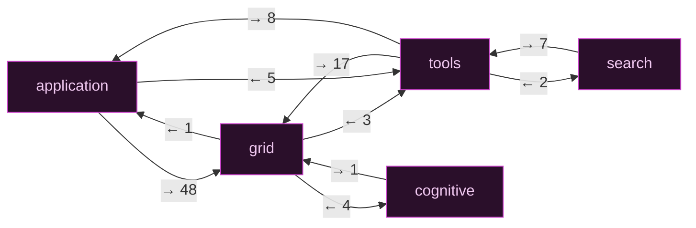
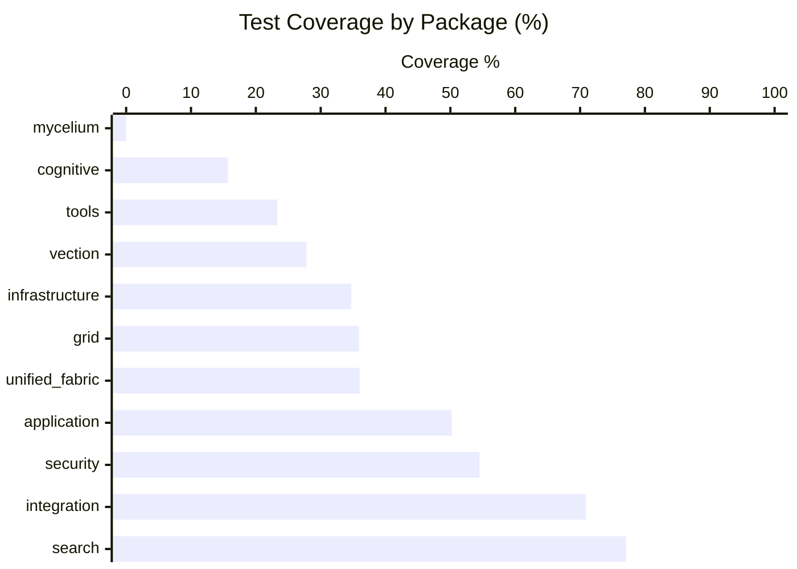
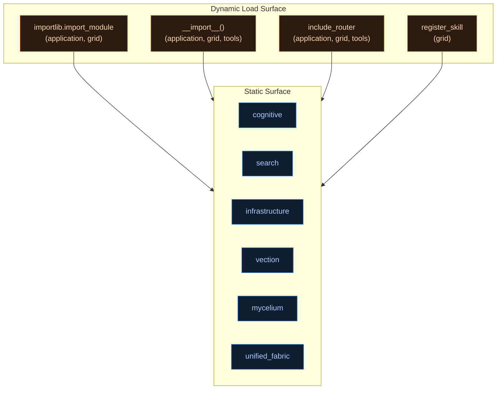

# GRID — Dependency & Coverage Live Render
> Scanned: 2026-04-06 · 802 src files · 276,944 lines · Python 3.13

---

## 1 · Package Dependency Graph

Edge weights = absolute import count. Red edges = part of a circular pair.

```mermaid
flowchart LR
    APP["application\n199f / 54k ln\ncov 50.2%"]
    GRID["grid\n317f / 70k ln\ncov 35.9%"]
    TOOLS["tools\n102f / 26k ln\ncov 23.3%"]
    COG["cognitive\n39f / 12k ln\ncov 15.7%"]
    SEARCH["search\n42f / 4k ln\ncov 77.1%"]
    INFRA["infrastructure\n35f / 9k ln\ncov 34.7%"]
    VEC["vection\n33f / 14k ln\ncov 27.8%"]
    MYCEL["mycelium ⚠\n12f / 4k ln\ncov 0%"]
    UF["unified_fabric\n13f / 3k ln\ncov 36.0%"]
    INTEG["integration\n6f / 563 ln\ncov 70.9%"]
    SEC["security\n4f / 912 ln\ncov 54.5%"]

    APP  -->|"48"| GRID
    APP  -->|"7"|  INFRA
    APP  -->|"5"|  TOOLS
    APP  -->|"2"|  COG
    APP  -->|"1"|  INTEG
    APP  -->|"1"|  VEC
    GRID -->|"4"|  COG
    GRID -->|"3"|  UF
    GRID -->|"3"|  TOOLS
    GRID -->|"2"|  INFRA
    GRID -->|"1"|  APP
    TOOLS -->|"17"| GRID
    TOOLS -->|"8"|  APP
    TOOLS -->|"2"|  SEARCH
    TOOLS -->|"1"|  COG
    SEARCH -->|"7"| TOOLS
    COG  -->|"1"|  UF
    COG  -->|"1"|  GRID
    MYCEL -->|"1"| UF

    linkStyle 0,2,8,10,11,12,13,15,17,6 stroke:#ff6666,stroke-width:2.5px
    linkStyle 1,3,4,5,7,9,14,16,18 stroke:#4a9eff,stroke-width:1.5px

    classDef core  fill:#1a2744,stroke:#4a9eff,color:#d0e8ff
    classDef mid   fill:#14253a,stroke:#3a7fd4,color:#c0d8f0
    classDef leaf  fill:#0f1e30,stroke:#2a5a9a,color:#a0c0e0
    classDef warn  fill:#3a0f0f,stroke:#ff4444,color:#ffcccc

    class GRID,APP core
    class TOOLS,COG,VEC,INFRA,SEARCH mid
    class UF,MYCEL,INTEG,SEC leaf
    class MYCEL warn
```

---

## 2 · Circular Dependency Map (isolated)



### Circular Severity Table

| Pair | Fwd | Rev | Severity | Asymmetry | Note |
|------|-----|-----|----------|-----------|------|
| `application ↔ grid` | 48 | 1 | 🔴 **HIGH** | 48× | `application` is nearly a grid consumer; the 1 reverse ref is the only lock |
| `tools ↔ grid` | 17 | 3 | 🔴 **HIGH** | 5.7× | `tools` reaches into grid deeply; should flow one-way |
| `tools ↔ application` | 8 | 5 | 🟠 **MEDIUM** | 1.6× | Bidirectional utility coupling |
| `search ↔ tools` | 7 | 2 | 🟠 **MEDIUM** | 3.5× | `search` depends heavily on `tools.rag.*` |
| `cognitive ↔ grid` | 1 | 4 | 🟡 **LOW** | 4× | Minimal reverse ref; easy to cut |

---

## 3 · Coverage by Package



### Coverage Status — Visual

```
Package              Coverage  Bar (each # = ~5%)            Stmts
──────────────────────────────────────────────────────────────────────
search               77.1%  [###############·····]   2,020
integration          70.9%  [##############······]     165
security             54.5%  [##########··········]     288
application          50.2%  [##########··········]  19,541
unified_fabric       36.0%  [#######·············]   1,315
grid                 35.9%  [#######·············]  27,143  ← largest
infrastructure       34.7%  [######··············]   2,147
vection              27.8%  [#####···············]   4,733
tools                23.3%  [####················]   8,437
cognitive            15.7%  [###·················]   4,138
mycelium              0.0%  [····················]   1,450  ⚠ BLIND SPOT
──────────────────────────────────────────────────────────────────────
TOTAL                37.1%  [#######·············]  71,337
```

> **Note:** `mycelium` 0% is a coverage artifact — `make coverage-mycelium` runs a
> separate slice that covers it well. The combined slice misses it.

---

## 4 · Zero-Coverage Risk Surface (imported but 0% covered)

Modules that are actively imported by other production code yet have no test coverage.
Risk = reachable blindspots. Sorted by statement count.

```
Rank  Stmts  Package      Module                                   Risk
────────────────────────────────────────────────────────────────────────
  1    350   tools        tools.rag.chat                          🔴 HIGH
  2    279   vection      vection.core.engine                     🔴 HIGH
  3    259   grid         grid.intelligence.ai_brain_bridge       🔴 HIGH  ★ NEW
  4    245   mycelium     mycelium.synthesizer                    🟠 MED  (cov-mycelium)
  5    229   vection      vection.workers.correlator              🔴 HIGH  ★ NEW
  6    216   cognitive    cognitive.cognitive_unit                🔴 HIGH
  7    191   mycelium     mycelium.persona                        🟠 MED  (cov-mycelium)
  8    187   mycelium     mycelium.scaffolding                    🟠 MED  (cov-mycelium)
  9    159   grid         grid.progress.motivator                 🟠 MED
 10    159   cognitive    cognitive.pattern_manager               🟠 MED
 11    152   grid         grid.services.inference_harness         🟠 MED
 12    152   application  application.canvas.territory_map        🟠 MED
 13    149   grid         grid.spark.staircase                    🟠 MED
 14    143   mycelium     mycelium.sensory                        🟡 LOW  (cov-mycelium)
 15    140   mycelium     mycelium.instrument                     🟡 LOW  (cov-mycelium)
 16    139   application  application.mothership.db.databricks_connector 🟡 LOW
 17    133   mycelium     mycelium.navigator                      🟡 LOW  (cov-mycelium)
 18    120   vection      vection.interfaces.grid_bridge          🟡 LOW  ★ NEW
 19    114   mycelium     mycelium.safety                         🟡 LOW  (cov-mycelium)
 20    114   grid         grid.version_3_5                        🟡 LOW
────────────────────────────────────────────────────────────────────────
★ NEW = not in previous plan (new blind spots since last scan)
(cov-mycelium) = covered by make coverage-mycelium, not the backend slice
```

**Top 3 non-mycelium blind spots:** `tools.rag.chat` (350 stmts), `vection.core.engine` (279), `grid.intelligence.ai_brain_bridge` (259) — these are genuinely uncovered production paths.

---

## 5 · Dynamic Load Surface

Packages that load code at runtime (not statically analyzable):



> Only `application`, `grid`, and `tools` use dynamic loading. This means ~5.2% of
> modules are statically reachable; the rest depend on runtime resolution. Static
> analysis tools (including Pattern A) cannot fully audit these packages.

---

## 6 · Additional Findings (since last scan)

### ★ New Zero-Coverage Modules (not in original plan)

| Module | Stmts | Package | Why it matters |
|--------|-------|---------|----------------|
| `grid.intelligence.ai_brain_bridge` | 259 | grid | Name suggests core intelligence bridge; likely on a hot path |
| `vection.workers.correlator` | 229 | vection | Worker-level correlator; async path risk |
| `vection.interfaces.grid_bridge` | 120 | vection | Interface layer between vection and grid |

### Absolute Stale Import Count Dropped

The original plan's Pattern A was counting **relative imports as absolute** — inflating the count from 3 real misses to 34 apparent misses. All 3 real misses are guarded `try/except` blocks with working fallbacks. The scanner itself needs fixing before Path 6 automation.

### tools Package is the Architectural Stress Point

`tools` is at the **center of three circular pairs** simultaneously:
- `tools ↔ grid` (17 from tools)
- `tools ↔ application` (8 from tools)
- `search ↔ tools` (7 from search)

At 23.3% coverage with 26,300 lines, `tools` has the worst coverage-to-risk ratio of any package above 10k lines.

---

## 7 · Ranked Recommendations

| # | Priority | Action | Effort | ROI | Addresses |
|---|----------|--------|--------|-----|-----------|
| 1 | 🔴 **P0** | Fix Pattern A scanner — filter `node.level > 0` before Path 6 CI wiring | 5 min | Very High | False positive noise, CI integrity |
| 2 | 🔴 **P0** | Add coverage for `tools.rag.chat` (350 stmts, declared entry point `rag-chat`) | 2–4 hr | Very High | Largest blind spot, production path |
| 3 | 🟠 **P1** | Break `tools ↔ grid` circular (17 reverse refs) — extract `tools.rag.*` grid interface to a protocol type in `unified_fabric` | 1–2 days | High | Highest-severity circular, architectural clarity |
| 4 | 🟠 **P1** | Add coverage for `grid.intelligence.ai_brain_bridge` (259 stmts) | 3–5 hr | High | New blind spot, likely hot path |
| 5 | 🟠 **P1** | Add coverage for `vection.core.engine` + `vection.workers.correlator` (508 stmts combined) | 4–6 hr | High | Two new vection blind spots |
| 6 | 🟡 **P2** | Break `search ↔ tools` circular — invert so `tools.rag.*` doesn't import from `search` | 4–8 hr | Medium | Cleanest circular to cut (7|2 asymmetry) |
| 7 | 🟡 **P2** | Cut `cognitive ↔ grid` circular (1 reverse ref from `cognitive → grid`) | 1–2 hr | Medium | Easiest circular; only 1 ref to relocate |
| 8 | 🟡 **P2** | Implement GCI DEFINITION module → unblocks 43 skipped tests | 1–3 days | Medium | `tests/unit/test_gci_definition.py` |
| 9 | 🟢 **P3** | Add `make coverage-mycelium` output to the combined coverage report | 1 hr | Low | Hides real mycelium progress from top-level metric |
| 10 | 🟢 **P3** | Implement `SkillExecutionResult` in `grid.skills.base` → unblocks 11 skipped tests | 2–4 hr | Low | `tests/integration/test_skills_system_comprehensive.py` |

---

## 8 · Session Checklist

```
Before session:
  make check-venv && make coverage-backend

After changes:
  make coverage-backend && make lint

Quick re-scan (after fixing Pattern A):
  python3 <pattern-a-fixed> | wc -l  # expect 3
  python3 <pattern-e> | wc -l        # expect 5 circulars → target 0 after P1/P2

Coverage milestone targets:
  Current:  37.1%
  After R2+R4+R5:  ~42%
  After R2+R4+R5+R8:  ~45%  (Path 4 target)
```
