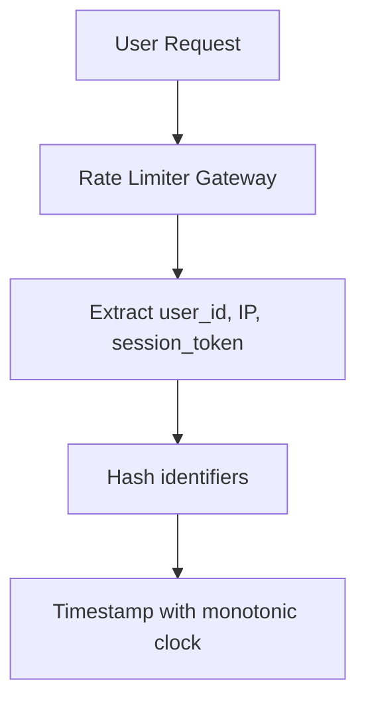
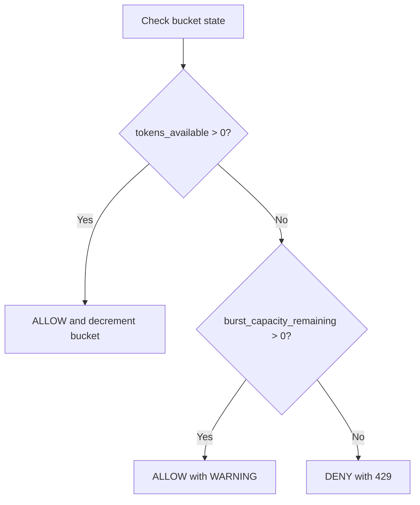
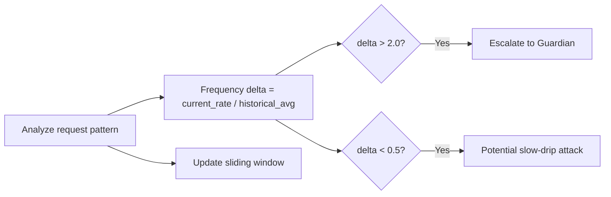
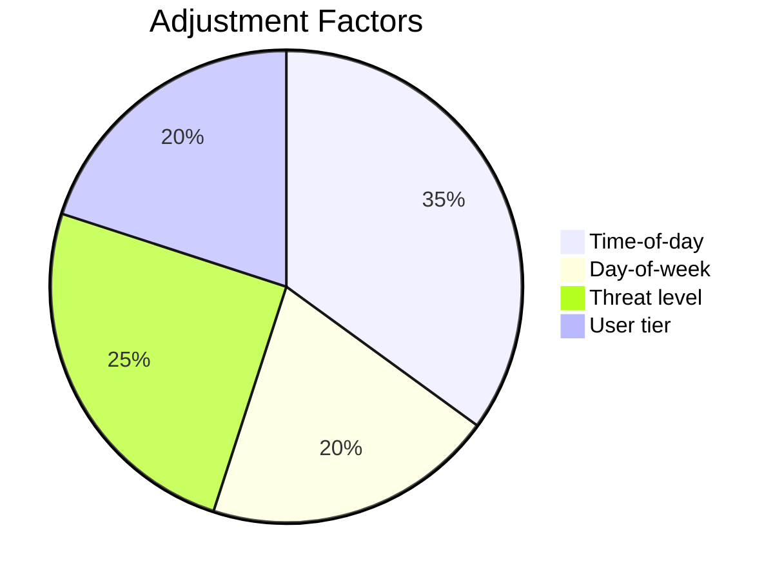
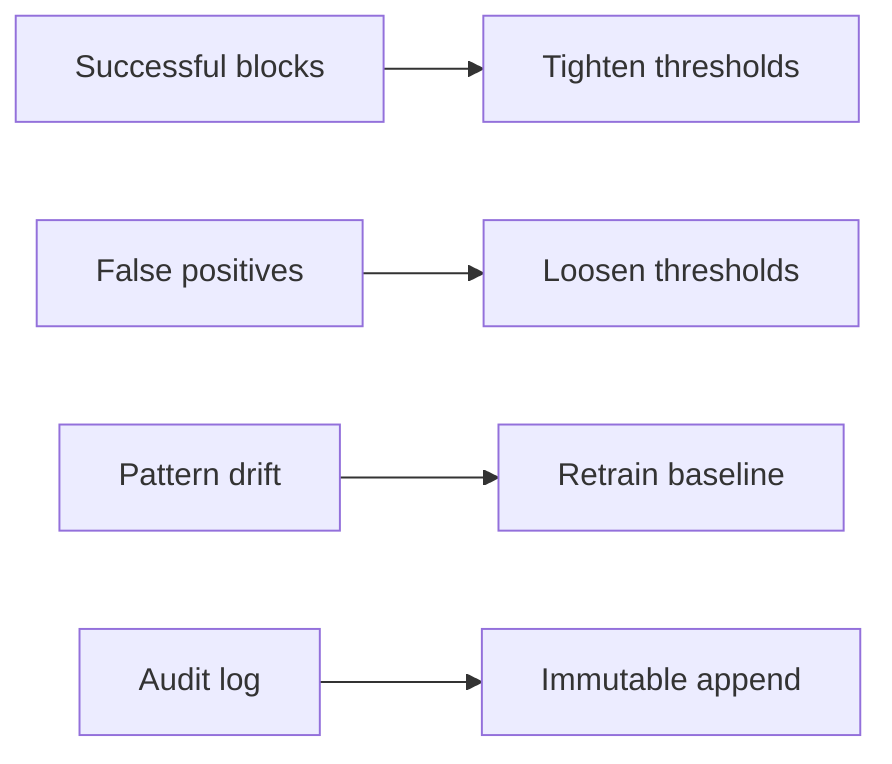
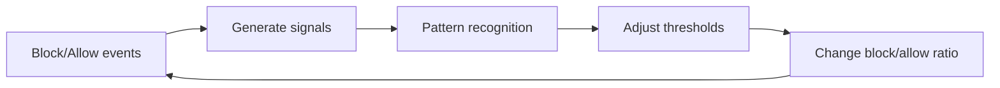

# Privacy Rate Limiting Visualization

## Step 1: Request Ingestion


## Step 2: Token Bucket Evaluation


## Step 3: Pattern Recognition


## Step 4: Adaptive Threshold Adjustment


## Step 5: Feedback Loop


## Step 6: State Persistence
```mermaid
graph TB
    A[Redis sorted set] --> B[ZADD user:{hash}]
    A --> C[ZREMRANGEBYSCORE]
    A --> D[EXPIRE key]
    A --> E[Fail-closed mode]
```

## The Paradox Resolved

