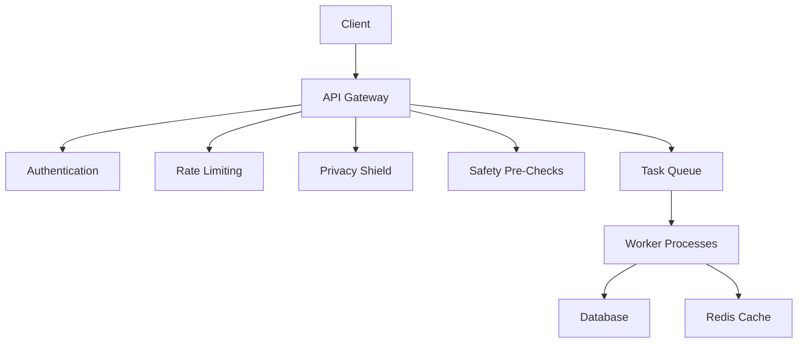

# GRID Architecture Overview

## System Components

## Data Flow
1. Client request → API Gateway
2. Sequential middleware processing
3. Task enqueuing for async operations
4. Worker processing
5. Response generation

## Security Layers
- **Authentication**: JWT/API keys
- **Authorization**: Trust tier system
- **Privacy**: PII detection/masking
- **Rate Limiting**: Per-user/IP limits
- **Audit Logging**: Comprehensive event tracking

## Scaling
- Horizontal pod autoscaling
- Redis-backed task queue
- Read replicas for database

## Technology Stack
- **API**: FastAPI (Python)
- **Frontend**: React/TypeScript
- **Database**: PostgreSQL
- **Cache**: Redis
- **Infrastructure**: Terraform/Kubernetes
- **Monitoring**: Prometheus/Grafana
