# GRID Architecture Documentation

**GRID (Geometric Resonance Intelligence Driver)** - Comprehensive Architecture Overview

Version: 2.5.0
Last Updated: February 2026
Status: Production Ready

---

## Table of Contents

1. [High-Level Architecture](#high-level-architecture)
2. [Layered Architecture](#layered-architecture)
3. [Core Intelligence Layer](#core-intelligence-layer)
4. [Application Layer](#application-layer)
5. [RAG System Architecture](#rag-system-architecture)
6. [Agentic System](#agentic-system)
7. [Cognitive Layer](#cognitive-layer)
8. [Data Flow & Integration](#data-flow--integration)
9. [Event-Driven Architecture](#event-driven-architecture)
10. [Deployment Architecture](#deployment-architecture)
11. [Security Architecture](#security-architecture)
12. [Technology Stack](#technology-stack)

---

## High-Level Architecture

GRID follows a **layered, domain-driven architecture** with clear separation of concerns, local-first AI, and cognitive-aware design.

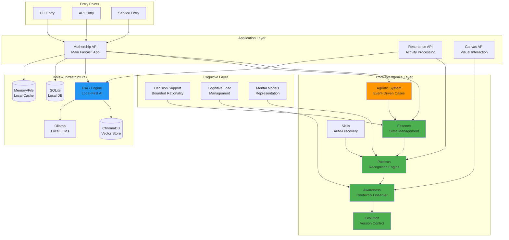

---

## Layered Architecture

GRID implements a clean layered architecture with dependency inversion and clear boundaries.

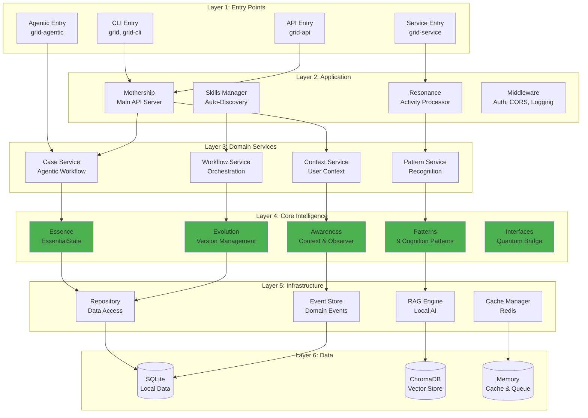

**Design Principles:**

- **Dependency Inversion**: High-level modules don't depend on low-level modules
- **Single Responsibility**: Each layer has one clear purpose
- **Interface Segregation**: Clean interfaces between layers
- **Local-First**: All AI operations use local models (Ollama, ChromaDB)

---

## Core Intelligence Layer

The "mind" of GRID - foundational intelligence components.

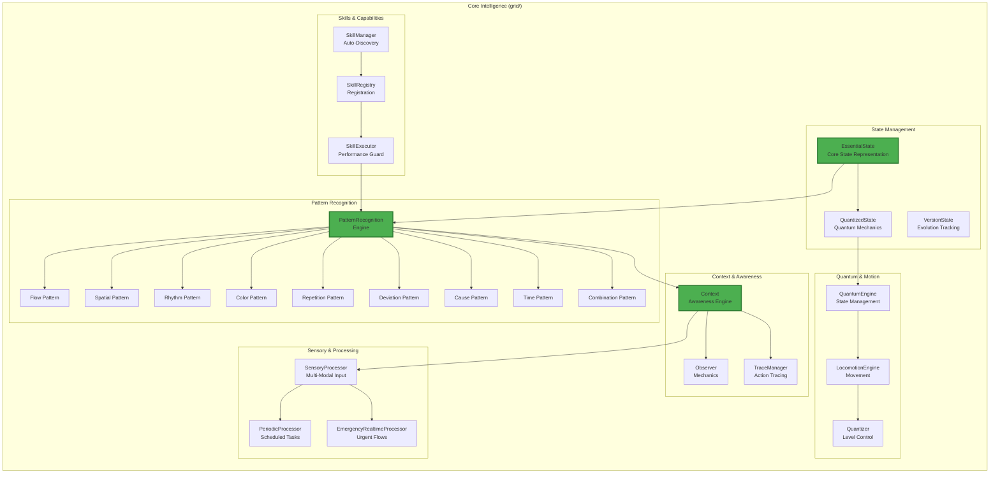

### 9 Cognition Patterns

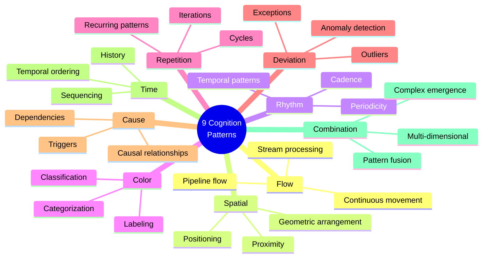

---

## Application Layer

FastAPI applications with clean architecture patterns.

```mermaid
graph TB
    subgraph "Mothership Application"
        MAIN[main.py<br/>Application Factory]

        subgraph "Routers"
            R1[/api/v1/intelligence]
            R2[/api/v1/agentic]
            R3[/api/v1/resonance]
            R4[/api/v1/skills]
            R5[/api/v1/health]
        end

        subgraph "Services"
            S1[CockpitService<br/>Main Orchestration]
            S2[CaseService<br/>Agentic Cases]
            S3[ContextService<br/>User Context]
            S4[PatternService<br/>Recognition]
            S5[WorkflowService<br/>Orchestration]
        end

        subgraph "Models"
            M1[Request Models<br/>Pydantic]
            M2[Response Models<br/>Pydantic]
            M3[Domain Models<br/>Business Logic]
        end

        subgraph "Repositories"
            REPO1[CaseRepository<br/>CRUD Operations]
            REPO2[UserRepository<br/>User Data]
            REPO3[EventRepository<br/>Event Store]
        end

        subgraph "Security"
            AUTH[Authentication<br/>JWT]
            AUTHZ[Authorization<br/>RBAC]
            VALID[PathValidator<br/>Security]
        end
    end

    MAIN --> R1 & R2 & R3 & R4 & R5
    R1 --> S1
    R2 --> S2
    R3 --> S3
    R4 --> S4
    R5 --> S5

    S1 & S2 & S3 & S4 & S5 --> M1 & M2 & M3
    S1 & S2 & S3 & S4 & S5 --> REPO1 & REPO2 & REPO3

    R1 & R2 & R3 & R4 --> AUTH
    AUTH --> AUTHZ
    AUTHZ --> VALID

    style MAIN fill:#2196F3,stroke:#1565C0,stroke-width:3px
    style S1 fill:#2196F3
    style S2 fill:#2196F3
```

### Resonance Application

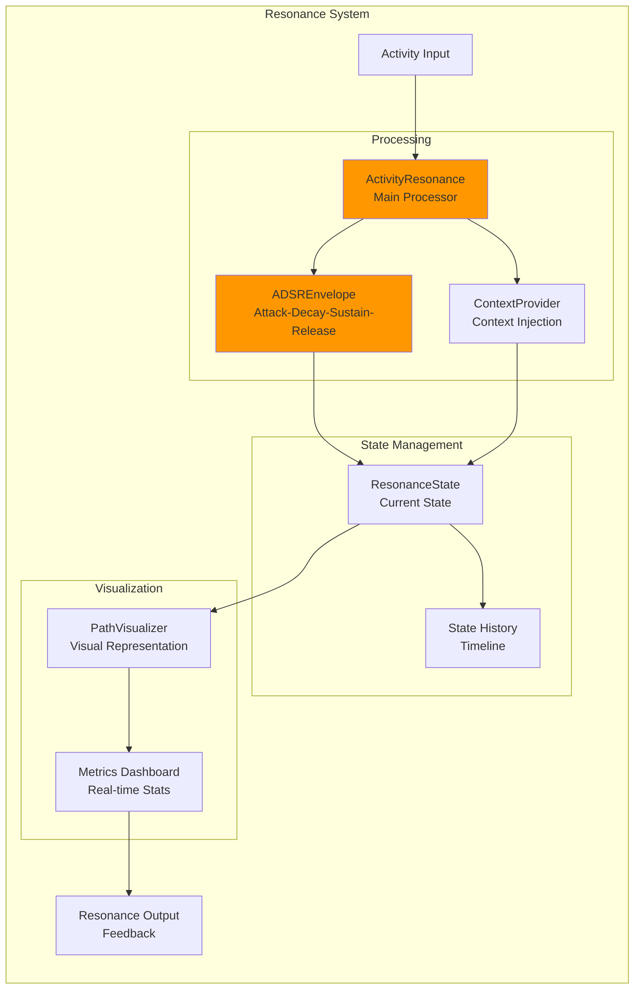

---

## RAG System Architecture

Local-first Retrieval-Augmented Generation with intelligent orchestration.

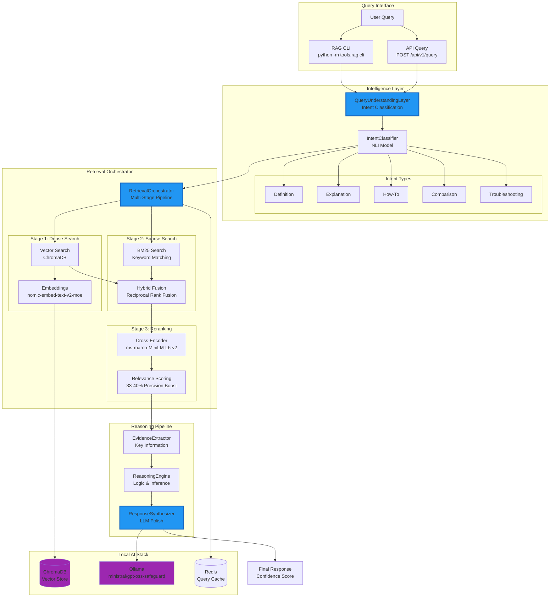

### RAG Document Processing Pipeline

```mermaid
graph LR
    subgraph "Document Ingestion"
        DOC[Documents<br/>MD, PDF, TXT, Code]
        LOADER[Document Loader<br/>Async Processing]
    end

    subgraph "Chunking Strategy"
        SEMANTIC[Semantic Chunker<br/>Context-Aware]
        RECURSIVE[Recursive Splitter<br/>Hierarchical]
        OVERLAP[Overlap Manager<br/>Continuity]
    end

    subgraph "Enrichment"
        META[Metadata Extraction<br/>Title, Author, Tags]
        LINK[Link Resolution<br/>Cross-References]
        SUMMARY[Summarization<br/>Key Points]
    end

    subgraph "Embedding Generation"
        EMB_GEN[Embedding Generator<br/>Batch Processing]
        OLLAMA_E[Ollama Embeddings<br/>nomic-embed-text-v2-moe]
    end

    subgraph "Storage"
        CHROMA_S[(ChromaDB<br/>Vector Index)]
        POSTGRES_S[(PostgreSQL<br/>Metadata)]
    end

    DOC --> LOADER
    LOADER --> SEMANTIC
    SEMANTIC --> RECURSIVE
    RECURSIVE --> OVERLAP
    OVERLAP --> META
    META --> LINK
    LINK --> SUMMARY
    SUMMARY --> EMB_GEN
    EMB_GEN --> OLLAMA_E
    OLLAMA_E --> CHROMA_S
    META --> POSTGRES_S

    style SEMANTIC fill:#4CAF50
    style EMB_GEN fill:#4CAF50
```

### RAG Performance Metrics

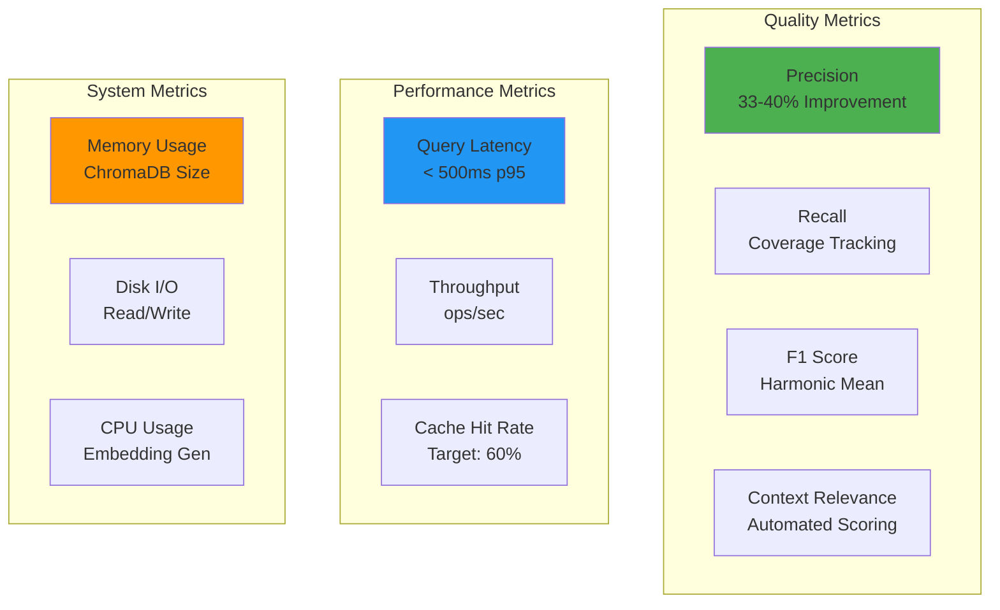

---

## Agentic System

Event-driven case management with continuous learning.

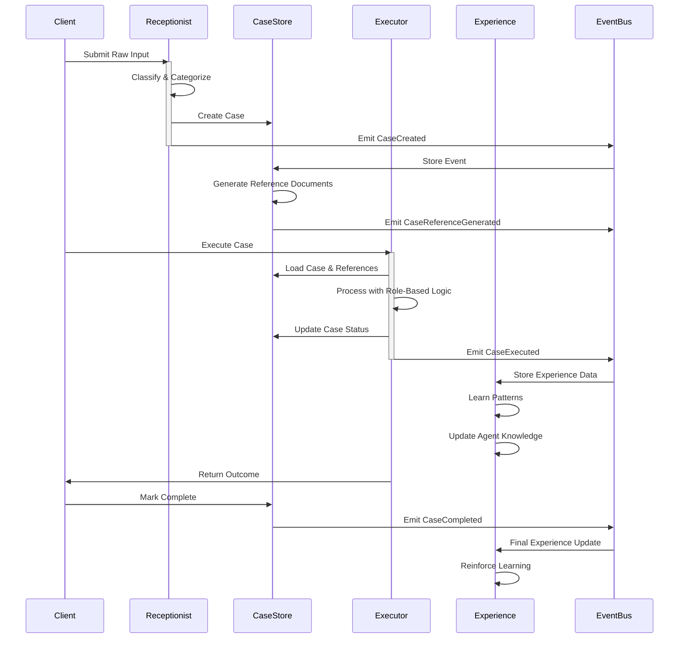

### Agentic State Machine

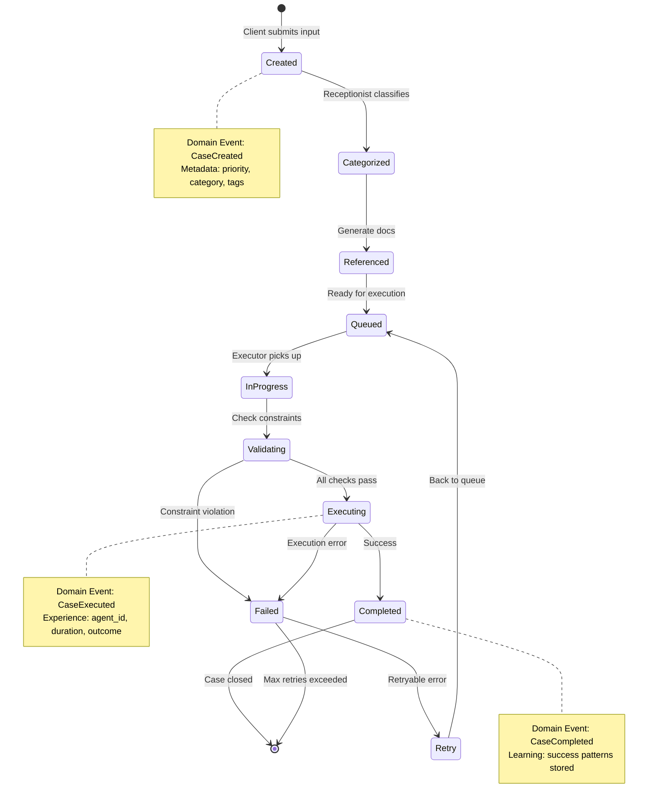

### Agent Roles & Responsibilities

```mermaid
graph TB
    subgraph "Agent Ecosystem"
        subgraph "Receptionist Agent"
            R1[Input Reception<br/>Raw Data Intake]
            R2[Classification<br/>Category Detection]
            R3[Priority Assignment<br/>Urgency Scoring]
            R4[Initial Filing<br/>Case Creation]
        end

        subgraph "Executor Agent"
            E1[Case Loading<br/>Context Retrieval]
            E2[Plan Generation<br/>Action Planning]
            E3[Execution<br/>Task Performance]
            E4[Validation<br/>Outcome Checking]
        end

        subgraph "Advisor Agent"
            A1[Pattern Analysis<br/>Historical Review]
            A2[Recommendation<br/>Best Practices]
            A3[Risk Assessment<br/>Constraint Check]
            A4[Quality Review<br/>Output Validation]
        end

        subgraph "Learning Agent"
            L1[Experience Collection<br/>Outcome Tracking]
            L2[Pattern Recognition<br/>Success Factors]
            L3[Knowledge Update<br/>Agent Training]
            L4[Continuous Improvement<br/>Feedback Loop]
        end
    end

    R1 --> R2 --> R3 --> R4
    E1 --> E2 --> E3 --> E4
    A1 --> A2 --> A3 --> A4
    L1 --> L2 --> L3 --> L4

    R4 -.-> E1
    E2 -.-> A1
    A2 -.-> E3
    E4 -.-> L1

    style R1 fill:#FF9800
    style E1 fill:#4CAF50
    style A1 fill:#2196F3
    style L1 fill:#9C27B0
```

### Environmental Intelligence

Homeostatic middleware layer that monitors conversational balance and adjusts LLM parameters dynamically.

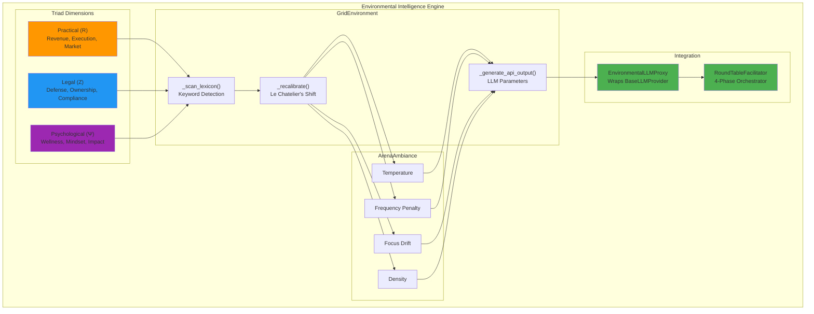

**Key principle:** When one dimension dominates beyond a threshold (default 0.2), the engine applies Le Chatelier's counter-shift — adjusting temperature, drift, and density to steer the LLM naturally toward neglected dimensions without explicit topic commands.

---

## Cognitive Layer

Human-centered AI decision support with bounded rationality.

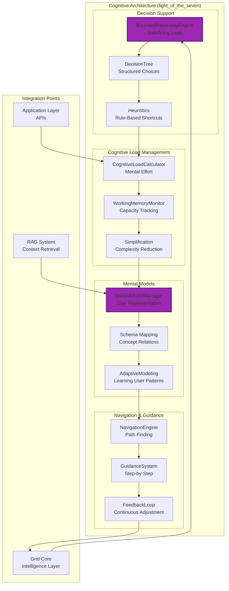

### Bounded Rationality Decision Flow

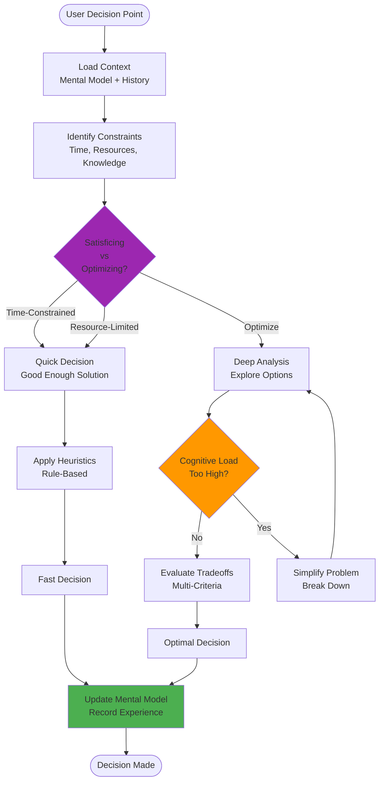

---

## Data Flow & Integration

End-to-end data flow through the GRID system.

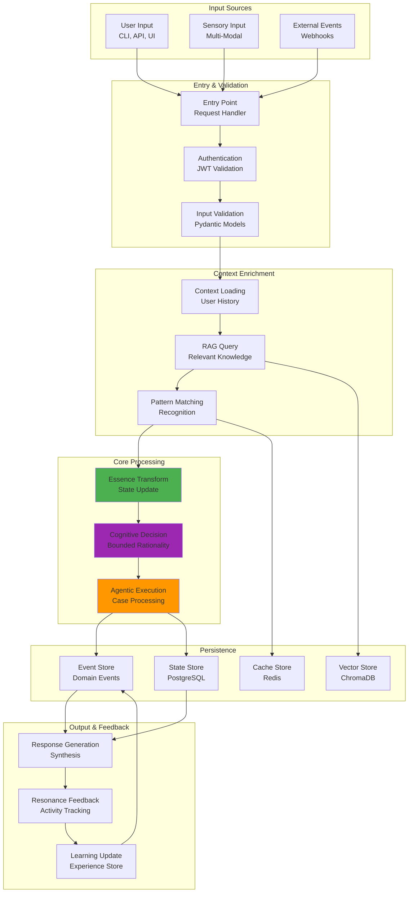

### Integration Patterns

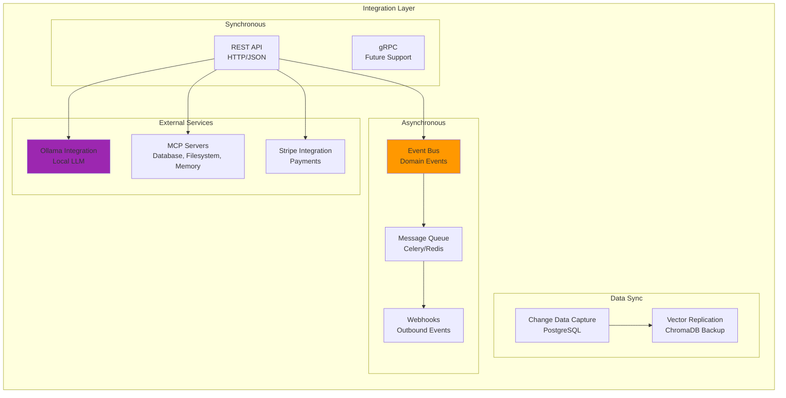

---

## Event-Driven Architecture

Domain events and event sourcing patterns.

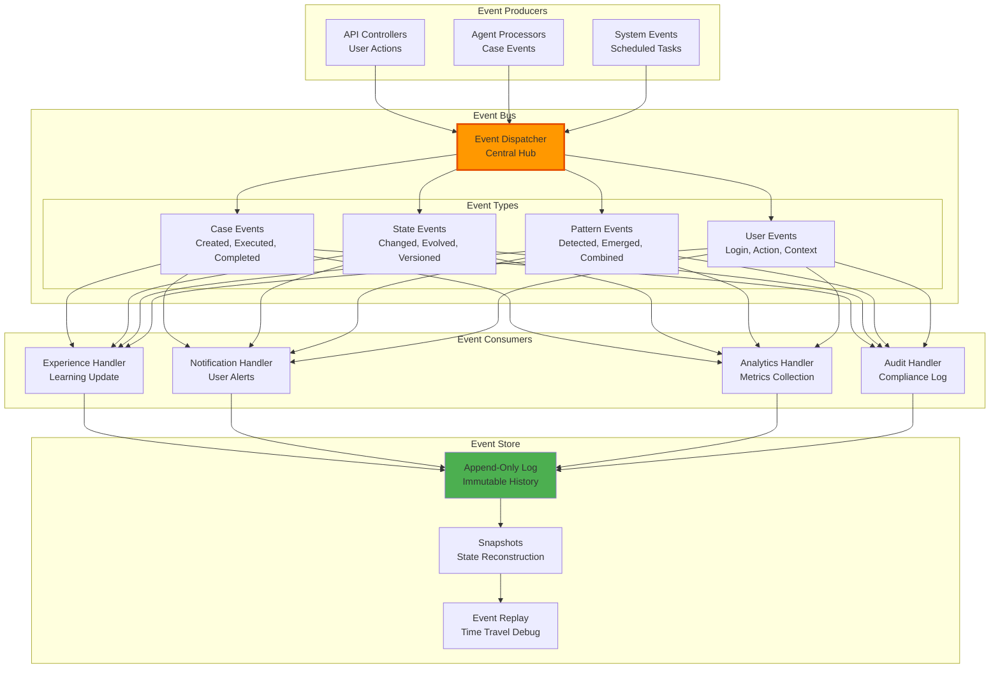

### Domain Events

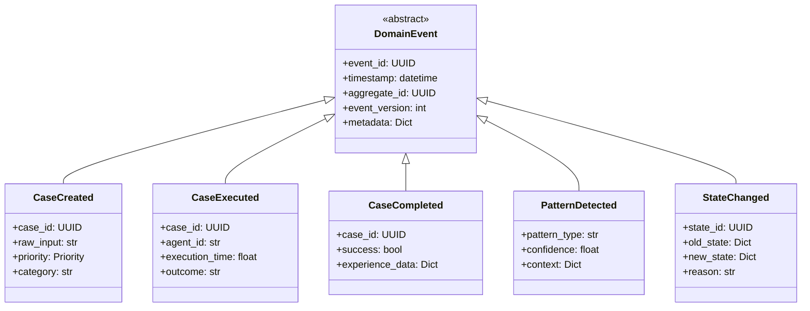

---

## Deployment Architecture


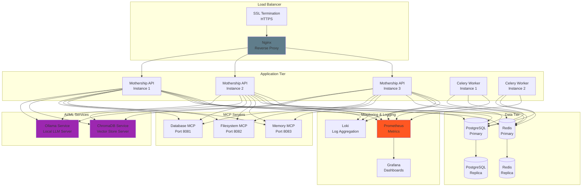


```mermaid
graph TB
        subgraph "Core Services"
            APP[mothership<br/>FastAPI App<br/>Port 8080]
            RESONANCE_SVC[resonance<br/>Activity Processor<br/>Port 8084]
        end

        subgraph "Worker Services"
            CELERY_W[celery-worker<br/>Task Processing]
            CELERY_B[celery-beat<br/>Scheduled Tasks]
        end

        subgraph "AI Services"
            OLLAMA_D[ollama<br/>LLM Server<br/>Port 11434]
            CHROMA_D[chromadb<br/>Vector Store<br/>Port 8001]
        end

        subgraph "Data Services"
            PG[postgres<br/>Database<br/>Port 5432]
            RD[redis<br/>Cache & Queue<br/>Port 6379]
        end

        subgraph "MCP Services"
            MCP_D[mcp-database<br/>Port 8081]
            MCP_F[mcp-filesystem<br/>Port 8082]
            MCP_M[mcp-memory<br/>Port 8083]
        end

        subgraph "Health Checks"
            HC[Health Monitor<br/>All Services]
        end
    end

    APP --> PG & RD & OLLAMA_D & CHROMA_D
    RESONANCE_SVC --> RD & PG
    CELERY_W --> RD & PG
    CELERY_B --> RD
    MCP_D & MCP_F & MCP_M --> PG
    HC -.-> APP & RESONANCE_SVC & OLLAMA_D & CHROMA_D & PG & RD

    style APP fill:#2196F3,stroke:#1565C0,stroke-width:3px
    style HC fill:#4CAF50
```

### Environment Configuration

```mermaid
graph LR
    subgraph "Environment: Development"
        DEV_ENV[.env.development]
        DEV_DEBUG[DEBUG=true]
        DEV_LOG[LOG_LEVEL=DEBUG]
        DEV_HOT[Hot Reload Enabled]
    end

    subgraph "Environment: Staging"
        STAGE_ENV[.env.staging]
        STAGE_DEBUG[DEBUG=false]
        STAGE_LOG[LOG_LEVEL=INFO]
        STAGE_MONITORING[Basic Monitoring]
    end

    subgraph "Environment: Production"
        PROD_ENV[.env.production]
        PROD_DEBUG[DEBUG=false]
        PROD_LOG[LOG_LEVEL=WARNING]
        PROD_MONITORING[Full Monitoring]
        PROD_SCALE[Auto-Scaling]
        PROD_BACKUP[Automated Backups]
    end

    DEV_ENV --> DEV_DEBUG & DEV_LOG & DEV_HOT
    STAGE_ENV --> STAGE_DEBUG & STAGE_LOG & STAGE_MONITORING
    PROD_ENV --> PROD_DEBUG & PROD_LOG & PROD_MONITORING & PROD_SCALE & PROD_BACKUP

    style PROD_ENV fill:#FF5722
```

---

## Security Architecture

Comprehensive security with defense-in-depth strategy.

```mermaid
graph TB
    subgraph "Security Layers"
        subgraph "Layer 1: Network Security"
            FW[Firewall<br/>Network Rules]
            SSL_SEC[TLS/SSL<br/>Encryption]
            RATE_LIM[Rate Limiting<br/>DDoS Protection]
        end

        subgraph "Layer 2: Authentication"
            JWT_AUTH[JWT Authentication<br/>Token-Based]
            OAUTH[OAuth 2.0<br/>Social Login]
            MFA[Multi-Factor Auth<br/>TOTP/SMS]
        end

        subgraph "Layer 3: Authorization"
            RBAC[Role-Based Access<br/>RBAC]
            ABAC[Attribute-Based<br/>ABAC]
            POLICY[Policy Engine<br/>OPA]
        end

        subgraph "Layer 4: Application Security"
            INPUT_VAL[Input Validation<br/>Pydantic]
            PATH_VAL[Path Validation<br/>Traversal Protection]
            SQL_PROTECT[SQL Injection<br/>Parameterized Queries]
            XSS_PROTECT[XSS Protection<br/>Content Security Policy]
        end

        subgraph "Layer 5: Data Security"
            ENCRYPT_REST[Encryption at Rest<br/>Database Encryption]
            ENCRYPT_TRANSIT[Encryption in Transit<br/>TLS 1.3]
            KEY_MGMT[Key Management<br/>Secrets Vault]
        end

        subgraph "Layer 6: Monitoring & Audit"
            AUDIT_LOG[Audit Logging<br/>Compliance]
            INTRUSION[Intrusion Detection<br/>SIEM]
            VULN_SCAN[Vulnerability Scanning<br/>Dependency Check]
        end
    end

    FW --> SSL_SEC
    SSL_SEC --> RATE_LIM
    RATE_LIM --> JWT_AUTH
    JWT_AUTH --> OAUTH
    OAUTH --> MFA
    MFA --> RBAC
    RBAC --> ABAC
    ABAC --> POLICY
    POLICY --> INPUT_VAL
    INPUT_VAL --> PATH_VAL
    PATH_VAL --> SQL_PROTECT
    SQL_PROTECT --> XSS_PROTECT
    XSS_PROTECT --> ENCRYPT_REST
    ENCRYPT_REST --> ENCRYPT_TRANSIT
    ENCRYPT_TRANSIT --> KEY_MGMT
    KEY_MGMT --> AUDIT_LOG
    AUDIT_LOG --> INTRUSION
    INTRUSION --> VULN_SCAN

    style JWT_AUTH fill:#FF9800
    style PATH_VAL fill:#4CAF50
    style ENCRYPT_REST fill:#2196F3
```

### Path Traversal Protection

```mermaid
sequenceDiagram
    participant Client
    participant API
    participant PathValidator
    participant FileSystem

    Client->>API: Request with file path
    activate API
    API->>PathValidator: validate_path(path, base_dir)
    activate PathValidator

    PathValidator->>PathValidator: Normalize path
    PathValidator->>PathValidator: Check for ".." sequences
    PathValidator->>PathValidator: Resolve absolute path
    PathValidator->>PathValidator: Verify within base_dir

    alt Path is Valid
        PathValidator-->>API: Validated path
        API->>FileSystem: Access file
        FileSystem-->>API: File content
        API-->>Client: Success response
    else Path is Invalid
        PathValidator-->>API: ValidationError
        API-->>Client: 400 Bad Request
        Note over Client,API: Path traversal attempt blocked
    end

    deactivate PathValidator
    deactivate API
```

### Security Test Coverage

```mermaid
pie title Security Test Coverage (9/9 Passing)
    "Path Traversal Protection" : 3
    "Input Validation" : 2
    "Authentication & JWT" : 2
    "Authorization & RBAC" : 1
    "SQL Injection Prevention" : 1
```

---

## Technology Stack

Comprehensive technology overview with versions and purposes.

```mermaid
graph TB
    subgraph "Language & Runtime"
        PYTHON[Python 3.13+<br/>Primary Language]
        ASYNCIO[AsyncIO<br/>Async Runtime]
        TYPING[Type Hints<br/>Static Typing]
    end

    subgraph "Web Framework"
        FASTAPI[FastAPI 0.104+<br/>Web Framework]
        UVICORN[Uvicorn<br/>ASGI Server]
        PYDANTIC[Pydantic 2.4+<br/>Data Validation]
        HTTPX[HTTPX 0.25+<br/>HTTP Client]
    end

    subgraph "AI/ML Stack"
        OLLAMA_T[Ollama 0.6+<br/>Local LLM Server]
        CHROMA_T[ChromaDB 1.4+<br/>Vector Database]
        SENTENCE_T[Sentence-Transformers 5.2+<br/>Embeddings]
        SKLEARN[scikit-learn 1.8.0<br/>ML Algorithms]
        RANK_BM25[rank-bm25 0.2+<br/>Sparse Search]
    end

    subgraph "Database Stack"
        POSTGRES_T[PostgreSQL<br/>Relational DB]
        SQLALCHEMY[SQLAlchemy 2.0+<br/>ORM]
        ALEMBIC[Alembic 1.13+<br/>Migrations]
        ASYNCPG[asyncpg 0.29+<br/>Async Driver]
    end

    subgraph "Cache & Queue"
        REDIS_T[Redis 5.0+<br/>Cache & Broker]
        CELERY_T[Celery 5.3+<br/>Task Queue]
    end

    subgraph "Development Tools"
        UV[UV<br/>Package Manager]
        PYTEST[Pytest 7.4+<br/>Testing]
        RUFF[Ruff<br/>Linting]
        BLACK[Black<br/>Formatting]
        MYPY[Mypy<br/>Type Checking]
    end

    subgraph "Infrastructure"
        NGINX_T[Nginx<br/>Reverse Proxy]
    end

    PYTHON --> FASTAPI & OLLAMA_T & POSTGRES_T
    FASTAPI --> UVICORN & PYDANTIC & HTTPX
    OLLAMA_T --> CHROMA_T & SENTENCE_T
    POSTGRES_T --> SQLALCHEMY & ALEMBIC & ASYNCPG
    REDIS_T --> CELERY_T
    UV --> PYTEST & RUFF & BLACK & MYPY

    style PYTHON fill:#4CAF50,stroke:#2E7D32,stroke-width:3px
    style FASTAPI fill:#2196F3,stroke:#1565C0,stroke-width:3px
    style OLLAMA_T fill:#9C27B0,stroke:#6A1B9A,stroke-width:3px
```

### Dependency Matrix

| Category | Package | Version | Purpose |
|----------|---------|---------|---------|
| **Web** | FastAPI | ≥0.104.0 | API framework |
| | Uvicorn | ≥0.24.0 | ASGI server |
| | Pydantic | ≥2.4.0 | Data validation |
| | HTTPX | ≥0.25.0 | HTTP client |
| **AI/ML** | Ollama | ≥0.6.1 | Local LLM |
| | ChromaDB | ≥1.4.1 | Vector store |
| | Sentence-Transformers | ≥5.2.0 | Embeddings |
| | scikit-learn | 1.8.0 | ML algorithms |
| | rank-bm25 | ≥0.2.2 | Sparse search |
| **Database** | asyncpg | ≥0.29.0 | PostgreSQL driver |
| | SQLAlchemy | ≥2.0.0 | ORM |
| | Alembic | ≥1.13.0 | Migrations |
| **Cache/Queue** | Redis | ≥5.0.0 | Cache & broker |
| | Celery | ≥5.3.0 | Task queue |
| **Dev Tools** | Pytest | ≥7.4.0 | Testing |
| | Ruff | ≥0.0.291 | Linting |
| | Black | ≥23.9.0 | Formatting |
| | Mypy | ≥1.5.1 | Type checking |

---

## Performance Metrics

Real-world performance benchmarks and optimization results.

```mermaid
graph LR
    subgraph "Cache Performance"
        CP1[cache_ops<br/>1,446 → 7,281 ops/sec<br/>🚀 5x Improvement]
        CP2[eviction<br/>36 → 6,336 ops/sec<br/>🚀 175x Improvement]
        CP3[honor_decay<br/>5,628 → 3.1M ops/sec<br/>🚀 550x Improvement]
    end

    subgraph "RAG Performance"
        RP1[Query Latency<br/>p95 < 500ms]
        RP2[Precision<br/>33-40% Improvement]
        RP3[Cache Hit Rate<br/>60% Target]
    end

    subgraph "API Performance"
        AP1[Response Time<br/>p95 < 200ms]
        AP2[Throughput<br/>1000+ req/sec]
        AP3[Concurrent Users<br/>500+ simultaneous]
    end

    subgraph "Test Coverage"
        TC1[Unit Tests<br/>122+ Passing]
        TC2[Coverage<br/>≥80%]
        TC3[Security Tests<br/>9/9 Passing]
    end

    style CP1 fill:#4CAF50
    style CP2 fill:#4CAF50
    style CP3 fill:#4CAF50
    style RP2 fill:#2196F3
```

---

## Design Patterns & Best Practices

GRID implements proven architectural patterns.

```mermaid
mindmap
    root((GRID<br/>Patterns))
        Architectural
            Layered Architecture
            Domain-Driven Design
            Event-Driven Architecture
            CQRS
            Event Sourcing
        Creational
            Factory Pattern
            Builder Pattern
            Dependency Injection
            Singleton Services
        Structural
            Repository Pattern
            Adapter Pattern
            Bridge Pattern
            Facade Pattern
        Behavioral
            Strategy Pattern
            Observer Pattern
            Command Pattern
            State Machine
        Cognitive
            Bounded Rationality
            Mental Models
            Pattern Recognition
            Satisficing
```

---

## Key Architectural Decisions

### ADR-001: Local-First AI
**Decision**: Use local Ollama models instead of cloud APIs
**Rationale**: Data privacy, cost control, offline capability
**Status**: Implemented ✅

### ADR-002: Event-Driven Agentic System
**Decision**: Implement event-driven case management
**Rationale**: Scalability, auditability, continuous learning
**Status**: Implemented ✅

### ADR-003: Layered Architecture
**Decision**: Strict layer separation with dependency inversion
**Rationale**: Maintainability, testability, modularity
**Status**: Implemented ✅

### ADR-004: 9 Cognition Patterns
**Decision**: Use geometric resonance patterns for intelligence
**Rationale**: Human-aligned pattern recognition
**Status**: Core Feature ✅

### ADR-005: ChromaDB for Vector Store
**Decision**: Use ChromaDB for local vector storage
**Rationale**: Python-native, local-first, performant
**Status**: Implemented ✅

---

## Future Roadmap

```mermaid
timeline
    title GRID Architecture Evolution
    section Phase 1 (Complete)
        Core Intelligence : Essence, Patterns, Awareness
        Basic RAG : ChromaDB + Ollama
        FastAPI Apps : Mothership, Resonance
    section Phase 2 (Complete)
        Agentic System : Event-driven cases
        Advanced RAG : Hybrid search, reranking
        Security Hardening : Path validation, 9/9 tests
    section Phase 3 (Current)
        Cognitive Layer : Bounded rationality, mental models
        Skills Ecosystem : Auto-discovery, performance guard
        Performance Optimization : Cache improvements
    section Phase 4 (Planned)
        Multi-Tenancy : Organization support
        GraphQL API : Alternative interface
        WebSocket Support : Real-time communication
        Advanced Analytics : ML-driven insights
    section Phase 5 (Future)
        Distributed Architecture : Multi-node deployment
        Advanced Monitoring : Full observability stack
        Plugin System : Extensible architecture
        Edge Deployment : Lightweight instances
```

---

## Conclusion

GRID is a **production-ready, cognitive-aware framework** that combines:

- ✅ **Local-First AI** - No external API dependencies
- ✅ **Layered Architecture** - Clean separation of concerns
- ✅ **Event-Driven Design** - Scalable and auditable
- ✅ **9 Cognition Patterns** - Human-aligned intelligence
- ✅ **Advanced RAG** - 33-40% precision improvement
- ✅ **Comprehensive Security** - 9/9 security tests passing
- ✅ **High Performance** - 550x improvement in key operations
- ✅ **122+ Tests** - ≥80% coverage across all layers

**GRID represents the state-of-the-art in local-first, cognitive-aware AI systems.** 🚀🧠✨

---

**For more information:**
- [Development Guide](DEVELOPMENT_GUIDE.md)
- [Skills & RAG Quickstart](SKILLS_RAG_QUICKSTART.md)
- [Agentic System Documentation](AGENTIC_SYSTEM.md)
- [Security Architecture](security/SECURITY_ARCHITECTURE.md)

**Version**: 2.2.0
**Last Updated**: January 2026
**Maintainer**: GRID Core Team
