# GRID Dependency Visualization Guide

**Subject:** Dependencies
**Version:** v1.0
**Canonical:** Yes

## Overview

This document describes GRID's component dependencies and provides visualization formats for documentation and project management.

## Component Structure

### Top-Level Packages
GRID contains 26 top-level packages:

1.  `api` - REST API layer (FastAPI)
1.  `ares` - Security and testing framework
1.  `bridge` - Integration bridges
1.  `cli` - Command-line interface
1.  `concept` - Concept-based analysis
1.  `core` - Core business logic
1.  `database` - Data persistence
1.  `demos` - Demonstration modules
1.  `grid` - Main grid functionality
1.  `kernel` - System kernel
1.  `ml` - Machine learning components
1.  `nl_dev` - Natural language development
1.  `pattern_engine` - Pattern recognition
1.  `physics` - Physics simulation (Heat/UBI)
1.  `plugins` - Plugin system
1.  `realtime` - Real-time processing
1.  `services` - Business services
1.  `throughput_engine` - Throughput management
1.  `tools` - Utility tools
1.  `transformer` - Data transformation
1.  `utils` - Shared utilities
1.  `valuation` - Valuation logic
1.  `vision` - Vision processing
1.  `workflow_engine` - Workflow orchestration

## Dependency Graph (Mermaid)

The following Mermaid diagram shows the high-level dependencies between GRID components:

```mermaid
graph TD
    api["api"]
    ares["ares"]
    bridge["bridge"]
    cli["cli"]
    concept["concept"]
    core["core"]
    database["database"]
    demos["demos"]
    grid["grid"]
    kernel["kernel"]
    ml["ml"]
    nl_dev["nl_dev"]
    pattern_engine["pattern_engine"]
    physics["physics"]
    plugins["plugins"]
    realtime["realtime"]
    services["services"]
    throughput_engine["throughput_engine"]
    tools["tools"]
    transformer["transformer"]
    utils["utils"]
    valuation["valuation"]
    vision["vision"]
    workflow_engine["workflow_engine"]

    grid --> utils
    services --> database
```



## Dependency Formats

### 1. Mermaid (Markdown)
- **File**: `docs/dependencies/dependency_graph.md`
- **Use Case**: Inline documentation, GitHub README
- **Rendering**: Automatically rendered by GitHub, GitLab, documentation tools

### 2. DOT/Graphviz
- **File**: `docs/dependencies/dependency_graph.dot`
- **Use Case**: Advanced visualization, custom styling
- **Rendering**: Use Graphviz tools (`dot`, `neato`, `fdp`)
- **Example**: `dot -Tpng dependency_graph.dot -o deps.png`

### 3. JSON Data
- **File**: `docs/dependencies/dependency_data.json`
- **Use Case**: Custom analysis, tooling integration
- **Structure**:
  ```json
  {
    "modules": {...},
    "dependencies": {...},
    "internal_deps": {...},
    "external_deps": {...}
  }
  ```

## Usage

### Regenerate Dependency Data
```bash
python scripts/analyze_dependencies.py
```

### Visualize with Graphviz
```bash
# PNG
dot -Tpng docs/dependencies/dependency_graph.dot -o dependency_graph.png

# SVG
dot -Tsvg docs/dependencies/dependency_graph.dot -o dependency_graph.svg

# Interactive HTML
dot -Tsvg docs/dependencies/dependency_graph.dot | svg-to-html > deps.html
```

### Parse JSON for Custom Analysis
```python
import json

with open("docs/dependencies/dependency_data.json") as f:
    deps = json.load(f)

# Find all external dependencies
external = set()
for module_deps in deps["external_deps"].values():
    external.update(module_deps)

print(f"External dependencies: {sorted(external)}")
```

## Dependency Analysis

### Internal Dependencies
- **grid → utils**: Core grid functionality relies on shared utilities
- **services → database**: Services layer interacts with database

### External Dependencies
Core external dependencies (from `pyproject.toml`):
1.  `click` - CLI framework
1.  `networkx` - Graph algorithms
1.  `numpy` - Numerical computing
1.  `sqlalchemy` - ORM and database toolkit
1.  `alembic` - Database migrations

## See Also
- [pyproject.toml](../../pyproject.toml) - Declared dependencies
- [STRUCTURE_GUIDE.md](./STRUCTURE_GUIDE.md) - Architecture overview
