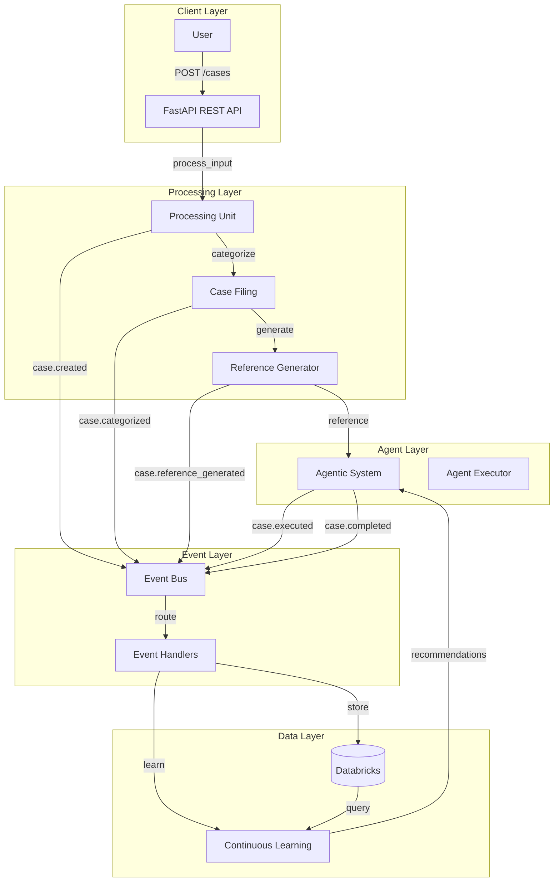

# Event-Driven Architecture Guide

## Overview

The GRID Agentic System uses an event-driven architecture to enable asynchronous processing, loose coupling, and scalable workflows. Events flow through the system from processing to execution to learning.

## Architecture Diagram



## Event Types

### 1. Case Created

Emitted when raw input is received:

```json
{
  "event_type": "case.created",
  "case_id": "CASE-abc123",
  "raw_input": "User input text",
  "user_id": "user123"
}
```

### 2. Case Categorized

Emitted when case is filed and categorized:

```json
{
  "event_type": "case.categorized",
  "case_id": "CASE-abc123",
  "category": "testing",
  "priority": "high",
  "confidence": 0.85
}
```

### 3. Case Reference Generated

Emitted when reference file is created:

```json
{
  "event_type": "case.reference_generated",
  "case_id": "CASE-abc123",
  "reference_file_path": ".case_references/CASE-abc123_reference.json"
}
```

### 4. Case Executed

Emitted when agent starts execution:

```json
{
  "event_type": "case.executed",
  "case_id": "CASE-abc123",
  "agent_role": "Executor",
  "task": "/execute"
}
```

### 5. Case Completed

Emitted when case is resolved:

```json
{
  "event_type": "case.completed",
  "case_id": "CASE-abc123",
  "outcome": "success",
  "solution": "Solution description"
}
```

## Event Bus

### Features

- **Async Publishing**: Non-blocking event publishing
- **Redis Pub-Sub**: Optional distributed event bus
- **In-Memory Queue**: Fallback for single-node deployments
- **Event History**: Track all events for replay
- **Event Filtering**: Subscribe to specific event types

### Usage

```python
from grid.agentic.event_bus import EventBus
from grid.agentic.events import CaseCreatedEvent

# Create event bus
event_bus = EventBus(use_redis=False)

# Subscribe to events
async def handler(event):
    print(f"Received event: {event['event_type']}")

await event_bus.subscribe("case.created", handler)

# Publish event
event = CaseCreatedEvent(case_id="CASE-001", raw_input="Test")
await event_bus.publish(event.to_dict())
```

## Event Handlers

### Handler Types

1. **CaseCreatedHandler**: Stores case in Databricks
2. **CaseCategorizedHandler**: Updates case status
3. **CaseReferenceGeneratedHandler**: Notifies agent system
4. **CaseExecutedHandler**: Tracks execution start
5. **CaseCompletedHandler**: Stores solution and updates learning

### Handler Registry

```python
from grid.agentic.event_handlers import EventHandlerRegistry, CaseCreatedHandler

registry = EventHandlerRegistry()
registry.register("case.created", CaseCreatedHandler(repository=repo))

# Handle event
await registry.handle_event(event_dict)
```

## Event Flow

### Standard Flow

```
1. User creates case → case.created event
2. Case categorized → case.categorized event
3. Reference generated → case.reference_generated event
4. User executes case → case.executed event
5. Case completed → case.completed event
```

### Event Processing

```
Event Published → Event Bus → Event Handlers → Databricks Repository
                                        ↓
                                Continuous Learning
```

## Benefits

### 1. Loose Coupling

Components communicate through events, not direct calls.

### 2. Scalability

Events can be processed asynchronously and distributed.

### 3. Observability

Event history provides audit trail and debugging.

### 4. Flexibility

New handlers can be added without changing existing code.

### 5. Resilience

Failed events can be replayed from history.

## Best Practices

### 1. Event Design

- Use clear, descriptive event types
- Include all necessary context in event payload
- Keep events immutable

### 2. Handler Design

- Make handlers idempotent
- Handle errors gracefully
- Log important operations

### 3. Event Ordering

- Events are processed asynchronously
- Don't rely on event ordering
- Use event timestamps for ordering if needed

### 4. Error Handling

- Handlers should catch and log errors
- Don't let handler errors break the system
- Consider dead-letter queues for failed events

## Configuration

### Redis Configuration (Optional)

```python
event_bus = EventBus(
    use_redis=True,
    redis_host="localhost",
    redis_port=6379,
    redis_db=0
)
```

### Environment Variables

- `USE_REDIS`: Enable Redis pub-sub
- `REDIS_HOST`: Redis hostname
- `REDIS_PORT`: Redis port

## Monitoring

### Event Metrics

- Events published per second
- Events processed per second
- Handler execution time
- Failed events count

### Event History

```python
# Get event history
history = await event_bus.get_event_history(event_type="case.created", limit=100)

# Replay events
await event_bus.replay_events(event_type="case.created", limit=100)
```

## References

- **Agentic System**: `docs/AGENTIC_SYSTEM.md`
- **Event Bus**: `grid/agentic/event_bus.py`
- **Event Handlers**: `grid/agentic/event_handlers.py`
- **Events**: `grid/agentic/events.py`
