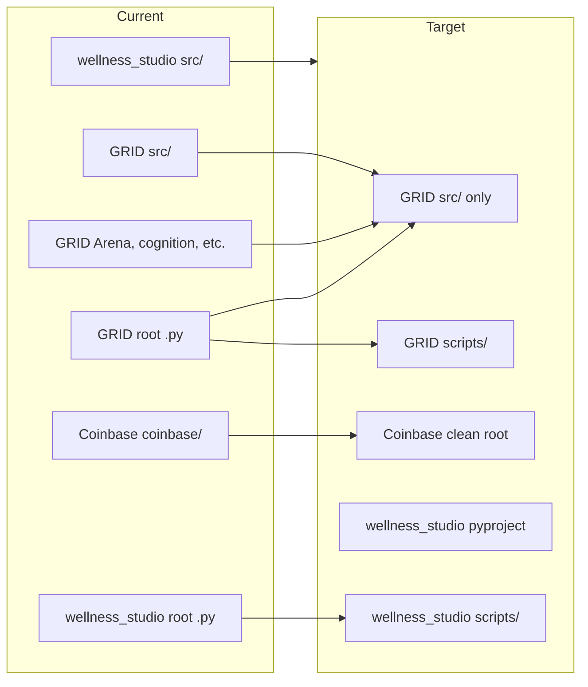

# Python Project Reorganization Plan (E:\ drive)

This document records the current layout of Python projects on the E:\ drive, best-practice references, per-project proposed changes with before/after sketches, implementation order, and risks/mitigations.

---

## Current structure summary

| Location | Layout | Package / entrypoint | Issues |
|----------|--------|----------------------|--------|
| E:\GRID | Hybrid: `src/` (grid, application, cognitive, tools) + root clutter | `grid-intelligence`, hatchling | Root: many loose `.py` (drt_*, parasite_analyzer, secret_scanner, conftest, etc.); top-level dirs Arena/, arena_api/, cognition/, knowledge_base/, EUFLE/, tools/ outside `src/`; wheel only includes 4 `src/*` packages |
| E:\Coinbase | Flat: `coinbase/` at root | `coinbase`, setuptools | One stray script at root: `concurrent_streams_demo.py`; otherwise clean (tests/, examples/, docs/, pyproject.toml) |
| E:\wellness_studio | src layout: `src/wellness_studio/` | `wellness-studio`, setup.py | Root scripts: `analyze_patient.py`, `integration_test_suite.py`, `run_security_tests.py`; no `pyproject.toml` (setup.py only) |
| E:\scripts | Flat scripts | N/A (not a package) | Mixed .py and .ps1; no single package; could use subdirs or a README index |
| E:\shared | Multi-package flat | N/A (workspace_utils, etc.) | Reusable libs; no root pyproject.toml; each subdir could be a proper package |
| E:\_projects\grid-rag-enhanced | Minimal | N/A | Data + minimal src; treat as archive/experiment |

### Root-level Python files (key projects)

- **GRID:** `conftest.py`, `drt_api_test.py`, `drt_comprehensive_test.py`, `drt_config_report.py`, `drt_demo.py`, `drt_middleware_test.py`, `drt_test_report.py`, `environment_audit.py`, `parasite_analyzer.py`, `run_verify_scan.py`, `secret_scanner.py`, `test_drt_functional.py`, `validate_parasite_guard.py` (and scripts/ already exists with subdirs)
- **Coinbase:** `concurrent_streams_demo.py`
- **wellness_studio:** `analyze_patient.py`, `integration_test_suite.py`, `run_security_tests.py`

---

## Best-practice references

- **Src layout vs flat layout:** [packaging.python.org – Source layout](https://packaging.python.org/en/latest/discussions/src-layout-vs-flat-layout/) — Prefer src layout for installable packages so the installed package is what gets tested and imports are from a single tree.
- **Python Application Layouts:** [Real Python – Python Application Layouts](https://realpython.com/python-application-layouts/) — Reference for project structure, `pyproject.toml`, and separation of package vs scripts/tests/docs.
- **Single source of truth:** Use `pyproject.toml` for metadata, build, and tool config; migrate away from `setup.py` where possible.
- **Clear boundaries:** Package in `src/`, tests in `tests/`, scripts/examples in `scripts/` or `examples/`, docs in `docs/`. No loose package modules at repo root.

---

## Per-project proposed changes

### GRID (E:\GRID)

**Before (sketch):**
```
GRID/
├── conftest.py, drt_*.py, parasite_analyzer.py, secret_scanner.py, ...
├── Arena/, arena_api/, cognition/, knowledge_base/, EUFLE/, tools/  (at root)
├── src/ (grid, application, cognitive, tools)
├── scripts/, tests/, docs/, pyproject.toml, ...
```

**After:**
- Root `.py` files moved to `scripts/drt/`, `scripts/security/`, or into `tests/` as appropriate; `conftest.py` in `tests/conftest.py` (or thin root delegate).
- Top-level code dirs (Arena, arena_api, cognition, knowledge_base, EUFLE, tools) either moved under `src/` and added to wheel if product code, or left in place / moved to `experiments/` or `legacy/` and documented (no wheel change).
- Root contains only config, docs, tests dir, scripts dir, and top-level files (README, LICENSE, pyproject.toml, requirements*.txt, Makefile).

### wellness_studio (E:\wellness_studio)

**Before:** `src/wellness_studio/`, `setup.py`, root scripts `analyze_patient.py`, `integration_test_suite.py`, `run_security_tests.py`.

**After:** Add `pyproject.toml` (metadata from setup.py, package dir `"" -> "src"`); move root scripts to `scripts/`; optionally keep thin `setup.py` or remove. Single `pyproject.toml`, clean root.

### Coinbase (E:\Coinbase)

**Before:** `coinbase/` at root, `concurrent_streams_demo.py` at root.

**After:** Move `concurrent_streams_demo.py` to `examples/concurrent_streams_demo.py`. Optional later: migrate to src layout (deferred).

### scripts (E:\scripts)

**Before:** Flat list of .py and .ps1 files, `_archive/` present.

**After:** Subdirs by purpose (e.g. `eufle/`, `denylist/`, `wsl/`, `harvest/`, `safety/`, `mcp/`, `diagnostics/`); move files into them; add `README.md` index. Keep `_archive/` for deprecated scripts.

### shared (E:\shared)

**Before:** `workspace_utils/`, `context_bridge/`, `studio_agent_config/` with no root pyproject.toml.

**After:** Document as shared libraries and how they are consumed (PYTHONPATH or local installs). Optional: add `pyproject.toml` per subdir or workspace root for installability.

---

## Implementation order

1. Write this plan document (E:\PYTHON_REORGANIZATION_PLAN.md).
2. **GRID:** Move root `.py` and reconcile top-level dirs; update pyproject and CI; run full test suite.
3. **wellness_studio:** Add pyproject.toml, move root scripts; run tests.
4. **Coinbase:** Move demo to examples; run tests.
5. **scripts:** Create subdirs, move files, add README.
6. **shared:** Document; optionally add pyproject.toml(s).

After each step: run tests and fix imports; update any hardcoded paths in docs or automation.

---

## Risks and mitigations

| Risk | Mitigation |
|------|------------|
| Import path changes break tests or runtime | Run full test suite after each project's moves; fix imports and `sys.path`/PYTHONPATH as needed. |
| CI or Makefile invokes root-level scripts by path | Update CI workflows and Makefile targets to new paths (e.g. `scripts/drt/`, `scripts/security/`). |
| IDE run configurations or launch configs point to old paths | Update or document new entrypoints in README so IDE configs can be updated. |
| conftest.py location | Pytest discovers `conftest.py` in root and in `tests/`; moving to `tests/conftest.py` is standard and avoids root clutter. |
| GRID wheel packaging | Only add new packages to `[tool.hatch.build.targets.wheel]` if dirs are moved under `src/` and are product code; otherwise leave excluded. |

---

## Diagram (conceptual)



---

## Files created or changed (summary)

- **Create:** E:\PYTHON_REORGANIZATION_PLAN.md (this document).
- **GRID:** Move root `.py` to scripts/tests; optionally move top-level dirs; update pyproject.toml and CI/Makefile.
- **wellness_studio:** Create pyproject.toml; move root scripts to `scripts/`; optionally deprecate setup.py.
- **Coinbase:** Move concurrent_streams_demo.py to `examples/`.
- **scripts:** New subdirs; new README.md.
- **shared:** Documentation in this plan; optional pyproject.toml per subdir or at root.

No changes to _projects or to non-Python layout unless explicitly included later.
