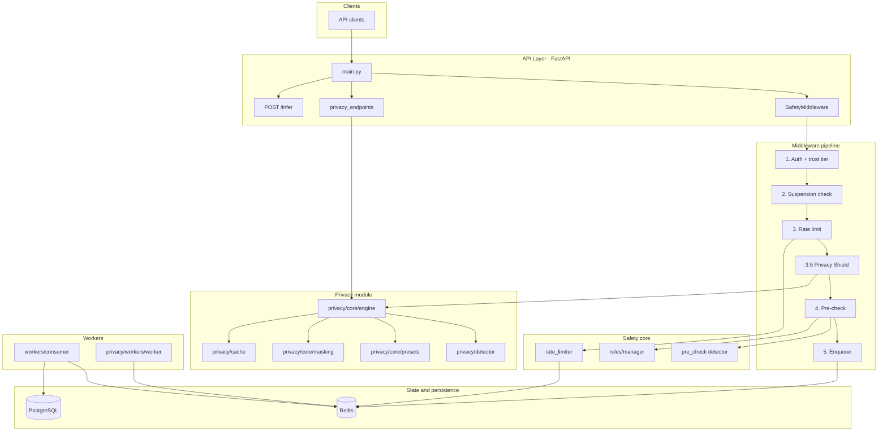
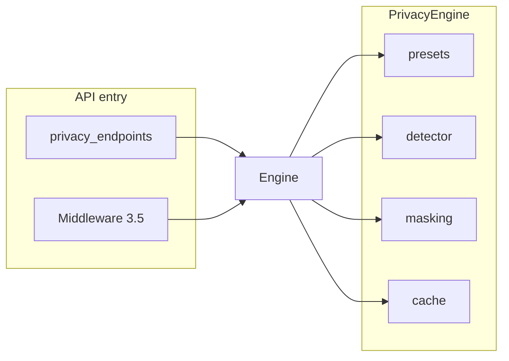

# Safety Layer & Cognitive Privacy Shield — Architecture

This document describes the architecture of the GRID safety enforcement pipeline and the Cognitive Privacy Shield, with emphasis on data flow, integration points, and design decisions.

---

## 1. Overview and design principles

The safety layer sits in front of all inference and privacy operations. It enforces:

- **Fail-closed** — If Redis, detectors, or any safety component is unavailable, requests are denied (no silent bypass).
- **Deterministic refusals** — Refused requests receive a fixed JSON shape with `reason_code` and `support_ticket_id`; no negotiation or bypass hints.
- **No direct model calls from API** — All inference requests are enqueued to Redis Streams; workers call the model in a sandbox and run post-checks.
- **Trust-tier and rate limiting** — Per-user and per-IP limits (Redis token bucket); trust tiers (ANON, USER, VERIFIED, PRIVILEGED) drive limits and risk scoring.
- **Audit and escalation** — Refusals, rate limits, and escalations are logged; flagged model outputs go to human review via `/review`.

The **Cognitive Privacy Shield** adds PII detection and masking for both singular (personal) and collaborative (team workspace) use. It runs in the request path for `/infer` (middleware step 3.5) and is also exposed as a dedicated API (`/privacy/detect`, `/privacy/mask`, `/privacy/batch`).

---

## 2. High-level architecture

---

## 3. Request pipeline (middleware)

The pipeline is **ordered and non-bypassable** for `POST` requests to `/infer` and `/v1/*`. Health and metrics paths skip enforcement but still get security headers.

| Step | Name | Purpose |
|------|------|--------|
| 0 | Infrastructure check | Redis health; if down → refuse with `SAFETY_UNAVAILABLE` (503). |
| 1 | Authenticate | Resolve user from JWT, API key, or anonymous; set trust tier. |
| 2 | Suspension check | If user is suspended → refuse with `USER_SUSPENDED`. |
| 3 | Rate limit | Redis token-bucket per user/tier; if exceeded → 429 and audit event. |
| **3.5** | **Privacy Shield** | For `/infer` only: read body, run `PrivacyEngine.process()` on `user_input`; if blocked → `PRIVACY_VIOLATION`; if masked → update body and store result in `request.state.privacy_results`. Body is read once and reused in step 4b. |
| 4 | Pre-check | Sync detector (<50ms) + rule manager (Guardian); if flagged → refuse. Body from 3.5 reused via `request.state.body_bytes` / `request.state.body`. |
| 5 | Enqueue | Write to Redis Stream `inference-stream`; worker consumes and runs model + post-check. |

**Body handling:** For `/infer`, step 3.5 reads the request body (bounded stream). Step 4b reuses `request.state.body_bytes` and `request.state.body` when present, and sets `request._body` so downstream can read the (possibly privacy-masked) body without re-reading the stream.

---

## 4. Cognitive Privacy Shield

### 4.1 Roles and data flow

- **API:** `safety/api/privacy_endpoints.py` — Router prefix `/privacy`; endpoints use existing auth (`get_current_user`) and metrics.
- **Middleware:** Step 3.5 in `safety/api/middleware.py` — Calls `get_privacy_engine(preset=PrivacyPreset.BALANCED)` and `engine.process(user_input)` for `/infer` body.
- **Engine:** `safety/privacy/core/engine.py` — Orchestrates detection, preset config, masking, and cache. Supports **singular** (personal) and **collaborative** (context_id / workspace) modes.
- **Detector:** `safety/privacy/detector.py` — Async PII detection with compiled regex patterns (EMAIL, PHONE_US, SSN, CREDIT_CARD, IP, etc.), `ThreadPoolExecutor` for CPU-bound matching, and optional LRU cache via `safety/privacy/cache/result_cache.py`.
- **Presets:** `safety/privacy/core/presets.py` — `PrivacyPreset` enum (BALANCED, STRICT, MINIMAL, GDPR_COMPLIANT, HIPAA_COMPLIANT, PCI_COMPLIANT, COLLABORATIVE) and `get_preset_config()` returning action and pattern config.
- **Masking:** `safety/privacy/core/masking.py` — Strategies (REDACT, PARTIAL, HASH, TOKENIZE, AUDIT, NOOP) and compliance presets (GDPR, HIPAA, PCI_DSS, etc.).
- **Cache:** `safety/privacy/cache/result_cache.py` — In-memory LRU (`OrderedDict`), TTL, context-aware for collaborative mode.
- **Workers:** `safety/privacy/workers/pool.py` (in-process batch); `safety/privacy/workers/worker.py` (Redis Stream consumer for `privacy-stream`).
- **Collaborative:** `safety/privacy/integration/collaborative.py` — Workspace/context management and `process_for_workspace()`.

### 4.2 Privacy actions and default behavior

- **Actions:** MASK, FLAG, BLOCK, ASK, LOG.
- **Default:** Interactive (ASK) — when PII is detected, the engine can return `requires_user_input=True`; the client may re-call with `user_choice` (e.g. via `/privacy/mask`).
- **Middleware:** Uses BALANCED preset; blocks on `privacy_result.blocked`, and replaces `user_input` in the body when `privacy_result.masked` is true.

### 4.3 Metrics

Privacy metrics live in `safety/observability/metrics.py` (no separate privacy observability package):

- `PRIVACY_DETECTION_LATENCY` — Histogram for detection latency (used by detector).
- `DETECTION_CACHE_HITS` / `DETECTION_CACHE_MISSES` — Cache effectiveness (aliases to privacy cache counters).
- `PRIVACY_DETECTION_REQUESTS_TOTAL`, `PRIVACY_DETECTION_TOTAL`, `PRIVACY_MASKED_TOTAL`, `PRIVACY_BLOCKED_TOTAL`, `PRIVACY_USER_CHOICES`, `PRIVACY_COLLABORATIVE_CONTEXT_TOTAL` — Request and action counters.

---

## 5. Workers and Redis Streams

| Stream | Purpose | Consumer |
|--------|--------|----------|
| `inference-stream` | Inference requests from API | `safety/workers/consumer.py` — calls model, post-check, then release or escalate |
| `response-stream` | Approved model outputs | Read by API or clients for status |
| `audit-stream` | Audit events (refusals, rate limits, etc.) | Observation/audit consumers |
| `privacy-stream` | Privacy detection jobs (optional) | `safety/privacy/workers/worker.py` |

Workers use Redis consumer groups, `xreadgroup`, and explicit `xack`. CPU-bound work (e.g. regex in detector) is offloaded to `ThreadPoolExecutor` / `run_in_executor` to avoid blocking the event loop.

---

## 6. Observability and fail-closed

- **Metrics:** Prometheus counters, histograms, gauges in `safety/observability/metrics.py`; service info and request/refusal/rate-limit/detection/privacy metrics.
- **Logging:** Structured (e.g. structlog/loguru) with trace context (`set_trace_context`) from middleware.
- **Security events:** `safety/observability/security_monitoring.py` — security logger and events (e.g. refusals, suspension, rate limit) for monitoring/alerting.
- **Audit DB:** `safety/audit/models.py` — SQLAlchemy models; `AuditRecord` with auto-PII redaction on insert; PostgreSQL via async connection in `safety/audit/db.py`.
- **Risk scoring:** `safety/observability/risk_score.py` — Redis-backed user risk with decay; integrated with rate limiter.

Fail-closed is applied at each step: missing Redis, detector errors, or rule-manager failures result in refusal and appropriate reason codes.

---

## 7. Authentication and trust tiers

- **Auth:** `safety/api/auth.py` — JWT (Bearer), API key (X-API-Key), or anonymous; produces `UserIdentity` (id, trust_tier, metadata).
- **Trust tiers:** ANON, USER, VERIFIED, PRIVILEGED — drive rate limits (e.g. ANON: 20/day, PRIVILEGED: 100,000/day) and rule-manager behavior.
- **Privacy API:** Uses same `get_current_user` dependency; no separate auth path.

---

## 8. Key files index

| Area | Path | Purpose |
|------|------|--------|
| API entry | `safety/api/main.py` | FastAPI app, lifespan, router includes; degraded mode for tests |
| Middleware | `safety/api/middleware.py` | Full pipeline including Privacy Shield step 3.5 |
| Privacy API | `safety/api/privacy_endpoints.py` | `/privacy/detect`, `/privacy/mask`, `/privacy/batch` |
| Auth | `safety/api/auth.py` | JWT/API key, trust tier, `get_current_user` |
| Rate limiting | `safety/api/rate_limiter.py` | Token bucket, Lua, tier limits, risk integration |
| Privacy engine | `safety/privacy/core/engine.py` | Orchestrator, singular/collaborative |
| Privacy detector | `safety/privacy/detector.py` | Async PII patterns, cache, PRIVACY_DETECTION_LATENCY |
| Presets | `safety/privacy/core/presets.py` | PrivacyPreset, get_preset_config |
| Masking | `safety/privacy/core/masking.py` | Strategies and compliance presets |
| Cache | `safety/privacy/cache/result_cache.py` | LRU detection cache |
| Inference worker | `safety/workers/consumer.py` | Consumes inference-stream, model + post-check |
| Privacy worker | `safety/privacy/workers/worker.py` | Consumes privacy-stream |
| Metrics | `safety/observability/metrics.py` | All safety and privacy Prometheus metrics |
| Audit | `safety/audit/models.py`, `safety/audit/db.py` | AuditRecord, PII redaction, async DB |
| Rules | `safety/rules/manager.py` | Request evaluation (`SafetyEvalResult`, thread-safe singleton) |
| Guardian engine | `safety/guardian/engine.py` | Aho-Corasick + regex rule engine, LRU cache, `evaluate()` / `quick_check()` |
| Guardian loader | `safety/guardian/loader.py` | Hot-reload rules from YAML/JSON/defaults |
| Pre-check | `safety/detectors/pre_check.py` | Sync <50ms detector using GuardianEngine |
| Escalation | `safety/escalation/handler.py` | Suspension, misuse tracking, fail-closed |
| Tests | `safety/tests/unit/test_*.py` | 203 tests (guardian, escalation, masking, security headers, manager, pre-check, privacy) |

---

## 9. Deployment and testing

- **Degraded mode:** Set `SAFETY_DEGRADED_MODE=true` to run without Redis (queuing mocked); safety checks and privacy still run. Used for integration tests (e.g. `test_privacy_api.py`).
- **Integration tests:** Run with degraded mode when Redis is unavailable:
  `SAFETY_DEGRADED_MODE=true pytest safety/tests/integration/test_privacy_api.py -v`

For full deployment and configuration, see `safety/DEPLOYMENT_GUIDE.md` and `docs/SAFETY_DEPLOYMENT_GUIDE.md`. For the enforcement specification (refusal format, streams contract, escalation), see `safety/SAFETY_ENFORCEMENT.md`.
