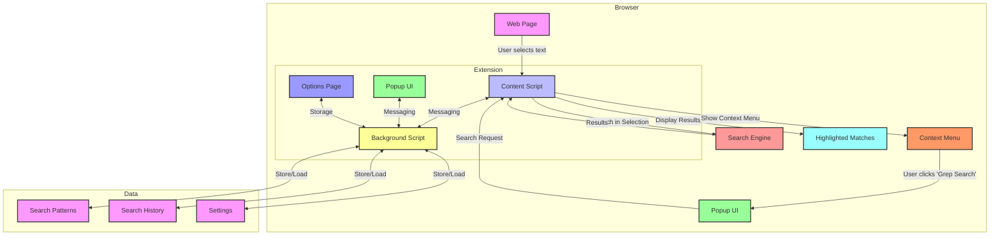

# Grep Tool Architecture

## Component Descriptions

1. **Web Page**
   - The target webpage where text is selected
   - Content script runs in this context

2. **Content Script**
   - Injects UI elements into the page
   - Listens for text selection events
   - Handles search execution on selected text
   - Manages highlighting of matches

3. **Context Menu**
   - Appears on right-click when text is selected
   - Triggers the grep search popup

4. **Popup UI**
   - Modal interface for entering search patterns
   - Displays search results
   - Provides search options (case sensitivity, regex, etc.)

5. **Search Engine**
   - Processes the selected text
   - Implements grep-like search functionality
   - Supports regex patterns
   - Returns matched lines with context

6. **Background Script**
   - Manages extension state
   - Handles communication between components
   - Manages storage for settings and history

7. **Options Page**
   - User preferences
   - Search history management
   - Export/import functionality

8. **Data Storage**
   - Search patterns (saved searches)
   - Search history
   - User settings and preferences
