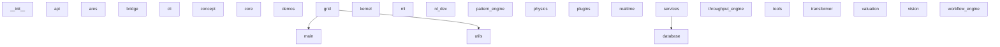

```mermaid
graph TD
    __init__["__init__"]
    api["api"]
    ares["ares"]
    bridge["bridge"]
    cli["cli"]
    concept["concept"]
    core["core"]
    database["database"]
    demos["demos"]
    grid["grid"]
    kernel["kernel"]
    main["main"]
    ml["ml"]
    nl_dev["nl_dev"]
    pattern_engine["pattern_engine"]
    physics["physics"]
    plugins["plugins"]
    realtime["realtime"]
    services["services"]
    throughput_engine["throughput_engine"]
    tools["tools"]
    transformer["transformer"]
    utils["utils"]
    valuation["valuation"]
    vision["vision"]
    workflow_engine["workflow_engine"]
    grid --> main
    grid --> utils
    services --> database
```
