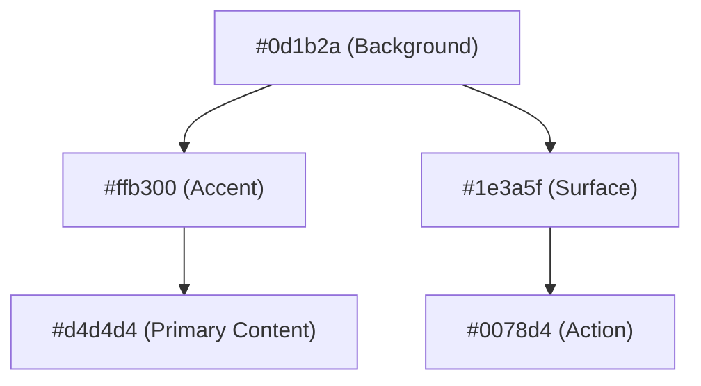

# GRID Exhibit: System Showcase
**Visual & Functional Highlights**

This exhibit showcases the key modules and design achievements of the GRID ecosystem.

---

## 🖥️ Exhibit A: The Intelligence Dashboard
The primary command center for GRID, featuring the **"Navy Amber"** aesthetic.

*(Note: Visual representation only; see `App.tsx` for layout details)*

**Key Features**:
- **Resonance Core**: Real-time status indicators for global sync.
- **Active Nexus**: High-tension glassmorphism cards for project monitoring.
- **Deep Intel Feed**: Monospaced event logging with hierarchical priority coloring.

---

## 🧠 Exhibit B: Neural Synthesis Engine
An interface for advanced intelligence gathering and movement simulation.

**Key Features**:
- **Flow Diffusion**: Context-aware user sequence generation.
- **Trajectory B-splines**: Visual rendering of robot movement paths.
- **Cost Gradients**: Dynamic feedback on collision and goal-reaching metrics.

---

## 📁 Exhibit C: Artifact Foundry
The reporting and export module for precision intel analysis.

**Key Features**:
- **Executive Brief**: Structured summaries with architectural solutions.
- **Stability Index**: Monospaced risk assessment tables.
- **Multi-Format Export**: One-click JSON/CSV generation in GRID colors.

---

## 🎨 Exhibit D: Design Tokens
The foundation of the GRID visual identity.

---

**Curation**: Stratagem Intelligence Studio
**Exhibition Date**: 2026-01-06
