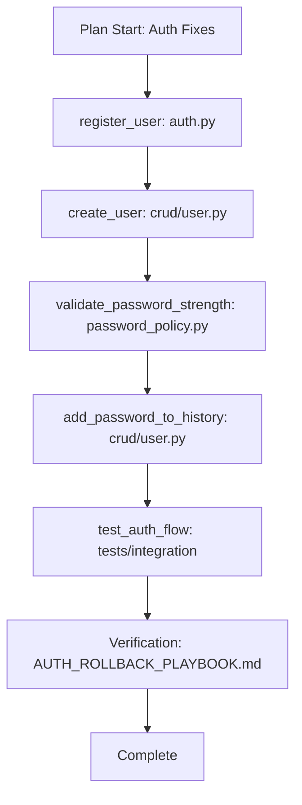

# Plan-to-Reference Implementation Guide

> **Purpose:** Demonstrate how to implement the Plan-to-Reference Debug Tool using real code from THE GRID codebase. Use this guide when resolving plan outlines to concrete file:symbol references.
>
> **Related:** [`.cursor/skills/plan-to-reference/SKILL.md`](../../.cursor/skills/plan-to-reference/SKILL.md) | [`.claude/rules/plan-grounding.md`](../../.claude/rules/plan-grounding.md) | [Multi-IDE Verification Index](./MULTI_IDE_VERIFICATION_INDEX.md)

---

## 1. Quick Reference: Plan Item → Code Mapping

When resolving an implementation plan, map abstract items to concrete references using these patterns from THE GRID:

| Plan Item                   | Reference                                                     | Actual Code Location |
| --------------------------- | ------------------------------------------------------------- | -------------------- |
| Implement user registration | `src/grid/api/routers/auth.py:register_user`                  | FastAPI endpoint     |
| Create user in database     | `src/grid/crud/user.py:create_user`                           | CRUD function        |
| Authenticate user           | `src/grid/core/security.py:authenticate_user`                 | Auth logic           |
| Validate password strength  | `src/grid/core/password_policy.py:validate_password_strength` | Policy function      |
| Add password history        | `src/grid/crud/user.py:add_password_to_history`               | CRUD function        |
| Check password reuse        | `src/grid/crud/user.py:check_password_reuse`                  | CRUD function        |
| Integration tests for auth  | `tests/integration/test_auth_flow.py`                         | Test module          |
| Auth rollback playbook      | `docs/guides/AUTH_ROLLBACK_PLAYBOOK.md`                       | Documentation        |
| IDE config standards        | `.claude/rules/ide-config-standards.md`                       | Rule                 |
| Daily verify task           | `.vscode/tasks.json` (label: "Daily: Verify the Wall")        | Config               |

---

## 2. Example: Auth System Plan → Reference Map

### Input Plan (User Provides)

```
1. Fix authentication bug
2. Add password history
3. Update tests
4. Deploy to staging
```

### Resolved Reference Map (Output)

| Item                   | Reference                                             | Severity | Impact | Status |
| ---------------------- | ----------------------------------------------------- | -------- | ------ | ------ |
| Fix authentication bug | `src/grid/api/routers/auth.py:login_for_access_token` | 🔴       | 🎯     | ✅     |
| Add password history   | `src/grid/crud/user.py:add_password_to_history`       | 🔴       | 🎯     | ✅     |
| Update tests           | `tests/integration/test_auth_flow.py`                 | 🟠       | ⚠️     | ✅     |
| Deploy to staging      | `infrastructure/kubernetes/api-deployment.yaml`       | 🟡       | 💡     | ✅     |

---

## 3. Code Examples for Resolution

### 3.1 Registration Endpoint (Symbol Reference)

**Plan item:** "Implement user registration"

**Resolved:** `src/grid/api/routers/auth.py:register_user`

```python
# src/grid/api/routers/auth.py (lines 46-78)
@router.post("/register", response_model=User)
async def register_user(user_in: UserCreate, db: Session = Depends(get_db)):
    """Register a new user"""
    # 1. Check existing user
    if get_user_by_email(db, email=user_in.email):
        raise HTTPException(
            status_code=400,
            detail="Email already registered"
        )
    if get_user_by_username(db, username=user_in.username):
        raise HTTPException(
            status_code=400,
            detail="Username already taken"
        )

    # 2. Validate Password Strength
    password_check = validate_password_strength(
        user_in.password,
        user_inputs=[user_in.username, user_in.email]
    )
    if not password_check["is_strong"]:
        raise HTTPException(
            status_code=400,
            detail={
                "message": "Password is too weak",
                "warning": password_check["warning"],
                "suggestions": password_check["suggestions"]
            }
        )

    # 3. Create User
    user = create_user(db, user_in)
    return user
```

### 3.2 CRUD Create User (File + Symbol)

**Plan item:** "Add password history on user creation"

**Resolved:** `src/grid/crud/user.py:create_user`

```python
# src/grid/crud/user.py (lines 16-37)
def create_user(db: Session, user: UserCreate):
    hashed_password = get_password_hash(user.password)
    db_user = User(
        email=user.email,
        username=user.username,
        full_name=user.full_name,
        hashed_password=hashed_password,
        is_active=user.is_active,
        trust_tier=user.trust_tier
    )
    db.add(db_user)
    db.flush()  # Flush to get the user ID

    # Store initial password in history
    password_history = PasswordHistory(
        user_id=db_user.id,
        hashed_password=hashed_password
    )
    db.add(password_history)

    db.commit()
    db.refresh(db_user)
    return db_user
```

### 3.3 Password Validation (Policy Symbol)

**Plan item:** "Validate password strength"

**Resolved:** `src/grid/core/password_policy.py:validate_password_strength`

```python
# src/grid/core/password_policy.py (lines 6-34)
def validate_password_strength(password: str, user_inputs: List[str] = None) -> Dict[str, Any]:
    """
    Validate password strength using zxcvbn.
    """
    if user_inputs is None:
        user_inputs = []

    result = zxcvbn(password, user_inputs=user_inputs)
    score = result['score']
    feedback = result['feedback']

    is_strong = score >= settings.PASSWORD_COMPLEXITY_SCORE
    if len(password) < settings.PASSWORD_MIN_LENGTH:
        is_strong = False
        feedback['warning'] = f"Password must be at least {settings.PASSWORD_MIN_LENGTH} characters long."

    return {
        "score": score,
        "is_strong": is_strong,
        "warning": feedback['warning'],
        "suggestions": feedback['suggestions']
    }
```

### 3.4 Integration Tests (File Reference)

**Plan item:** "Update auth tests"

**Resolved:** `tests/integration/test_auth_flow.py`

```python
# tests/integration/test_auth_flow.py (lines 48-62)
def test_register_user_success(client, db):
    response = client.post(
        "/auth/register",
        json={
            "username": "newuser",
            "email": "newuser@example.com",
            "password": "StrongPassword123!",
            "full_name": "New User"
        }
    )
    assert response.status_code == 200
    data = response.json()
    assert data["email"] == "newuser@example.com"
    assert "id" in data
    assert "hashed_password" not in data
```

### 3.5 Config / Task (Config Reference)

**Plan item:** "Run daily verification"

**Resolved:** `.vscode/tasks.json` (label: "Daily: Verify the Wall")

```json
// .vscode/tasks.json (lines 3-12)
{
  "label": "Daily: Verify the Wall",
  "detail": "Run all tests + lint before starting any new work",
  "type": "shell",
  "command": "uv run python -m pytest -q --tb=short && uv run ruff check work/ safety/ security/ boundaries/",
  "group": { "kind": "build", "isDefault": true },
  "presentation": { "reveal": "always", "panel": "shared" },
  "problemMatcher": []
}
```

### 3.6 Documentation Reference

**Plan item:** "Review security rollback"

**Resolved:** `docs/guides/AUTH_ROLLBACK_PLAYBOOK.md`

```markdown
# docs/guides/AUTH_ROLLBACK_PLAYBOOK.md (excerpt)

## Rollback Scenarios

### Scenario 1: Database Migration Issues

**Symptoms**: Migration fails, database corruption, data loss

### Scenario 2: Authentication Service Failures

**Symptoms**: Login failures, registration errors, token validation issues
```

---

## 4. Flow Trace (Mermaid) from Resolved References



---

## 5. Format Pivot: CSV Export

```csv
Item,Reference,Severity,Impact,Status
"Implement user registration","src/grid/api/routers/auth.py:register_user","🔴","🎯","✅"
"Create user in DB","src/grid/crud/user.py:create_user","🔴","🎯","✅"
"Validate password","src/grid/core/password_policy.py:validate_password_strength","🔴","🎯","✅"
"Add password history","src/grid/crud/user.py:add_password_to_history","🟠","⚠️","✅"
"Auth tests","tests/integration/test_auth_flow.py","🟠","⚠️","✅"
"Rollback playbook","docs/guides/AUTH_ROLLBACK_PLAYBOOK.md","🟡","💡","✅"
```

---

## 6. Verification Chain (Prompt → Workflow → Result → Verification → Final)

| Stage        | Input                     | Output              | Reference                           |
| ------------ | ------------------------- | ------------------- | ----------------------------------- |
| Prompt       | "Fix auth race condition" | Plan outline        | Conversation                        |
| Workflow     | Plan items                | Resolved references | `plan-grounding` rule               |
| Result       | Resolved map              | Reference map + CSV | `plan-to-reference` skill           |
| Verification | Reference map             | Config review       | `.claude/agents/config-reviewer.md` |
| Final        | Verified map              | Implementation      | `src/grid/crud/user.py`, `auth.py`  |

---

## 7. Grep/SemanticSearch Patterns for Resolution

When resolving plan items, use these patterns:

| Plan Item Type | Grep Pattern                       | Example                            |
| -------------- | ---------------------------------- | ---------------------------------- |
| Registration   | `grep "register" --include="*.py"` | Finds `register_user`              |
| Password       | `grep "password" --include="*.py"` | Finds `validate_password_strength` |
| Login          | `grep "login" --include="*.py"`    | Finds `login_for_access_token`     |
| Config         | `Glob "**/config*.py"`             | Finds `src/grid/core/config.py`    |
| Tests          | `Glob "**/test*auth*.py"`          | Finds `test_auth_flow.py`          |
| Playbook       | `Grep "rollback" docs/`            | Finds `AUTH_ROLLBACK_PLAYBOOK.md`  |

---

## 8. Related Resources

- **Skill:** [`.cursor/skills/plan-to-reference/SKILL.md`](../../.cursor/skills/plan-to-reference/SKILL.md)
- **Rule:** [`.claude/rules/plan-grounding.md`](../../.claude/rules/plan-grounding.md)
- **Subagent:** [`.claude/agents/plan-resolver.md`](../../.claude/agents/plan-resolver.md)
- **IDE Verification:** [`.cursor/skills/ide-verification/SKILL.md`](../../.cursor/skills/ide-verification/SKILL.md)
- **Index:** [MULTI_IDE_VERIFICATION_INDEX.md](./MULTI_IDE_VERIFICATION_INDEX.md)
