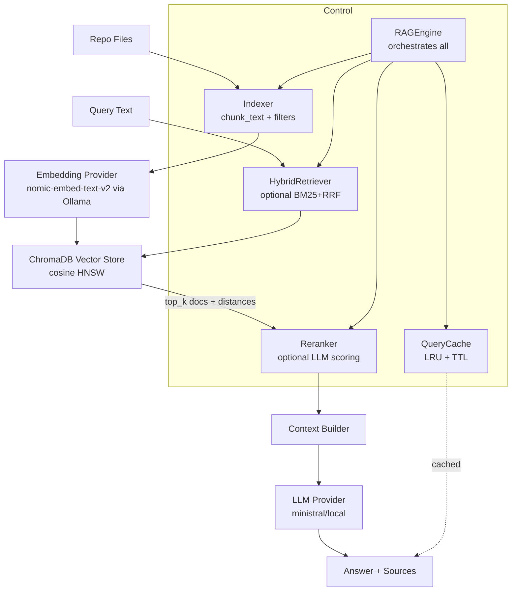

# RAG Implementation Guide

## Architecture Overview



## Components

| Component | File | Description |
|-----------|------|-------------|
| **RAGEngine** | `rag_engine.py` | Main orchestrator, wires all components |
| **FileTracker** | `file_tracker.py` | Tracks file hashes for incremental indexing |
| **QueryCache** | `cache.py` | LRU cache with TTL for query responses |
| **HybridRetriever** | `hybrid_retriever.py` | BM25 + Vector RRF fusion (optional) |
| **Reranker** | `reranker.py` | LLM-based relevance scoring (optional) |
| **ChromaDBVectorStore** | `vector_store/chromadb_store.py` | Persistent vector storage |

## Configuration

All settings are configurable via environment variables:

### Core Settings
```bash
RAG_EMBEDDING_MODEL="nomic-embed-text-v2-moe:latest"
RAG_LLM_MODEL_LOCAL="ministral-3:3b"
RAG_VECTOR_STORE_PATH=".rag_db"
RAG_COLLECTION_NAME="grid_knowledge_base"
RAG_CHUNK_SIZE=800
RAG_CHUNK_OVERLAP=100
RAG_TOP_K=10
```

### Cache Settings
```bash
RAG_CACHE_ENABLED=true    # Enable query caching (default: true)
RAG_CACHE_SIZE=100        # Max cache entries
RAG_CACHE_TTL=3600        # TTL in seconds
```

### Advanced Features (Disabled by Default)
```bash
RAG_USE_HYBRID=false      # Enable BM25+Vector hybrid search
RAG_USE_RERANKER=false    # Enable LLM-based reranking
RAG_RERANKER_TOP_K=20     # Max candidates for reranker
```

### Concurrency
```bash
RAG_MAX_CONCURRENT_EMBEDDINGS=4
RAG_EMBEDDING_BATCH_SIZE=20
```

## Usage

### CLI

```bash
# Incremental update (default)
python -m tools.rag.cli index /path/to/repo

# Full rebuild
python -m tools.rag.cli index /path/to/repo --rebuild

# Query
python -m tools.rag.cli query "How does the cognitive layer work?"

# Stats
python -m tools.rag.cli stats
```

### Python API

```python
from tools.rag import RAGEngine, RAGConfig

config = RAGConfig.from_env()
engine = RAGEngine(config=config)

# Index (incremental by default)
from tools.rag.indexer import update_index
update_index(repo_path=".", vector_store=engine.vector_store,
             embedding_provider=engine.embedding_provider)

# Or full rebuild
engine.index(repo_path=".", rebuild=True)

# Query
result = engine.query("What is RAG?", top_k=5)
print(result["answer"])
print(f"Cached: {result.get('cached', False)}")
```

## Incremental Indexing

The `update_index()` function uses `FileTracker` to:
1. Compute SHA-256 hash of each file
2. Compare with previously indexed hashes
3. Only re-index changed files
4. Delete chunks for removed files

State is persisted in `.rag_db/file_tracker.json`.

## Hybrid Search (Optional)

When `RAG_USE_HYBRID=true`:
1. BM25 sparse retrieval runs in parallel with vector search
2. Results are fused using Reciprocal Rank Fusion (RRF)
3. Captures both semantic similarity AND exact keyword matches

Requires `rank_bm25` package: `pip install rank_bm25`

## Reranker (Optional)

When `RAG_USE_RERANKER=true`:
1. Top-20 candidates are passed to the LLM
2. Each document is scored 0-10 for relevance
3. Results are reordered by score
4. 5-second timeout per document prevents latency explosion

## Troubleshooting

### Metadata Mismatch After Upgrade
```bash
# If you see metadata errors, rebuild with new format:
python -m tools.rag.cli index . --rebuild
```

### Slow Indexing
- Check Ollama is running: `ollama serve`
- Reduce batch size: `RAG_EMBEDDING_BATCH_SIZE=10`
- Enable verbose logging

### Stale Cache Results
- Cache invalidates when index changes (chunk count or source IDs differ)
- Manually clear: `engine._cache.invalidate()` if needed
