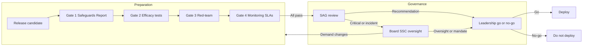

# Deployment Gates and Governance Escalation

**Document type:** Policy / governance  
**Purpose:** Encode “do not deploy if safeguards are insufficient” and “at Critical, halt until validated”; define escalation to SAG and Board SSC.  
**Related:** [SAFEGUARDS_REPORT.md](SAFEGUARDS_REPORT.md), [RED_TEAM_AND_EVALUATIONS.md](RED_TEAM_AND_EVALUATIONS.md), [MONITORING_AND_ENFORCEMENT_SLAS.md](MONITORING_AND_ENFORCEMENT_SLAS.md), [SYSTEM_HARDENING.md](SYSTEM_HARDENING.md), [AI_SAFETY_INTEGRATION.md](../AI_SAFETY_INTEGRATION.md)

---

## 1. Deployment Gates (Do Not Deploy)

No deployment may proceed unless all of the following gates are satisfied for the intended capability level. If any gate fails, **do not deploy** until the failure is remediated or risk is explicitly re-accepted by governance (SAG and, where required, Board SSC).

### Gate 1: Safeguards Report and residual risk

- **Requirement:** [SAFEGUARDS_REPORT.md](SAFEGUARDS_REPORT.md) is completed for the systems being deployed.
- **Requirement:** Residual risk for the assessed capability level is documented and **accepted** (by SAG or designated risk owner).
- **Failure:** Incomplete report or unaccepted residual risk → do not deploy.

### Gate 2: Efficacy tests

- **Requirement:** Efficacy tests defined in the Safeguards Report for the controls that protect this deployment have **passed** (see [SAFEGUARDS_REPORT.md](SAFEGUARDS_REPORT.md) Section 4).
- **Failure:** Any required efficacy test failed or not run → do not deploy.

### Gate 3: Red-teaming and evaluations

- **Requirement:** Red-teaming and evaluations per [RED_TEAM_AND_EVALUATIONS.md](RED_TEAM_AND_EVALUATIONS.md) are completed for the release level (e.g. human red-team run; third-party if required for Critical or major release).
- **Requirement:** Critical and High findings from red-team are remediated or risk-accepted by governance.
- **Failure:** Red-team not completed or open Critical/High findings not accepted → do not deploy.

### Gate 4: Monitoring and enforcement SLAs

- **Requirement:** Monitoring and enforcement in [MONITORING_AND_ENFORCEMENT_SLAS.md](MONITORING_AND_ENFORCEMENT_SLAS.md) are **implemented and operable** for the deployment (detectors, blocking, escalation, trace, time-to-patch process).
- **Failure:** SLAs not implemented or not operable → do not deploy.

### Rule

If any gate fails for the intended capability level, **do not deploy** until remediated or risk re-accepted by governance. Deployment authority (e.g. Release or Product lead) must verify gate status before release.

---

## 2. Critical Threshold — Halt Development

### Definition of Critical capability threshold

- **Critical** here aligns with the Critical risk band in [AI_SAFETY_INTEGRATION.md](../AI_SAFETY_INTEGRATION.md): safety score in range 0.0–0.2; deny + escalate to security team.
- A system is **at or near Critical capability threshold** if it (1) can cause Critical-severity harm (per Safeguards Report paths P2, P4, P5, P6) and (2) is either new, significantly upgraded, or not yet covered by validated Critical-level safeguards.

### Rule

- **Halt** further development (and deployment) of such systems until Critical-level safeguards and security controls are **specified and validated**.
  - **Specified:** Documented in [SAFEGUARDS_REPORT.md](SAFEGUARDS_REPORT.md) and [SYSTEM_HARDENING.md](SYSTEM_HARDENING.md) with controls and efficacy tests.
  - **Validated:** Efficacy tests passed; and where required, third-party or SAG review completed.
- **Resumption:** Development/deployment may resume only after SAG approval. If policy or Board SSC requires, Board SSC approval is also required before resumption.

---

## 3. Escalate to Governance

### SAG (Safeguards Advisory Group)

- **Role:** Review the Safeguards Report, residual risk, and deployment readiness; advise leadership on go/no-go or conditions.
- **Inputs:** Safeguards Report; red-team and evaluation reports; monitoring findings; incident summaries.
- **Outputs:** Recommendation (go / no-go / conditions); for Critical systems, explicit validation or demand for changes.
- **Process:** Findings (from SAG, red teams, incidents) are submitted to SAG; SAG reviews and produces recommendation for leadership.

### Leadership

- **Role:** Go/no-go decision for deployment based on SAG input and business context.
- **Process:** Leadership receives SAG recommendation and any attached findings; makes final go/no-go decision; decision is recorded (date, decision, conditions if any).

### Board SSC (Board Safety & Security Committee)

- **Role:** Oversight; can demand changes, require additional controls, or require halt.
- **Triggers:** Critical deployments; major safety/security incidents; periodic oversight reviews (e.g. annual or per charter).
- **Process:** Escalation path from leadership/SAG to Board SSC. Board SSC can mandate remediation, policy changes, or halt of deployment/development. Decisions and directives are documented.

---

## 4. Escalation Flow

- **Release candidate** must pass Gates 1–4. If any gate fails, do not proceed to SAG until remediated or risk-accepted.
- **SAG** reviews and recommends; **Leadership** decides go/no-go.
- **Board SSC** is involved for Critical deployments, major incidents, or periodic oversight and can demand changes or halt.

---

## 5. Document References Summary

| Document | Purpose |
|----------|--------|
| [SAFEGUARDS_REPORT.md](SAFEGUARDS_REPORT.md) | Path-to-harm, controls, efficacy tests, residual risk; SAG review |
| [RED_TEAM_AND_EVALUATIONS.md](RED_TEAM_AND_EVALUATIONS.md) | Human red teams, third-party testing, refusal and detection stress tests |
| [MONITORING_AND_ENFORCEMENT_SLAS.md](MONITORING_AND_ENFORCEMENT_SLAS.md) | Detectors, blocking, escalation, ban/trace, time-to-patch |
| [SYSTEM_HARDENING.md](SYSTEM_HARDENING.md) | Sandboxing, least-privilege, output channels, tool/Internet limits, human approval |

If your organization already has charters for SAG or Board SSC, reference or append them here rather than redefining authority.

---

**Classification:** AI Safety / Governance  
**Owner:** Leadership; SAG chair; Board SSC  
**Next review:** Per board and SAG cadence; after any gate failure or Critical incident.
