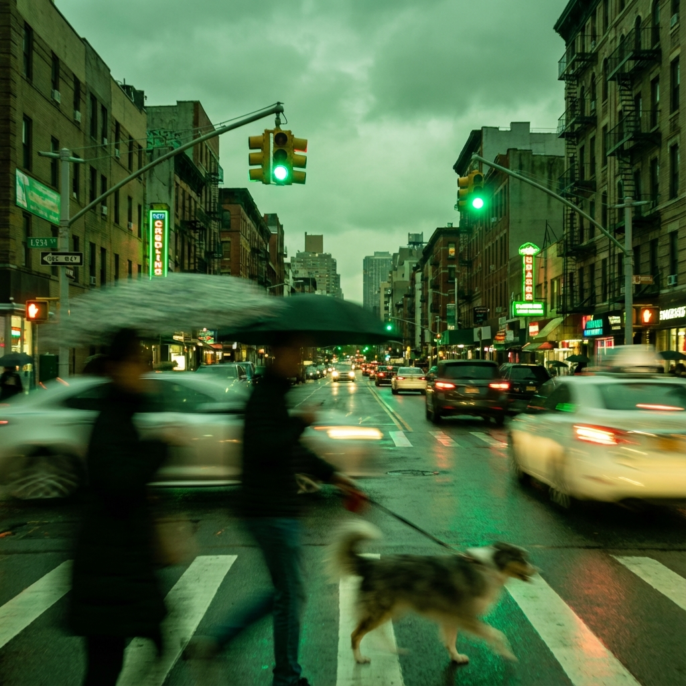
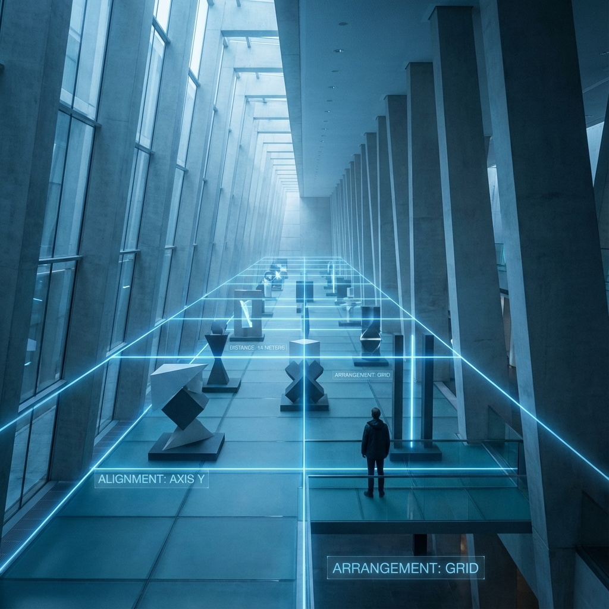
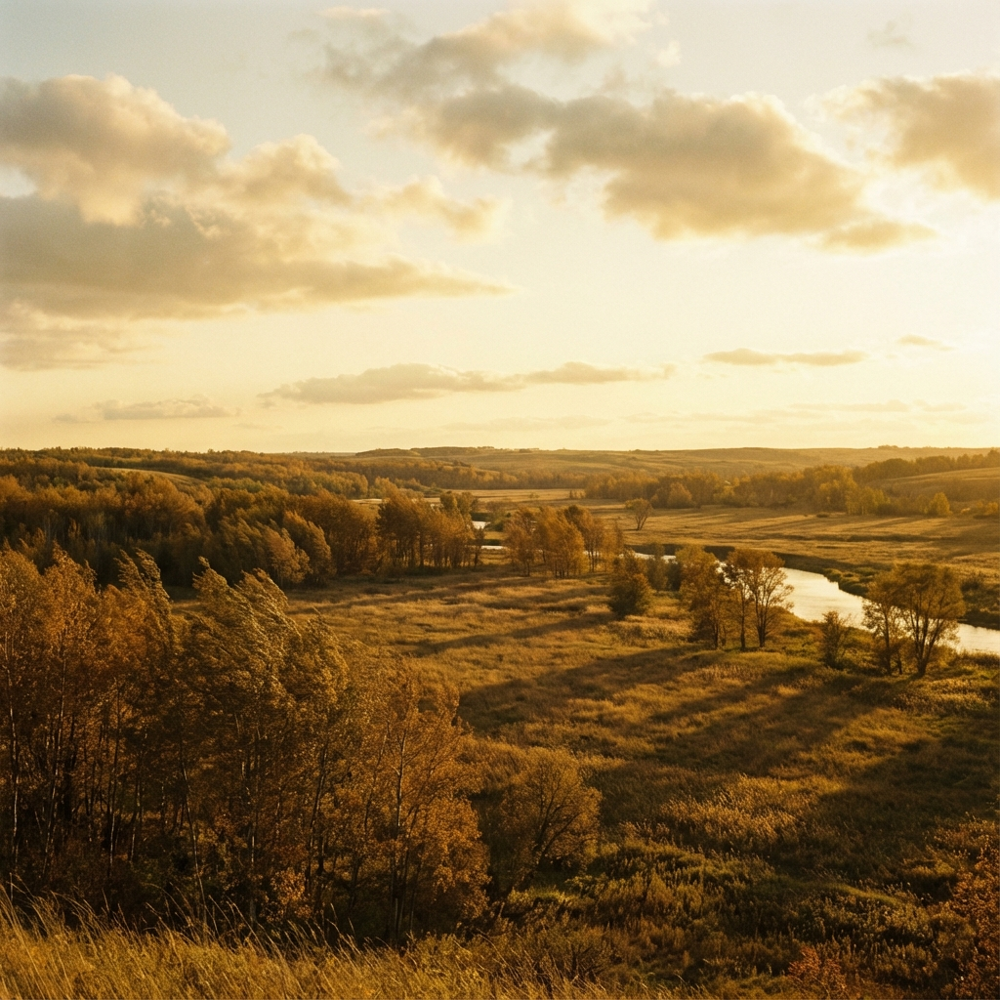
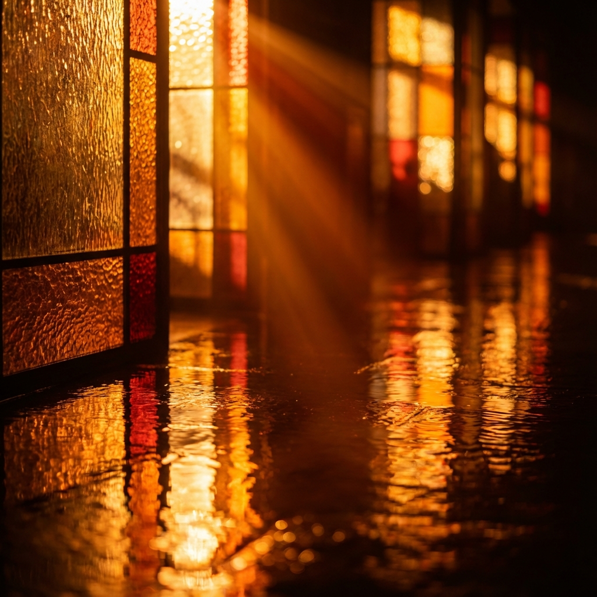
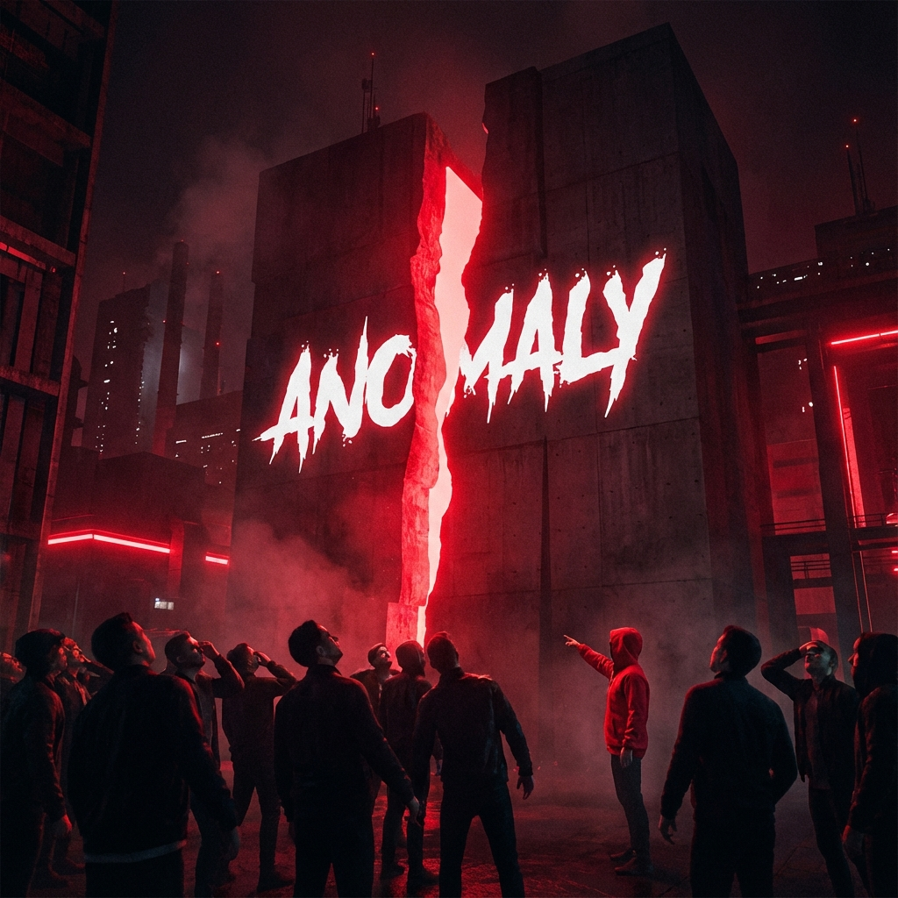
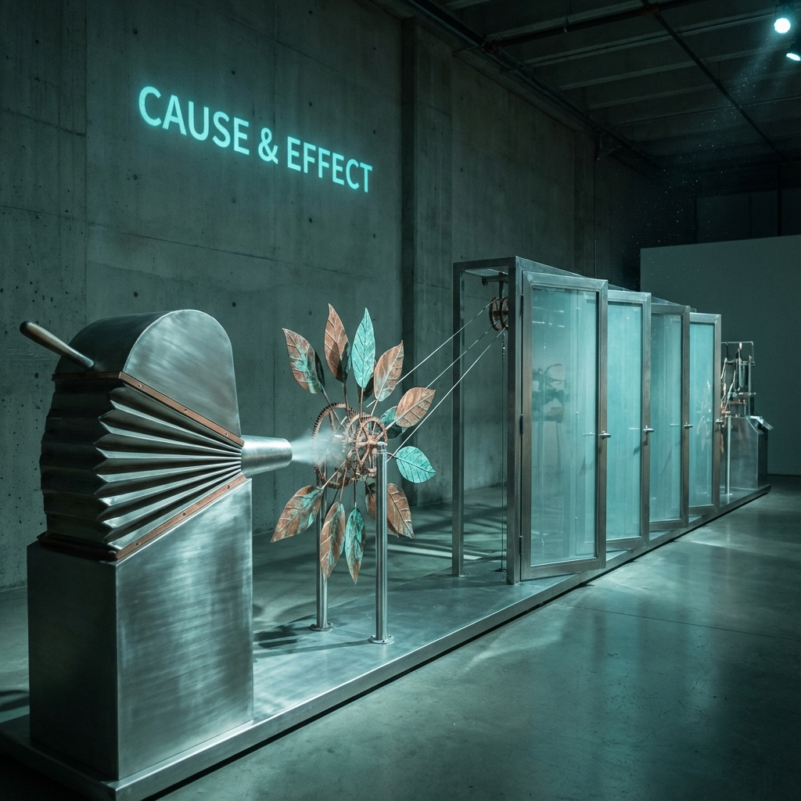
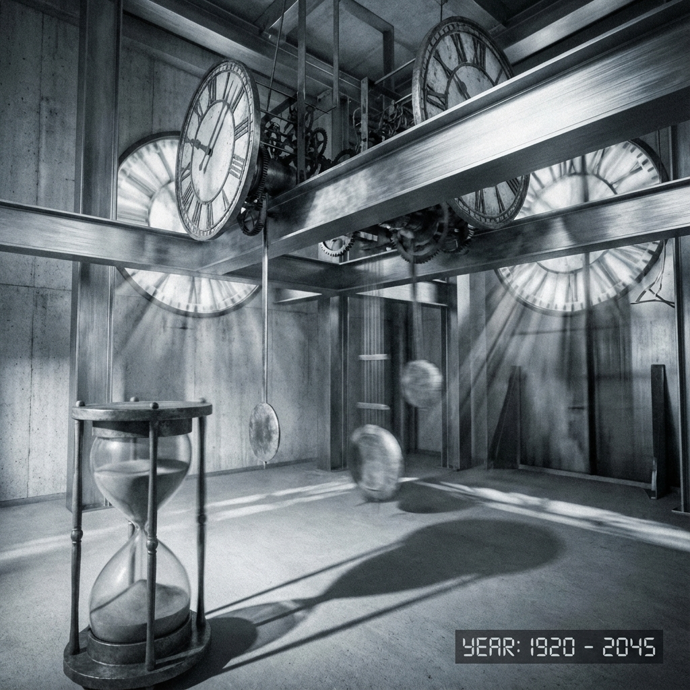
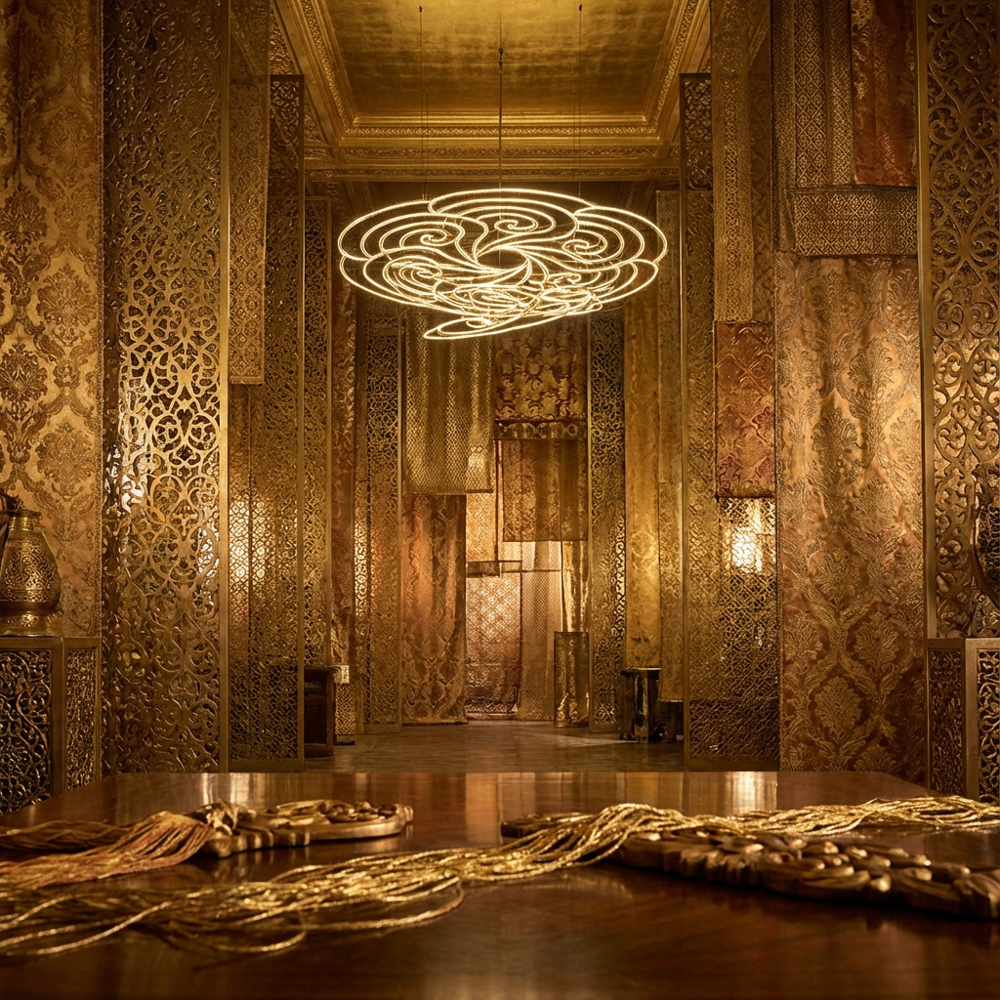

# Visual References: Pattern Concepts

This document provides visual references for the core pattern concepts used in the Throughput Engine design system.

## 1. Flow & Motion (Green Book)
**Concept:** People walking, cars moving, pets running.
**Visual:** Dynamic, motion blur, high energy.

## 2. Spatial Relationships (Blue Book)
**Concept:** Distances, arrangements, alignment of objects.
**Visual:** Geometric, structured, perspective, depth.

## 3. Natural Rhythms (Yellow Book)
**Concept:** Trees swaying, clouds drifting, shadows moving.
**Visual:** Organic, fluid, peaceful, sunlight.

## 4. Color & Light (Orange Book)
**Concept:** Bright spots, contrasts, reflections, patterns in color.
**Visual:** Radiant, glowing, high contrast.

## 5. Repetition & Habit (Purple Book)
**Concept:** Predictable sequences: traffic lights, footsteps, birds perching.
**Visual:** Rhythmic, patterned, orderly.

## 6. Deviation & Surprise (Red Book)
**Concept:** Anything that breaks the expected pattern.
**Visual:** Shock, disruption, anomaly, bold.

---

## 7. Cause & Effect (Teal Book)
**Concept:** Actions and reactions: wind moves leaves, doors opening, people reacting.
**Visual:** Connected, interactive, kinetic, conceptual.

## 8. Temporal Patterns (Silver Book)
**Concept:** Changes over time: shadows shifting, sounds appearing, clocks ticking.
**Visual:** Time-lapse feel, chronological, evolving, metallic.

## 9. Combination Patterns (Gold Book)
**Concept:** Two or more patterns interacting in interesting ways.
**Visual:** Complex, layered, rich, interwoven, luxury.

