# GRID Frontend — Architecture Documentation

> **Stack:** Electron 40 · React 19 · TypeScript 5.9 · Vite 7 · Tailwind CSS v4 · TanStack Query v5

---

## Current Status Summary

| Layer        | Technology                                | Description                                                                |
| ------------ | ----------------------------------------- | -------------------------------------------------------------------------- |
| **Runtime**  | Electron 40                               | Desktop shell with IPC bridge for secure API communication                 |
| **Frontend** | React 19 + TypeScript + Vite              | SPA with config-driven routing and TanStack Query for data fetching        |
| **Styling**  | Tailwind CSS v4                           | Utility-first CSS with custom design tokens                                |
| **Backend**  | FastAPI (port 8000) + Ollama (port 11434) | REST API for GRID services, local LLM integration via Ollama               |
| **Testing**  | Vitest 4 + Testing Library                | 123+ tests across 10+ files covering utils, schema, clients, and all pages |

---

## Architecture Overview

### Core Principles

1. **Config-Driven Design** — Routes, endpoints, navigation, and page settings are defined in `app.config.json` with typed accessors in `app-schema.ts`
2. **Secure IPC Bridge** — Electron preload exposes `window.grid` and `window.ollama` via context bridge (no direct Node.js access in renderer)
3. **Type-Safe API Clients** — `GridClient` and `OllamaClient` wrap IPC calls with full TypeScript types
4. **Component Registry** — Pages are mapped dynamically from config using `routeComponents` registry

---

## 🔷 Unified End-to-End Architecture

This diagram shows **WHO** each component is, **HOW** they communicate, and the complete data flow from user interaction to backend processing.

```mermaid
flowchart TB
  subgraph User["👤 USER"]
    action["Clicks / Types / Navigates"]
  end

  subgraph Electron["⚡ ELECTRON SHELL"]
    mainProc["main.ts<br/><i>Main Process</i><br/>• Window management<br/>• IPC handlers<br/>• HTTP requests"]
    preload["preload.ts<br/><i>Context Bridge</i><br/>• Exposes window.grid<br/>• Exposes window.ollama<br/>• Exposes window.windowControls"]
  end

  subgraph React["⚛️ REACT RENDERER"]
    app["App.tsx<br/><i>Root Component</i>"]
    router["HashRouter<br/><i>Client Routing</i>"]
    shell["AppShell<br/><i>Layout + Nav</i>"]

    subgraph Pages["📄 PAGES (11)"]
      dashboard["Dashboard"]
      chat["ChatPage"]
      rag["RagQuery"]
      intel["Intelligence"]
      cognitive["Cognitive"]
      security["Security"]
      obs["Observability"]
      knowledge["Knowledge"]
      roundtable["RoundTable"]
    end

    subgraph DataLayer["🔄 DATA LAYER"]
      query["TanStack Query<br/><i>Caching + Fetching</i>"]
      gridClient["GridClient<br/><i>GRID API calls</i>"]
      ollamaClient["OllamaClient<br/><i>LLM calls</i>"]
    end

    schema["Schema Layer<br/><i>app.config.json</i><br/>• Routes<br/>• Endpoints<br/>• Navigation"]
  end

  subgraph Backend["🖥️ BACKEND SERVICES"]
    subgraph FastAPI["FastAPI :8000"]
      health["/health<br/><i>Health checks</i>"]
      ragAPI["/rag/query<br/><i>RAG search</i>"]
      intelAPI["/api/v1/intelligence<br/><i>Intelligence pipeline</i>"]
      cockpit["/api/v1/cockpit<br/><i>Cognitive status</i>"]
      secAPI["/security<br/><i>Security posture</i>"]
    end

    subgraph Cognitive["🧠 COGNITIVE ENGINE"]
      cogEngine["CognitiveEngine<br/><i>Pattern detection</i>"]
      flowMgr["FlowManager<br/><i>State orchestration</i>"]
      patterns["PatternManager<br/><i>Recognition</i>"]
    end

    subgraph Resonance["🔔 RESONANCE"]
      actRes["ActivityResonance<br/><i>Left-to-right comm</i>"]
      adsr["ADSR Envelope<br/><i>Haptic feedback</i>"]
      context["ContextProvider<br/><i>Fast context</i>"]
      pathViz["PathVisualizer<br/><i>Triage paths</i>"]
    end

    ollama["Ollama :11434<br/><i>Local LLM</i><br/>• Chat streaming<br/>• Model management"]
  end

  %% User Flow
  action --> app
  app --> router --> shell --> Pages

  %% React Internal
  Pages --> query
  Pages --> schema
  query --> gridClient
  query --> ollamaClient

  %% IPC Bridge
  gridClient -->|"window.grid.api()"| preload
  ollamaClient -->|"window.ollama.chat()"| preload
  preload -->|"ipcRenderer.invoke()"| mainProc

  %% Backend Calls
  mainProc -->|"HTTP GET/POST"| FastAPI
  mainProc -->|"HTTP Streaming"| ollama

  %% Backend Internal
  cockpit --> cogEngine
  cogEngine --> Resonance
  actRes --> adsr
  actRes --> context
  actRes --> pathViz
  intelAPI --> cogEngine

  %% Response Flow (implied by bidirectional)
  FastAPI -.->|"JSON Response"| mainProc
  ollama -.->|"NDJSON Tokens"| mainProc
  mainProc -.->|"IPC Event"| preload
  preload -.->|"Callback"| DataLayer
  DataLayer -.->|"State Update"| Pages

  classDef user fill:#e1bee7,stroke:#7b1fa2,color:#000
  classDef electron fill:#fff3e0,stroke:#ef6c00,color:#000
  classDef react fill:#bbdefb,stroke:#1976d2,color:#000
  classDef backend fill:#c8e6c9,stroke:#388e3c,color:#000
  classDef cognitive fill:#ffe0b2,stroke:#f57c00,color:#000
  classDef resonance fill:#b2dfdb,stroke:#00796b,color:#000

  class User user
  class Electron,mainProc,preload electron
  class React,app,router,shell,Pages,DataLayer,schema react
  class Backend,FastAPI,health,ragAPI,intelAPI,cockpit,secAPI,ollama backend
  class Cognitive,cogEngine,flowMgr,patterns cognitive
  class Resonance,actRes,adsr,context,pathViz resonance
```



---

### Component Roles (WHO)

| Layer        | Component           | Role                                                       |
| ------------ | ------------------- | ---------------------------------------------------------- |
| **User**     | Human               | Initiates actions via UI                                   |
| **Electron** | `main.ts`           | Main process — window lifecycle, IPC handlers, HTTP client |
| **Electron** | `preload.ts`        | Context bridge — securely exposes APIs to renderer         |
| **React**    | `App.tsx`           | Root component with routing                                |
| **React**    | `AppShell`          | Layout wrapper with Sidebar + Header                       |
| **React**    | Pages (11)          | Feature-specific UI components                             |
| **React**    | `TanStack Query`    | Data fetching, caching, state sync                         |
| **React**    | `GridClient`        | Typed wrapper for GRID API calls                           |
| **React**    | `OllamaClient`      | Typed wrapper for Ollama LLM calls                         |
| **React**    | Schema Layer        | Config-driven routes, endpoints, navigation                |
| **Backend**  | FastAPI             | REST API server on port 8000                               |
| **Backend**  | Ollama              | Local LLM server on port 11434                             |
| **Backend**  | `CognitiveEngine`   | Pattern detection and processing                           |
| **Backend**  | `FlowManager`       | State orchestration for cognitive tasks                    |
| **Backend**  | `ActivityResonance` | Left-to-right communication orchestrator                   |
| **Backend**  | `ADSR Envelope`     | Haptic-like feedback timing                                |
| **Backend**  | `ContextProvider`   | Fast context from application layer                        |
| **Backend**  | `PathVisualizer`    | Path triage and visualization                              |

---

### Communication Flow (HOW)

| Step | From       | To             | Mechanism              | Data                           |
| ---- | ---------- | -------------- | ---------------------- | ------------------------------ |
| 1    | User       | React          | DOM Events             | Clicks, typing                 |
| 2    | Page       | TanStack Query | Hook call              | `useQuery()` / `useMutation()` |
| 3    | Query      | GridClient     | Method call            | `gridClient.get()`             |
| 4    | GridClient | preload.ts     | `window.grid.api()`    | Method, endpoint, body         |
| 5    | preload.ts | main.ts        | `ipcRenderer.invoke()` | IPC message                    |
| 6    | main.ts    | FastAPI        | HTTP request           | REST call                      |
| 7    | FastAPI    | Cognitive      | Python call            | Internal routing               |
| 8    | Cognitive  | Resonance      | Method call            | Activity processing            |
| 9    | Resonance  | Cognitive      | Return                 | Feedback + paths               |
| 10   | FastAPI    | main.ts        | HTTP response          | JSON                           |
| 11   | main.ts    | preload.ts     | IPC event              | Stream chunks                  |
| 12   | preload.ts | React          | Callback               | State update                   |
| 13   | React      | User           | DOM update             | Rendered UI                    |

---

### Streaming Flow (LLM Chat)


---

### Resonance Activity Flow


---

## Visual Diagrams

Copy any Mermaid block below into [mermaid.live](https://mermaid.live) or a Markdown viewer with Mermaid support.

---

### 1. High-Level Architecture


---

### 2. IPC Bridge Architecture


---

### 3. Schema-Driven Routing


---

### 4. Page Component Flow


---

### 5. Ollama Chat Streaming Flow


---

### 6. Project File Structure


---

## Pages Summary

| Page              | File                   | Key Features                                                             |
| ----------------- | ---------------------- | ------------------------------------------------------------------------ |
| **Dashboard**     | `Dashboard.tsx`        | Health polling, stat cards, quick action links                           |
| **AI Chat**       | `ChatPage.tsx`         | Streaming LLM chat via Ollama, model selector, message history           |
| **RAG Query**     | `RagQuery.tsx`         | NDJSON streaming search, conversational mode toggle                      |
| **Intelligence**  | `IntelligencePage.tsx` | Multi-capability pipeline (pattern/reasoning/security), evidence toggle  |
| **Cognitive**     | `Cognitive.tsx`        | Cockpit status, resonance metrics, skills, navigation planner            |
| **Security**      | `Security.tsx`         | Posture assessment, compliance scoring, corruption monitor, DRT          |
| **Observability** | `Observability.tsx`    | Health/metrics dashboards, resilience scoring, readiness probes, version |
| **Knowledge**     | `Knowledge.tsx`        | RAG engine stats, conversation metrics, signal quality, session mgmt     |
| **Terminal**      | `TerminalPage.tsx`     | Interactive terminal (placeholder)                                       |
| **Settings**      | `SettingsPage.tsx`     | API connection configuration display                                     |
| **Round Table**   | `RoundTablePage.tsx`   | Multi-agent round table discussions with environmental intelligence      |

---

## API Configuration

### Endpoints (from `app.config.json`)

| Key                   | Path                           | Purpose                       |
| --------------------- | ------------------------------ | ----------------------------- |
| `health`              | `/health`                      | Backend health check          |
| `healthLive`          | `/health/live`                 | Liveness probe                |
| `healthReady`         | `/health/ready`                | Readiness probe               |
| `ragQuery`            | `/rag/query`                   | RAG search (non-streaming)    |
| `ragQueryStream`      | `/rag/query/stream`            | RAG search (NDJSON streaming) |
| `intelligenceProcess` | `/api/v1/intelligence/process` | Intelligence pipeline         |
| `cockpitStatus`       | `/api/v1/cockpit/status`       | Cognitive cockpit status      |
| `cockpitHealth`       | `/api/v1/cockpit/health`       | Cognitive health check        |
| `navigationPlan`      | `/api/v1/navigation/plan`      | Navigation planner            |
| `skillsHealth`        | `/api/v1/skills/health`        | Skills health check           |
| `securityStatus`      | `/security/status`             | Security posture              |
| `ollamaModels`        | `/api/tags`                    | List Ollama models            |
| `ollamaChat`          | `/api/chat`                    | Ollama chat (streaming)       |

### Base URLs

| Service  | URL                      |
| -------- | ------------------------ |
| GRID API | `http://127.0.0.1:8000`  |
| Ollama   | `http://127.0.0.1:11434` |

---

## IPC Bridge Reference

### `window.grid` (GridAPI)

| Method          | Signature                                                         | Description                |
| --------------- | ----------------------------------------------------------------- | -------------------------- |
| `api`           | `(method, endpoint, body?) → Promise<{ok, status, data, error?}>` | REST API call              |
| `stream`        | `(method, endpoint, body?) → Promise<{ok, streamId, error?}>`     | Start NDJSON stream        |
| `onStreamChunk` | `(streamId, callback) → unsubscribe`                              | Subscribe to stream chunks |

### `window.ollama` (OllamaAPI)

| Method        | Signature                                                         | Description              |
| ------------- | ----------------------------------------------------------------- | ------------------------ |
| `api`         | `(method, endpoint, body?) → Promise<{ok, status, data, error?}>` | REST API call            |
| `chat`        | `(model, messages, temp?) → Promise<{ok, streamId, error?}>`      | Start streaming chat     |
| `onChatToken` | `(streamId, callback) → unsubscribe`                              | Subscribe to chat tokens |

### `window.windowControls` (WindowAPI)

| Method             | Signature                  | Description                   |
| ------------------ | -------------------------- | ----------------------------- |
| `minimize`         | `() → Promise<void>`       | Minimize window               |
| `maximize`         | `() → Promise<void>`       | Toggle maximize               |
| `close`            | `() → Promise<void>`       | Close window                  |
| `isMaximized`      | `() → Promise<boolean>`    | Check maximized state         |
| `onMaximizeChange` | `(callback) → unsubscribe` | Subscribe to maximize changes |

---

## Test Suite

**Stack:** Vitest 4 · @testing-library/react · @testing-library/jest-dom · @testing-library/user-event · jsdom

### Test Infrastructure

- **setup.ts** — Global IPC mocks (`window.grid`, `window.ollama`, `window.windowControls`)
- **test-utils.tsx** — `renderWithProviders` helper (QueryClient + MemoryRouter)

### Test Coverage (123 tests, 10 files)

| File                        | Tests | Coverage                                                                 |
| --------------------------- | ----- | ------------------------------------------------------------------------ |
| `utils.test.ts`             | 6     | `cn()` class merging utility                                             |
| `schema.test.ts`            | 26    | Config, endpoints, routes, navigation, icons, registry, helper functions |
| `grid-client.test.ts`       | 19    | GridClient CRUD + streaming, OllamaClient models/health/chat/generate    |
| `ChatPage.test.tsx`         | 9     | Title, online/offline badge, model selector, empty state, input, send    |
| `IntelligencePage.test.tsx` | 13    | Capability toggles, evidence checkbox, process button states, API        |
| `RagQuery.test.tsx`         | 9     | Search input, submit states, conversational toggle, stream submission    |
| `Cognitive.test.tsx`        | 10    | Cockpit/resonance/skills cards, navigation planner, API, refresh         |
| `Security.test.tsx`         | 8     | Security posture, compliance, corruption monitor, DRT, offline fallback  |
| `Observability.test.tsx`    | 11    | Health status, uptime formatting, ops, resilience, readiness, version    |
| `Knowledge.test.tsx`        | 12    | RAG engine info, conversation stats, signal quality, session mgmt        |

---

## Running the Application

### Development

```bash
# Start Vite dev server + Electron
npm run dev

# Run tests
npm test              # single run
npm run test:watch    # watch mode
npm run test:coverage # with coverage

# Linting & formatting
npm run lint
npm run lint:fix
npm run format
```

### Production

```bash
# Build renderer + electron
npm run build

# Package Windows executable
npm run package
```

### Storybook

```bash
npm run storybook       # dev server on :6006
npm run build-storybook # static build
```

---

## Dependencies

### Runtime

| Package                    | Version  | Purpose                 |
| -------------------------- | -------- | ----------------------- |
| `react`                    | ^19.2.4  | UI framework            |
| `react-dom`                | ^19.2.4  | React DOM renderer      |
| `react-router-dom`         | ^7.13.0  | Client-side routing     |
| `@tanstack/react-query`    | ^5.90.20 | Data fetching & caching |
| `lucide-react`             | ^0.563.0 | Icon library            |
| `clsx`                     | ^2.1.1   | Class name utility      |
| `tailwind-merge`           | ^3.4.0   | Tailwind class merging  |
| `class-variance-authority` | ^0.7.1   | Variant-based styling   |
| `zod`                      | ^3.25.76 | Schema validation       |

### Dev

| Package       | Version | Purpose               |
| ------------- | ------- | --------------------- |
| `electron`    | ^40.2.1 | Desktop runtime       |
| `vite`        | ^7.3.1  | Build tool            |
| `typescript`  | ^5.9.3  | Type checking         |
| `tailwindcss` | ^4.1.18 | CSS framework         |
| `vitest`      | ^4.0.18 | Test runner           |
| `storybook`   | ^10.2.7 | Component development |

---

_Documentation generated from codebase exploration. Last updated: February 2026._
