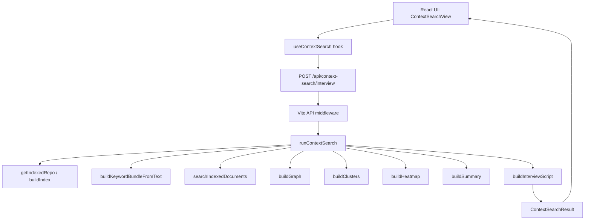

# UI-First Glimpse Artifact Architecture
## Foundation and Construction Guide

## 1. Purpose

This document describes the current architecture around the UI-first "glimpse-artifact" context-search workflow across three related but distinct surfaces:

- the implemented **React + TypeScript context-search path** in `glimpse-artifact`
- the adjacent **scenario canvas seed path** in `glimpse-artifact`
- the standalone **Python prototype** in `GRID/mcp-setup/server`

The goal is accuracy first:

- describe what is actually implemented
- separate current behavior from future seams
- show what is load-bearing vs. what is presentation, prototype, or planned work

## 2. Accuracy corrections to the earlier interpretation

### 2.1 Color semantics

There is **no single formal red / mustard / green legend** exposed as an architecture contract in the codebase.

What the implemented UI actually shows in `ContextSearchView` and `GraphPanel` is:

- **Amber / mustard**
  - cluster emphasis
  - transfer emphasis
  - some transcript / visibility section headers

- **Teal / green**
  - accepted keywords
  - evidence emphasis
  - file / hit emphasis
  - most active action accents

- **Neutral / border color**
  - structural containers
  - baseline edges such as `belongs_to`

- **Red**
  - not part of the implemented context-search graph semantics shown in the runtime code reviewed here
  - if a red box appears in a codemap or diagram, treat it as a **documentation-layer styling choice**, not a runtime semantic contract

### 2.2 Why things look "sorted in file"

The structure is better understood as being grouped by:

- runtime stage
- source file ownership
- output type

not simply alphabetical order.

In practice, the diagram tends to look file-sorted because:

- UI nodes come from React view and hook files
- API nodes come from the Vite middleware file
- search / graph / clustering nodes come from `server/context-search.ts`
- adjacent prototype nodes come from the Python script

So the apparent sort order is mostly a combination of:

- file locality
- vertical dependency order
- grouped stage presentation

## 3. System boundary

The architecture currently has **three lanes**.

### 3.1 Lane A — Production context-search path

This is the implemented path used by the main context-search UI:

- `src/views/ContextSearchView.tsx`
- `src/hooks/useContextSearch.ts`
- `server/vite-api-plugin.ts`
- `server/context-search.ts`
- `src/components/phase4/types.ts`

This is the primary runtime path for deterministic search and artifact generation.

### 3.2 Lane B — Adjacent scenario-canvas path

This is a separate UI surface:

- `src/views/ScenarioCanvasView.tsx`
- `src/hooks/useCanvasSeeds.ts`

It currently uses:

- static seed templates from `/data/seed-templates.json`
- a mock fallback seed list
- local canvas persistence

This path is **adjacent** to context search, but not the same runtime pipeline.

### 3.3 Lane C — Python prototype / mirror

This is the standalone script at:

- `GRID/mcp-setup/server/Design a UI-first glimpse-artifact tool `

It is a simplified mirror that demonstrates:

- keyword selection
- validation
- deterministic search
- cluster roll-up
- artifact creation
- CLI flags and printed outputs

It is **not currently wired into the React + TypeScript production runtime**.

## 4. Executive definition

The implemented system is a **deterministic, evidence-grounded context-search pipeline**.

It takes a scenario-like input, compresses it into a keyword bundle, searches a repo-native index built from files and symbols, scores grounded evidence, propagates relevance into cluster visibility, and emits portable artifacts such as:

- summary
- hits
- graph
- clusters
- heatmap
- interview transcript
- export package

The design is intentionally **not vector-store-first** and **not model-authority-first**.

The current center of gravity is:

- local repository evidence
- explainable scoring
- exportable result shape
- visible trace of accepted / rejected / unknown terms

## 5. Vertical architecture

### 5.1 Vertical reading

- **Top**
  - user-facing interaction and result rendering

- **Middle**
  - transport and orchestration

- **Lower middle**
  - deterministic retrieval and evidence scoring

- **Bottom**
  - indexing, token extraction, references, result assembly

The vertical layout answers:

- what calls what
- what depends on what
- where transformations happen

## 6. Core runtime flow

### 6.1 Request initiation

`ContextSearchView` collects:

- `scenarioText`
- `optionalContext`
- `optionalProblemFrame`
- `maxKeywords`
- `provider`

`useContextSearch` sends the request to:

- `POST /api/context-search/interview`

### 6.2 API boundary

`server/vite-api-plugin.ts` exposes three related endpoints:

- `/api/context-search/keywords`
- `/api/context-search/query`
- `/api/context-search/interview`

They all call the same orchestrator:

- `runContextSearch(body, CASCADE_ROOT)`

The difference is the amount of result packaging returned.

### 6.3 Orchestration

`runContextSearch` performs the pipeline in this order:

1. validate that `scenarioText` is present
2. load or rebuild the repo index
3. synthesize the keyword bundle
4. search indexed documents
5. build graph
6. build clusters
7. build heatmap
8. build summary
9. build interview script
10. return a `ContextSearchResult`

### 6.4 UI rendering

The UI renders the result into sections:

- keyword bundle
- summary
- unknown terms
- synthesis trace
- node and cluster visibility graph
- cluster ranking
- keyword heatmap
- interview transcript
- reference artifacts
- evidence hits

## 7. Component reference

| Component | Role | Inputs | Outputs | Depends on |
| --- | --- | --- | --- | --- |
| `ContextSearchView` | Main user-facing analysis page | Form state, `ContextSearchResult` | Rendered search UI and export action | `useContextSearch`, shared types |
| `useContextSearch` | Request lifecycle hook | Input payload | `result`, `loading`, `error`, `runSearch`, `reset` | `/api/context-search/interview` |
| `vite-api-plugin.ts` | API boundary inside Vite dev server | HTTP request body | JSON response | `runContextSearch` |
| `runContextSearch` | Main orchestration function | `ContextSearchRequest`, `repoRoot` | `ContextSearchResult` | indexing, keywords, search, graph, clusters, heatmap, summary, interview |
| `buildIndex` / `getIndexedRepo` | Repo-native read model builder and short-lived cache | `repoRoot` | docs + vocabulary | filesystem, token extraction, reference extraction |
| `buildKeywordBundleFromText` | Deterministic keyword synthesis | scenario text + vocab | accepted / rejected / unknown keyword bundle | tokenizer, stopwords, fuzzy mapping, term expansion |
| `searchIndexedDocuments` | Deterministic evidence ranking | keyword bundle + indexed docs | ranked hits | path tokens, symbol tokens, content occurrences |
| `buildGraph` | Visibility topology builder | hits + docs + keywords | nodes + edges | hit cluster assignment + references |
| `buildClusters` | Cluster ranking and transfer summary | hits + keywords | cluster list | hit grouping |
| `buildHeatmap` | keyword-to-cluster distribution | hits + clusters + keywords | heatmap cells | matched terms per cluster |
| `buildSummary` | top-level narrative compression | hits + clusters + keywords | summary string | top cluster + top hit |
| `buildInterviewScript` | Evidence-backed transport packaging | summary + hits + clusters + keywords | speakers + turns + artifacts | grounded evidence references |
| `ScenarioCanvasView` | Separate scenario exploration surface | seed templates + local state | visual canvas | `useCanvasSeeds`, local persistence |
| `useCanvasSeeds` | Static seed loader | `/data/seed-templates.json` | seed shelf data | `useDataSource`, fallback mock seeds |
| Python prototype | Standalone mirror / teaching workflow | CLI args | printed summary + artifact snapshot | static index and simple deterministic overlap |

## 8. Implemented vs adjacent vs prototype

### 8.1 Implemented production path

The production path is:

- React input
- Vite API route
- TypeScript deterministic search engine
- packaged result
- React visualization

This is the path with tests and typed result contracts.

### 8.2 Adjacent but separate path

The canvas path is separate.

`ScenarioCanvasView` currently:

- fetches static seeds
- creates seed cards
- creates branches and glimpse snapshots
- exports local canvas state

It does **not** currently call `runContextSearch`.

### 8.3 Prototype path

The Python script mirrors the idea of the pipeline but uses:

- a hardcoded `REPO_NATIVE_INDEX`
- simple set-overlap scoring
- CLI flags
- print statements and dataclasses

It is useful for:

- explanation
- prototyping
- quick local experiments
- teaching the mechanics

It is not yet a shared service contract.

## 9. Foundation flags

These are the main load-bearing runtime flags, hard constraints, and tuning constants that shape the system.

### 9.1 Request flags

- **`scenarioText`**
  - required
  - if empty after trim, `runContextSearch` throws `"scenarioText is required"`

- **`optionalContext`**
  - optional
  - merged into the keyword-synthesis input

- **`optionalProblemFrame`**
  - optional
  - merged into the keyword-synthesis input

- **`maxKeywords`**
  - clamped to `5..12`
  - default falls back to `8`

- **`provider`**
  - allowed values:
    - `deterministic`
    - `openai`
    - `ollama`
  - current reality:
    - the UI only enables `deterministic`
    - `openai` and `ollama` are visible but disabled in the selector
    - backend accepts the enum but does not call an external model here
    - today, provider acts mainly as a source label / future seam rather than a live model path

### 9.2 Index flags

- **Included roots**
  - `glimpse-artifact/src`
  - `glimpse-artifact/server`
  - `glimpse-engine`
  - `overview-server/src`
  - `shared-types/src`
  - `docs`
  - `README.md`
  - `glimpse.master.yaml`
  - `mcp_config.json`

- **Included extensions**
  - `.ts`
  - `.tsx`
  - `.js`
  - `.mjs`
  - `.md`
  - `.json`
  - `.yaml`
  - `.yml`
  - `.html`

- **Skipped directories**
  - `.git`
  - `node_modules`
  - `dist`
  - `coverage`
  - `tmp`
  - `.vite`

- **Index cache TTL**
  - `15_000 ms`

### 9.3 Keyword synthesis flags

- stopword filtering is applied
- terms shorter than `3` are rejected
- unknown term mapping uses token-overlap similarity
- fuzzy mapping threshold is `0.6`
- accepted terms are capped by `maxKeywords`
- synthesis trace records:
  - provider
  - raw term count
  - accepted count
  - unknown count

### 9.4 Search scoring flags

The search engine currently weights matches as follows:

- **path token match**
  - `+3.2`

- **symbol token match**
  - `+2.4`

- **token presence in document token set**
  - `+1.2`

- **content occurrences**
  - `+0.55` each
  - capped at `4` counted occurrences per term for scoring contribution

Then a **kind weight** is applied:

- `view` / `hook` / `component`
  - `1.18`

- `doc`
  - `0.95`

- everything else
  - `1`

Result limits:

- top **18** hits retained
- top **8** clusters retained

## 10. Construction preferences

These are the architectural preferences the current implementation expresses.

### 10.1 Deterministic-first

The system strongly prefers:

- deterministic ranking
- explicit evidence
- reproducible search behavior

over opaque or purely generative retrieval.

### 10.2 Evidence-first

Truth claims are expected to be grounded in:

- file paths
- symbols
- content excerpts
- references
- cluster membership
- traceable keywords

The interview transcript and artifact cards are built **after** evidence ranking, not before it.

### 10.3 Repo-native over external infrastructure

The system currently favors:

- filesystem walk
- local token vocabulary
- reference extraction
- cluster propagation

instead of an external vector database.

### 10.4 Progressive provider seam

The provider interface exists, but current production behavior remains deterministic.

This means the architecture is prepared for later integration while keeping:

- scoring grounded
- ranking explainable
- provider choice non-authoritative

### 10.5 Exportable result shape

The result is intentionally transportable.

The UI can export a full JSON package containing:

- keywords
- summary
- hits
- graph
- clusters
- heatmap
- artifacts
- interview

### 10.6 Keep adjacent surfaces separate until contract is explicit

The canvas seed shelf is useful, but it is not yet the same contract as context search.

That separation is healthy right now because it avoids accidental coupling between:

- static scenario seeding
- deterministic repo evidence search

## 11. Dependency and conversation map

### 11.1 What talks to what

- `ContextSearchView` talks to `useContextSearch`
- `useContextSearch` talks to `/api/context-search/interview`
- Vite middleware talks to `runContextSearch`
- `runContextSearch` talks to:
  - `getIndexedRepo`
  - `buildKeywordBundleFromText`
  - `searchIndexedDocuments`
  - `buildGraph`
  - `buildClusters`
  - `buildHeatmap`
  - `buildSummary`
  - `buildInterviewScript`
- `ContextSearchView` then renders the returned `ContextSearchResult`

### 11.2 What depends on what

- the UI depends on the `ContextSearchResult` contract
- the API route depends on `runContextSearch`
- search depends on the index and keyword bundle
- graph / clusters / heatmap depend on hits
- summary depends on top hits and top clusters
- interview and artifact cards depend on summary + hits + clusters + keywords
- canvas depends on static seed data and local canvas state
- the Python prototype depends only on CLI args and its static mapping

### 11.3 Strongest dependency spine

The most important vertical spine is:

`scenarioText -> keyword bundle -> hits -> clusters/graph/heatmap -> summary/interview/artifacts -> rendered UI`

That is the core cross-component function of the system.

## 12. Depth, breadth, and pattern satisfaction

### 12.1 What determines depth

Depth is determined by how many distinct transforms the data passes through.

In the production stack, depth increases as the system moves through:

1. scenario input
2. tokenization and stopword removal
3. vocabulary matching and expansion
4. document scoring
5. hit ranking
6. cluster aggregation
7. graph / heatmap / summary generation
8. interview packaging
9. UI rendering

More transforms mean more depth.

### 12.2 What determines breadth

Breadth is determined by how many parallel items exist at a given layer.

Examples:

- many indexed files
- many accepted keywords
- many hits
- many clusters
- many artifact cards
- multiple API endpoints for different return granularity

More siblings at the same level mean more breadth.

### 12.3 Pattern satisfaction

A lower-level observation can satisfy higher-level structures through roll-up.

Examples:

- a **keyword match** satisfies part of a **document hit**
- a **document hit** contributes to a **cluster score**
- multiple **cluster scores** satisfy a **heatmap**
- the strongest **hits + clusters** satisfy the **summary**
- the **summary + evidence refs** satisfy the **interview transcript**
- the same evidence can satisfy:
  - graph nodes
  - cluster ranking
  - checklist artifact
  - transcript confidence framing

This is a classic roll-up pattern:

- evidence upward
- explanation outward

## 13. Why the main function matters

The main architectural function is not a single UI component by itself.

The most important function is the **orchestration contract** anchored by `runContextSearch`.

It matters because it is where the whole vertical stack becomes one system:

- input validation
- indexing
- compression into keywords
- deterministic retrieval
- evidence scoring
- visibility mapping
- artifact packaging

Without that orchestration spine:

- the UI would only be presentation
- the index would only be a data store
- the artifacts would have no grounded assembly path

`runContextSearch` is important because it is the point where:

- components become a pipeline
- evidence becomes a transportable result
- vertical integration becomes real

## 14. Layout semantics: color view vs vertical view

### 14.1 Color view

The color view answers:

- what category of thing is this?
- what is being emphasized visually?
- what is evidence-like, cluster-like, or structural?

In the implemented graph UI:

- amber is cluster / transfer emphasis
- teal is evidence / file / active analysis emphasis
- neutral is structural linkage

### 14.2 Vertical view

The vertical view answers:

- what layer is this in?
- what calls what?
- where does dependency flow?
- where is the boundary between UI, transport, retrieval, and packaging?

### 14.3 Fundamental contrast

Color semantics are about **role and emphasis**.

Vertical semantics are about **dependency and execution order**.

Both are useful, but they are not interchangeable.

## 15. Industry patterns this architecture resembles

This architecture is close to several widely practiced patterns.

- **Layered architecture**
  - UI -> API boundary -> application service -> retrieval core

- **Ports and adapters**
  - the UI, API route, and search core are separable interfaces around the central logic

- **Read-model indexing**
  - `buildIndex()` behaves like a generated searchable read model over the repo

- **Deterministic retrieval with explainability**
  - ranking is grounded in traceable file, symbol, and content matches

- **Progressive enhancement**
  - provider seam exists, but deterministic behavior remains primary

- **Evidence-grounded synthesis**
  - explanation is generated from evidence rather than replacing it

- **Transportable artifact packaging**
  - one result contract feeds UI sections, export, and future integrations

## 16. Construction guidance

### 16.1 Foundation-first order

If continuing construction, the safest order is:

1. stabilize the shared result contract
2. keep deterministic ranking as the reference implementation
3. decide whether Python remains a teaching mirror or becomes a service peer
4. unify adjacent surfaces only after a contract decision
5. add provider-specific integration behind the same contract
6. extend tests before widening behavior

### 16.2 Recommended load-bearing invariants

Preserve these invariants during construction:

- `scenarioText` must remain required
- evidence scoring must stay inspectable
- unknown terms must remain visible rather than silently forced
- artifacts must continue to reference evidence
- the provider seam must not become an ungrounded truth source
- canvas and context search should stay separate until shared semantics are explicit

### 16.3 Safest expansion seams

The best seams for future work are:

- swap or enrich the index source
- add a provider adapter behind the existing provider enum
- connect canvas actions to context search via an explicit request contract
- unify artifact export and seed/template packaging
- share a common schema between the Python prototype and TypeScript runtime

## 17. Verification status

The reviewed TypeScript tests already cover important architectural behavior:

- grounded keyword acceptance with isolated unknown terms
- deterministic ranking where exact path and symbol matches outrank loose content mentions
- interview packaging tied to evidence refs and artifact refs
- end-to-end `runContextSearch` returning grounded artifacts against the repo

This matters because it means the implemented production lane is not just conceptual; it is partially verified.

## 18. Non-goals and cautions

Important limits of the current design:

- this is **not** a real vector store
- this is **not** currently a live model-powered retrieval path
- the Python prototype is **not** the production backend
- the scenario canvas is **not** the same runtime as context search
- the provider enum is ahead of live provider execution in this specific implementation

These are not flaws by themselves. They are boundary markers.

## 19. Short takeaway

The architecture has a clear center:

- deterministic, repo-native, evidence-grounded context search

The production vertical stack is:

- React UI
- request hook
- Vite API boundary
- `runContextSearch`
- indexing
- keyword synthesis
- deterministic search
- cluster / graph / heatmap / summary / interview packaging
- typed result rendered back into the UI

The most important distinction is:

- **implemented production path**
- **adjacent canvas path**
- **prototype Python mirror**

The most important construction rule is:

- keep the evidence spine stable while expanding the seams.
